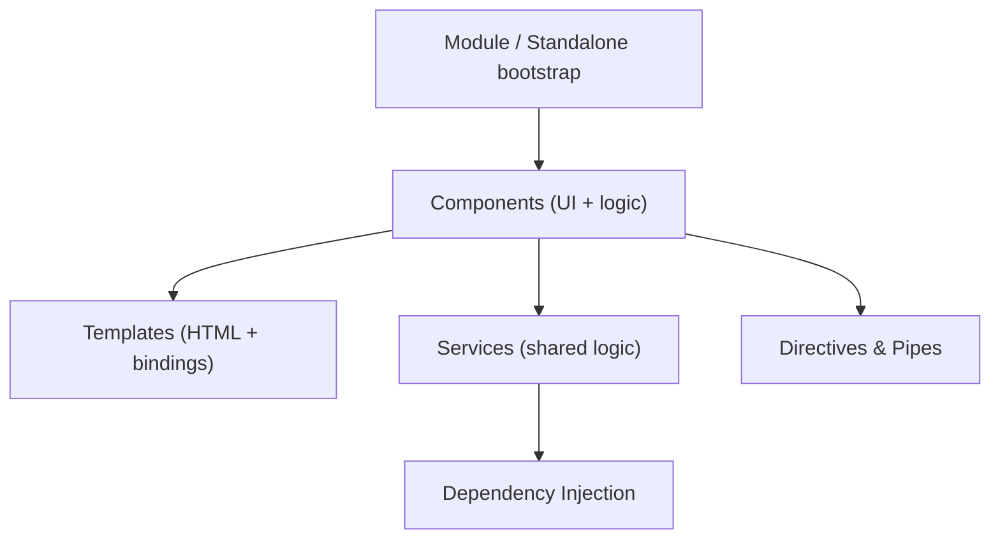

# 🅰️ Angular — Introduction & Setup

> 💼 **Industry Perspective:** In professional frontend teams, **Angular — Introduction & Setup** is applied to build reliable, scalable, and maintainable production software. Engineers are expected to understand its trade-offs, best practices, and how it fits into modern architecture, code reviews, and day-to-day team workflows.

⬅ [Back to Index](../README.md)

> **Big idea:** Angular is a **full, opinionated framework** (not just a library) for building large single-page apps. It ships with routing, forms, HTTP, testing, and a CLI — all built on **TypeScript**.

---

## 🧠 Angular vs React (quick context)

| | Angular | React |
|--|---------|-------|
| Type | Full framework (batteries included) | UI library |
| Language | TypeScript (first-class) | JS or TS |
| Structure | Opinionated, consistent | Flexible, you choose |
| DI, Router, Forms, HTTP | Built-in | Add libraries |

---

## 🏛️ The building blocks



- **Components** — UI building blocks (class + template).
- **Templates** — HTML enhanced with Angular binding syntax.
- **Services** — reusable logic, provided via **Dependency Injection**.
- **Directives & Pipes** — extend/transform the DOM and data.
- **Modules / Standalone** — organize the app.

---

## 🚀 Setup with the Angular CLI

```bash
npm install -g @angular/cli
ng new my-app          # scaffold a new project
cd my-app
ng serve               # dev server at http://localhost:4200
```

Useful generators:

```bash
ng generate component user      # or: ng g c user
ng g service data
ng g directive highlight
ng g pipe currencyFormat
```

---

## 🧩 A minimal standalone component (Angular 17+)

```ts
import { Component } from "@angular/core";

@Component({
	selector: "app-hello",
	standalone: true,
	template: `<h1>Hello, {{ name }}!</h1>`,
})
export class HelloComponent {
	name = "Angular";
}
```

## 🔌 Bootstrapping the app

```ts
// main.ts
import { bootstrapApplication } from "@angular/platform-browser";
import { HelloComponent } from "./app/hello.component";

bootstrapApplication(HelloComponent);
```

---

## 📁 Project structure (typical)

```
src/
	app/
		app.component.ts      // root component
		app.routes.ts         // routes
		app.config.ts         // providers
	main.ts                 // bootstrap
	index.html
angular.json              // workspace config
```

---

⬅ [Back to Index](../README.md)
