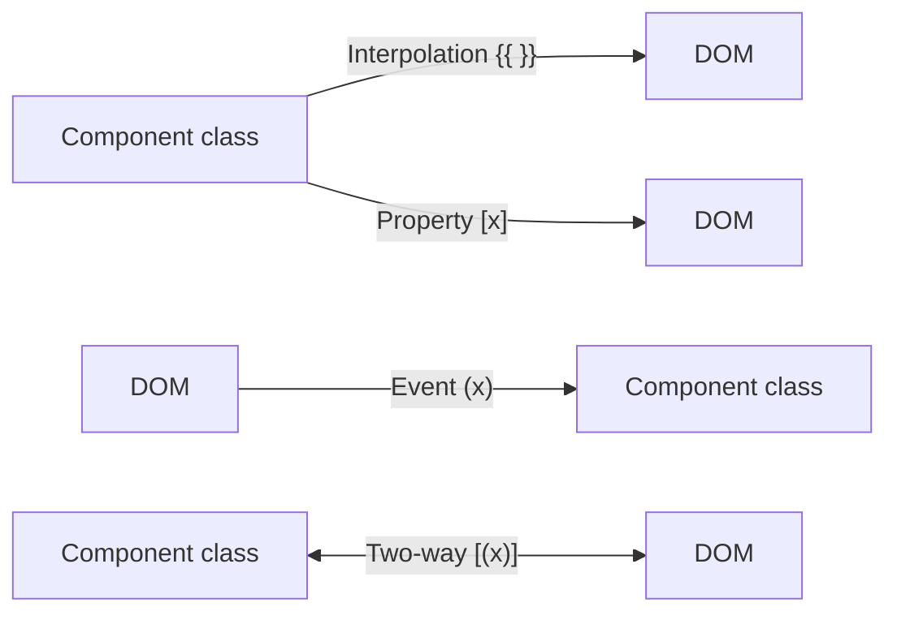

# 🔗 Angular — Data Binding

> 💼 **Industry Perspective:** In professional frontend teams, **Angular — Data Binding** is applied to build reliable, scalable, and maintainable production software. Engineers are expected to understand its trade-offs, best practices, and how it fits into modern architecture, code reviews, and day-to-day team workflows.

⬅ [Back to Index](../README.md)

> **Big idea:** Data binding connects your component class to the template. Angular has **four** kinds, flowing in different directions.

---

## 🧭 The four bindings



---

## 1️⃣ Interpolation — class → view

```html
<h1>{{ title }}</h1>
<p>Total: {{ price * quantity }}</p>
<p>{{ getFullName() }}</p>
```

## 2️⃣ Property binding — class → element property

```html

<button [disabled]="isLoading">Save</button>
<div [class.active]="isActive"></div>
<div [style.color]="color"></div>
<app-child [user]="currentUser"></app-child>  <!-- @Input -->
```

## 3️⃣ Event binding — view → class

```html
<button (click)="onClick()">Go</button>
<input (input)="onInput($event)" />
<form (submit)="onSubmit()"></form>
<app-child (saved)="onSaved($event)"></app-child> <!-- @Output -->
```

```ts
onInput(event: Event) {
	const value = (event.target as HTMLInputElement).value;
}
```

## 4️⃣ Two-way binding — both directions

```html
<!-- Requires FormsModule for ngModel -->
<input [(ngModel)]="name" />
<p>Hello {{ name }}</p>
```

`[(ngModel)]` is sugar for `[ngModel]="name"` + `(ngModelChange)="name = $event"` (the "banana in a box").

---

## 🎨 Special attribute bindings

```html
<!-- Class binding -->
<div [class.highlight]="isOn"></div>
<div [ngClass]="{ active: isActive, disabled: isDisabled }"></div>

<!-- Style binding -->
<div [style.width.px]="width"></div>
<div [ngStyle]="{ color: c, 'font-size.px': size }"></div>

<!-- Attribute binding (for non-property attributes) -->
<td [attr.colspan]="span"></td>
```

---

## 🧷 Template reference variables

```html
<input #box (keyup)="log(box.value)" />
<button (click)="box.focus()">Focus</button>
```

`#box` references the element within the template.

---

⬅ [Back to Index](../README.md)
