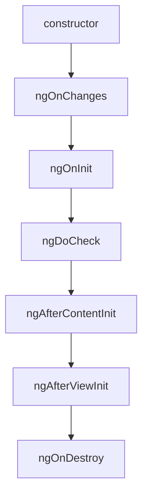

# ♻️ Angular — Lifecycle Hooks

> 💼 **Industry Perspective:** In professional frontend teams, **Angular — Lifecycle Hooks** is applied to build reliable, scalable, and maintainable production software. Engineers are expected to understand its trade-offs, best practices, and how it fits into modern architecture, code reviews, and day-to-day team workflows.

⬅ [Back to Index](../README.md)

> **Big idea:** Angular calls **lifecycle hook methods** at key moments — creation, change, and destruction — so you can run logic at the right time.

---

## 🗺️ The hook sequence



---

## 📋 Each hook

| Hook | When it runs | Common use |
|------|--------------|------------|
| `ngOnChanges` | On `@Input` changes (before init & on updates) | React to input changes |
| `ngOnInit` | Once, after first inputs set | Init logic, fetch data |
| `ngDoCheck` | Every change detection | Custom change detection |
| `ngAfterContentInit` | After `<ng-content>` projected | Access projected content |
| `ngAfterContentChecked` | After projected content checked | — |
| `ngAfterViewInit` | After the view (and child views) init | Access `@ViewChild` |
| `ngAfterViewChecked` | After view checked | — |
| `ngOnDestroy` | Just before destruction | Cleanup, unsubscribe |

---

## 🧩 Implementing hooks

```ts
import { Component, Input, OnInit, OnChanges, OnDestroy, SimpleChanges } from "@angular/core";

@Component({ selector: "app-user", standalone: true, template: `` })
export class UserComponent implements OnInit, OnChanges, OnDestroy {
	@Input() id!: number;
	private sub?: Subscription;

	ngOnChanges(changes: SimpleChanges) {
		if (changes["id"]) {
			console.log("id changed to", this.id);
		}
	}

	ngOnInit() {
		this.sub = this.service.load(this.id).subscribe();
	}

	ngOnDestroy() {
		this.sub?.unsubscribe(); // prevent memory leaks
	}
}
```

---

## 🧠 Best practices

- Put initialization in **`ngOnInit`**, not the constructor (constructor is for DI only).
- Always **unsubscribe** in `ngOnDestroy` (or use the `async` pipe / `takeUntilDestroyed`).
- Use `ngAfterViewInit` when you need a rendered `@ViewChild`.

```ts
// Modern auto-unsubscribe (Angular 16+)
import { takeUntilDestroyed } from "@angular/core/rxjs-interop";
this.service.data$.pipe(takeUntilDestroyed()).subscribe();
```

---

⬅ [Back to Index](../README.md)
