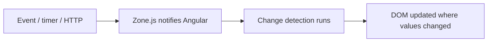

# ⚡ Angular — Change Detection & Signals

> 💼 **Industry Perspective:** In professional frontend teams, **Angular — Change Detection & Signals** is applied to build reliable, scalable, and maintainable production software. Engineers are expected to understand its trade-offs, best practices, and how it fits into modern architecture, code reviews, and day-to-day team workflows.

⬅ [Back to Index](../README.md)

> **Big idea:** Change detection is how Angular keeps the DOM in sync with your data. **Signals** (Angular 16+) are a modern, fine-grained reactivity system that makes this faster and simpler.

---

## 🔄 How change detection works

- Angular runs change detection after events, timers, and HTTP responses (via **Zone.js**).
- It walks the component tree and updates bindings whose values changed.



---

## 🎛️ OnPush change detection (performance)

Skips checking a component unless its `@Input` reference changes, an event fires in it, or a bound Observable/Signal emits.

```ts
@Component({
	selector: "app-row",
	standalone: true,
	changeDetection: ChangeDetectionStrategy.OnPush,
	template: `{{ item.name }}`,
})
export class RowComponent {
	@Input() item!: Item;
}
```

> With OnPush, treat inputs as **immutable** — replace objects/arrays instead of mutating them.

---

## 🚦 Signals (modern reactivity)

A signal is a reactive value; reading it tracks dependencies, writing it notifies consumers.

```ts
import { signal, computed, effect } from "@angular/core";

const count = signal(0);          // create
count();                          // read → 0
count.set(5);                     // set
count.update((c) => c + 1);       // update → 6

const double = computed(() => count() * 2); // derived, auto-updates

effect(() => {
	console.log("count is", count()); // runs when count changes
});
```

---

## 🧩 Signals in a component

```ts
@Component({
	selector: "app-counter",
	standalone: true,
	template: `
		<p>Count: {{ count() }}</p>
		<p>Double: {{ double() }}</p>
		<button (click)="inc()">+</button>`,
})
export class CounterComponent {
	count = signal(0);
	double = computed(() => this.count() * 2);
	inc() { this.count.update((c) => c + 1); }
}
```

Note: signals are **called** in templates: `{{ count() }}`.

---

## 🔌 Signal inputs & more (Angular 17.1+)

```ts
import { input, output, model } from "@angular/core";

readonly id = input.required<number>();     // signal input
readonly name = input("guest");             // with default
readonly saved = output<void>();            // signal output
readonly value = model(0);                  // two-way signal
```

---

## 🔁 Interop with RxJS

```ts
import { toSignal, toObservable } from "@angular/core/rxjs-interop";

users = toSignal(this.userService.getAll(), { initialValue: [] });
count$ = toObservable(this.count);
```

---

## 🧠 Manual control

```ts
constructor(private cdr: ChangeDetectorRef) {}
this.cdr.markForCheck();   // schedule a check (OnPush)
this.cdr.detectChanges();  // run now
```

> **Direction of Angular:** Signals are becoming the primary reactivity model, gradually reducing reliance on Zone.js ("zoneless").

---

⬅ [Back to Index](../README.md)
