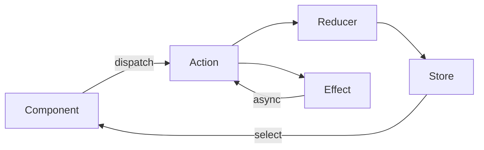

# 🗄️ Angular — State Management (NgRx)

> 💼 **Industry Perspective:** In professional frontend teams, **Angular — State Management (NgRx)** is applied to build reliable, scalable, and maintainable production software. Engineers are expected to understand its trade-offs, best practices, and how it fits into modern architecture, code reviews, and day-to-day team workflows.

⬅ [Back to Index](../README.md)

> **Big idea:** For large apps with complex shared state, **NgRx** provides a predictable Redux-style store. For simpler needs, a **service with signals/BehaviorSubject** is enough.

---

## 🧭 When do you need it?

| Approach | Use when |
|----------|----------|
| Component state / signals | Local UI state |
| Service + `BehaviorSubject`/signal | Shared state, small–medium apps |
| **NgRx Store** | Large apps, complex flows, time-travel devtools |
| **NgRx SignalStore** | Modern, signal-based, less boilerplate |

---

## 🟣 NgRx building blocks



```bash
npm install @ngrx/store @ngrx/effects @ngrx/store-devtools
```

### Actions

```ts
import { createAction, props } from "@ngrx/store";

export const loadUsers = createAction("[Users] Load");
export const loadUsersSuccess = createAction("[Users] Load Success", props<{ users: User[] }>());
```

### Reducer

```ts
import { createReducer, on } from "@ngrx/store";

export interface UsersState { users: User[]; loading: boolean; }
const initial: UsersState = { users: [], loading: false };

export const usersReducer = createReducer(
	initial,
	on(loadUsers, (s) => ({ ...s, loading: true })),
	on(loadUsersSuccess, (s, { users }) => ({ ...s, users, loading: false })),
);
```

### Selectors

```ts
import { createFeatureSelector, createSelector } from "@ngrx/store";

const selectUsersState = createFeatureSelector<UsersState>("users");
export const selectUsers = createSelector(selectUsersState, (s) => s.users);
```

### Effects (async side effects)

```ts
import { createEffect, ofType, Actions } from "@ngrx/effects";

loadUsers$ = createEffect(() =>
	this.actions$.pipe(
		ofType(loadUsers),
		switchMap(() => this.api.getUsers().pipe(
			map((users) => loadUsersSuccess({ users }))
		))
	)
);
```

### Wiring it up (standalone)

```ts
bootstrapApplication(AppComponent, {
	providers: [
		provideStore({ users: usersReducer }),
		provideEffects([UsersEffects]),
		provideStoreDevtools(),
	],
});
```

### Using the store in a component

```ts
export class UsersComponent {
	private store = inject(Store);
	users$ = this.store.select(selectUsers);
	ngOnInit() { this.store.dispatch(loadUsers()); }
}
```

---

## 🆕 NgRx SignalStore (modern, less boilerplate)

```ts
import { signalStore, withState, withMethods, patchState } from "@ngrx/signals";

export const CounterStore = signalStore(
	withState({ count: 0 }),
	withMethods((store) => ({
		increment() { patchState(store, { count: store.count() + 1 }); },
	}))
);
```

---

## 🧩 Simple alternative: a signal-based service

```ts
@Injectable({ providedIn: "root" })
export class CartStore {
	private items = signal<Item[]>([]);
	readonly total = computed(() => this.items().reduce((s, i) => s + i.price, 0));
	add(item: Item) { this.items.update((list) => [...list, item]); }
}
```

> Don't reach for NgRx by default — start simple and adopt it only when shared state gets complex.

---

⬅ [Back to Index](../README.md)
