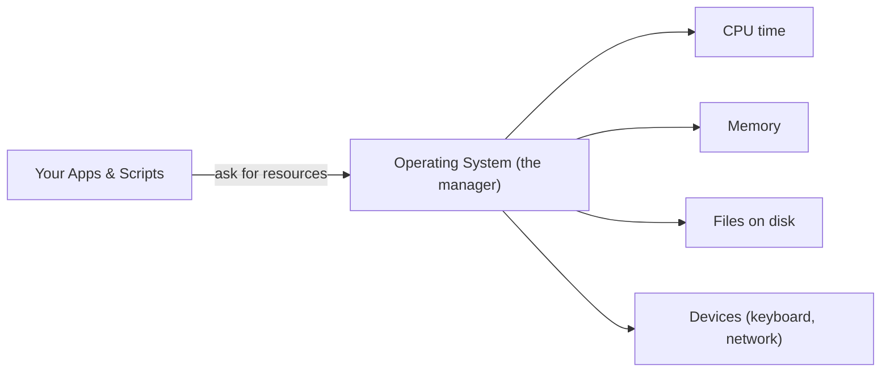

# 👋 Start Here — OS & Scripting in Plain English

> **Read this first.** No jargon, no assumptions. This page explains the *whole* of operating systems and scripting using everyday analogies, then shows how each idea is used in real companies. Once this "clicks," the rest of the track will make sense easily.

⬅ [Back to Index](../README.md)

---

## 🧠 The One Big Idea (if you remember nothing else)

> **An Operating System is the manager that shares one computer's hardware among all your programs. A script is a written recipe that tells the computer to do a job for you — automatically.**

That's it. Everything else is a detail on top of those two sentences.

**Explanation:** Your programs never touch the hardware directly. They ask the operating system, which fairly shares the CPU, memory, disk, and devices between everyone — so nothing crashes into anything else.

---

## 🏢 The Master Analogy: OS = Office Manager

Keep this one analogy in your head for the whole track:

| Office Situation | OS Equivalent | What it means |
|------------------|---------------|---------------|
| 🧑‍💼 **Manager assigns desks & meeting rooms** | Resource scheduling | The OS decides which program gets the CPU and memory, and when. |
| 🗄️ **Filing cabinet with labeled folders** | File system | The OS organizes your data into files and folders on disk. |
| 🔐 **Security badge access** | Permissions & users | The OS controls who can read, write, or run what. |
| 📋 **A checklist stuck to the wall** | A **script** | A repeatable recipe the office runs the same way every time. |

The manager makes sure everyone shares fairly and nobody breaks the rules — **that's the heart of an operating system.**

---

## 📜 What is a "Script"?

A **script** is just a text file full of commands that the computer runs top-to-bottom, like a recipe.

| Manual way | Scripted way |
|------------|--------------|
| You type 20 commands by hand every morning | You run one script that does all 20 for you |
| Easy to forget a step | Always the same, every time |
| Slow and error-prone | Fast and reliable |

> 💡 If you ever catch yourself doing the same clicks or commands twice, that's a signal to **write a script**.

---

## 🎓 Professional (IT-Standard) Reference

| Concept | Layman View | Professional (IT-Standard) View + Example |
|---------|-------------|--------------------------------------------|
| Operating System | The manager that runs the computer | An Operating System (OS) is system software that manages hardware resources and provides services to applications. It handles process scheduling, memory management, and Input/Output (I/O). It exposes those services through System Calls and Application Programming Interfaces (APIs). It enforces isolation and security between users and processes. *Example: Linux, Microsoft Windows, and Apple macOS.* |
| Shell | The window where you type commands | A shell is a command interpreter that turns typed commands into OS actions. It can run interactively or execute a saved script file. It provides variables, loops, pipes, and redirection. It is the primary automation surface for administrators. *Example: Bash on Linux, PowerShell on Windows.* |
| Script | A recipe the computer follows | A script is an interpreted program executed line-by-line by a shell or language runtime. It automates repetitive Operations (Ops) tasks without compilation. It is central to DevOps, Continuous Integration/Continuous Delivery (CI/CD), and system administration. Scripts are version-controlled like application code. *Example: a Bash backup script scheduled with cron.* |

---

## 🚀 Why Learn This?

- 🔧 **Automate** repetitive work — backups, deployments, log parsing.
- 🐧 **Work anywhere** — Windows, Linux, and macOS with confidence.
- ☁️ **Foundation for DevOps & Cloud** — servers, containers, and pipelines all run on an OS and are driven by scripts.
- 💼 **Career skill** — every backend, cloud, and DevOps role expects it.

---

## 🧭 How to Use This Track

1. Build a mental model with **[OS Fundamentals](../01-OS-Fundamentals/what-is-an-os.md)**.
2. Learn the **[types of OS](../02-Types-of-OS/windows.md)** and where each is used.
3. Pick up **[shells & scripting](../03-Shells-and-Scripting-Types/bash.md)**, then practice **[commands](../04-OS-Specific-Commands/linux-commands.md)**.
4. Level up through **[basic → advanced scripting](../05-Scripting-Basic-to-Advanced/variables-io.md)**.
5. Master **[debugging](../06-Debugging-Scripts/bash-debugging.md)** so your scripts survive the real world.

---

## ✅ Key Takeaways

- The OS is the **manager** that shares hardware safely among programs.
- A **shell** is where you type commands; a **script** automates them.
- Learning this unlocks automation, DevOps, and cloud engineering.
- Keep a terminal open and **try every command** as you read.

---

**Navigation:** [Next → What is an Operating System?](../01-OS-Fundamentals/what-is-an-os.md) | ⬅ [Back to Index](../README.md)
