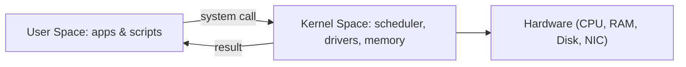

⬅ [Back to Index](../README.md)

# Kernel vs User Space

Modern operating systems split execution into two privilege levels — **kernel space** and **user space** — to stay stable and secure. This separation is one of the most important ideas in all of computing.

### 🎓 Professional (IT-Standard) Reference

| Concept | Layman View | Professional (IT-Standard) View + Example |
|---------|-------------|--------------------------------------------|
| Kernel space | The trusted core of the OS | Kernel space is the privileged mode where the Operating System (OS) core runs with full hardware access.<br>It contains the scheduler, memory manager, and device drivers.<br>Code here executes in CPU "ring 0" with no restrictions.<br>A fault here can crash the entire system (a kernel panic).<br>*Example: the Linux kernel handling a network packet interrupt.* |
| User space | Where your apps and scripts run | User space is the unprivileged mode where applications execute.<br>Processes are sandboxed into their own virtual address space.<br>They cannot touch hardware or other processes directly.<br>A crash here is contained to that single process.<br>*Example: a browser, a text editor, or a Bash script.* |
| System call | The app asking the OS for a favor | A System Call is the controlled gateway from user space into kernel space.<br>It requests privileged operations like file or network access.<br>The CPU switches modes to service the request, then returns.<br>This boundary is where security is enforced.<br>*Example: `read()`, `write()`, and `open()` on Linux.* |

---

## 🚪 The Two Worlds

- **Kernel space** — full hardware access. Runs the scheduler, drivers, and memory manager.
- **User space** — limited privileges. Your apps and scripts live here.

When user code needs something privileged (read a file, open a network socket), it can't do it directly — it must **ask the kernel** through a system call.



**Explanation:** Think of the system call as a service window. Your program slides a request through the window; the kernel does the privileged work behind the counter and hands back the result. Your program never reaches over the counter itself.

---

## 🏦 Simple Analogy

Think of a **bank**:

| Bank | Operating System |
|------|------------------|
| The vault (only staff enter) | Kernel space |
| The customer lobby | User space |
| The teller window | System call interface |
| A customer asking the teller for cash | An app making a system call |

You can't walk into the vault yourself — you ask a teller. That controlled boundary keeps the money (and the system) safe.

---

## 🛡️ Why the Split Matters

- 🛡️ A crashing app **can't take down** the whole machine.
- 🔒 Apps **can't directly stomp** on hardware or each other's memory.
- 🧾 Every privileged action passes an **auditable, enforceable checkpoint**.

---

## 🧪 See It Yourself

```bash
# Linux: watch the system calls a simple command makes
strace ls
```

```powershell
# Windows: kernel vs user CPU time per process
Get-Process | Select-Object Name, CPU, PrivilegedProcessorTime, UserProcessorTime | Sort-Object CPU -Descending | Select-Object -First 5
```

---

## ✅ Key Takeaways

- The OS runs in two modes: privileged **kernel space** and restricted **user space**.
- Apps request privileged work through **system calls**, never directly.
- This boundary provides stability, security, and isolation.
- A user-space crash is contained; a kernel crash halts the system.

---

**Navigation:** [Next → Processes & Threads](processes-threads.md) | ⬅ [Back to Index](../README.md)
