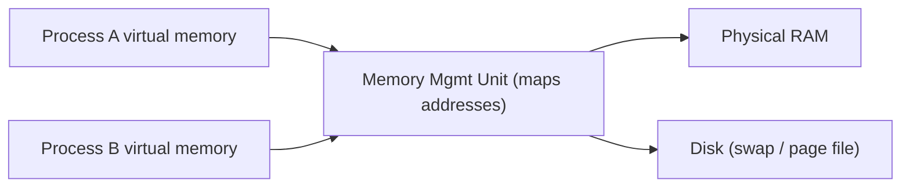

⬅ [Back to Index](../README.md)

# Memory & File Systems

Two things every OS must manage well: **memory** (fast, temporary working space) and the **file system** (permanent storage on disk). Getting these right is what makes a computer feel fast and reliable.

### 🎓 Professional (IT-Standard) Reference

| Concept | Layman View | Professional (IT-Standard) View + Example |
|---------|-------------|--------------------------------------------|
| RAM | Fast temporary workspace | Random Access Memory (RAM) is volatile memory holding active code and data.<br>It is fast but cleared when power is lost.<br>The Operating System (OS) allocates and reclaims it per process.<br>Running out triggers swapping or process termination.<br>*Example: your open apps living in RAM until you close them.* |
| Virtual memory | Everyone thinks they have the whole computer | Virtual memory gives each process its own private address space.<br>The OS maps virtual pages to physical RAM, using disk (swap/paging) when full.<br>It enables isolation and running programs larger than RAM.<br>The Memory Management Unit (MMU) performs address translation.<br>*Example: Linux swap space or the Windows page file.* |
| File system | The filing cabinet for your data | A file system organizes bytes on disk into files and directories with metadata.<br>It tracks names, sizes, permissions, and timestamps.<br>It provides journaling for crash consistency.<br>Different file systems trade off speed, size limits, and features.<br>*Example: New Technology File System (NTFS) on Windows, ext4 on Linux.* |

---

## 🧠 Memory Basics

- **RAM** — fast, volatile working memory. Cleared on power off.
- **Virtual memory** — each process sees its *own* address space; the OS maps it to physical RAM and spills to disk (**paging/swap**) when needed.



**Explanation:** Each process is fooled into thinking it owns a full block of memory. The MMU quietly maps those "virtual" addresses to real RAM — and when RAM is full, older pages are pushed to disk so everything keeps working (just slower).

---

## 🗄️ File Systems

A file system organizes bytes on disk into files and directories, tracking metadata (name, size, permissions, timestamps).

| OS | Common File Systems |
|----|---------------------|
| Windows | NTFS, exFAT, FAT32 |
| Linux | ext4, XFS, Btrfs |
| macOS | APFS, HFS+ |

### Paths differ per OS

```bash
# Linux/macOS: forward slashes, single root /
/home/user/notes.txt
```

```text
# Windows: backslashes and drive letters
C:\Users\user\notes.txt
```

---

## 🗂️ Simple Analogy

Think of an **office**:

- **RAM** = the desk you're actively working on (limited, gets cleared each night).
- **Disk / file system** = the filing cabinet (huge, keeps things permanently).
- **Virtual memory** = giving every employee their *own* copy of the desk layout, even though there's only one real desk shared behind the scenes.

---

## 🧪 Inspect It Yourself

```bash
# Linux / macOS
free -h           # memory usage
df -h             # disk space per file system
du -sh *          # size of items in current folder
```

```powershell
# Windows PowerShell
Get-Counter '\Memory\Available MBytes'
Get-PSDrive -PSProvider FileSystem
Get-Volume
```

---

## 🧗 What You Gain: 50+ Years of Experience, Condensed

Work through this lesson and you absorb judgment that normally takes a career to earn. Each stage below is not just a shift in viewpoint but a level of mastery you unlock. By the end you carry the instincts of someone with 50+ years in the field:

| Stage | How you see memory & files | What you can do |
|-------|----------------------------|-----------------|
| 🌱 **Beginner** | "RAM makes it fast; disk stores my files." | Check free space; save and open files. |
| 🧭 **Learner** | RAM is temporary; the file system organizes disk. | Read `free`/`df`/`du`; understand paths and permissions. |
| 🛠️ **Practitioner** | Virtual memory and caching sit between app and hardware. | Diagnose "out of memory" and "disk full"; read `/proc/meminfo`. |
| 🚀 **Advanced** | Paging, mmap, page cache, and journaling shape performance. | Tune swappiness, cache behavior, and I/O patterns. |
| 🏛️ **Veteran** | Storage is a hierarchy of trade-offs (latency, durability, cost). | Design data layout, durability, and caching for scale. |

---

## 🔬 Deep Dive — Advanced & Expert Insights

- **Virtual memory mechanics:** each process sees a private address space; the MMU maps virtual pages to physical frames via page tables, with the TLB caching translations. A page fault fetches the page (or kills the process on a bad access).
- **The page cache is why the second read is fast:** the OS keeps recently used file data in free RAM. "Free RAM" that looks used is often just cache — a classic beginner misread of `top`.
- **mmap vs read/write:** memory-mapping a file lets you treat it as an array and lets the OS page it in on demand — powerful for large files and databases, but with subtle flush/durability rules.
- **Journaling & fsync:** file systems (ext4, NTFS, APFS, ZFS) journal metadata to survive crashes. `fsync()` is the difference between "written" and "durable" — the root cause of many real-world data-loss bugs.
- **Inodes, links, and copy-on-write:** hard links share an inode; ZFS/APFS/Btrfs snapshots use copy-on-write so a "copy" is instant until data diverges.
- **The storage hierarchy:** registers → cache → RAM → NVMe/SSD → HDD → network/object storage, each roughly 10–100× slower and cheaper than the last. Veterans design around *where* data lives.

> 🏛️ **Veteran habit:** ask "is it durable, or just written?" and "is this cached, and by whom?" — those two questions explain most storage surprises.

---

## ✅ Key Takeaways

- **RAM** is fast and temporary; **disk** is large and permanent.
- **Virtual memory** isolates processes and lets you exceed physical RAM.
- The **file system** organizes and protects data with metadata and permissions.
- Paths, roots, and file systems differ across Windows, Linux, and macOS.

---

**Navigation:** [Next → Windows](../02-Types-of-OS/windows.md) | ⬅ [Back to Index](../README.md)
