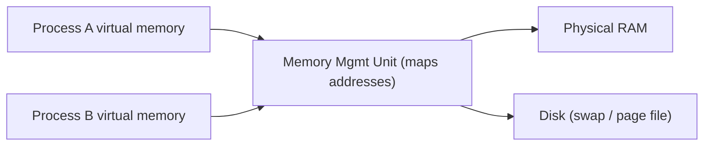

⬅ [Back to Index](../README.md)

# Memory & File Systems

Two things every OS must manage well: **memory** (fast, temporary working space) and the **file system** (permanent storage on disk). Getting these right is what makes a computer feel fast and reliable.

### 🎓 Professional (IT-Standard) Reference

| Concept | Layman View | Professional (IT-Standard) View + Example |
|---------|-------------|--------------------------------------------|
| RAM | Fast temporary workspace | Random Access Memory (RAM) is volatile memory holding active code and data.<br>It is fast but cleared when power is lost.<br>The Operating System (OS) allocates and reclaims it per process.<br>Running out triggers swapping or process termination.<br>*Example: your open apps living in RAM until you close them.* |
| Virtual memory | Everyone thinks they have the whole computer | Virtual memory gives each process its own private address space.<br>The OS maps virtual pages to physical RAM, using disk (swap/paging) when full.<br>It enables isolation and running programs larger than RAM.<br>The Memory Management Unit (MMU) performs address translation.<br>*Example: Linux swap space or the Windows page file.* |
| File system | The filing cabinet for your data | A file system organizes bytes on disk into files and directories with metadata.<br>It tracks names, sizes, permissions, and timestamps.<br>It provides journaling for crash consistency.<br>Different file systems trade off speed, size limits, and features.<br>*Example: New Technology File System (NTFS) on Windows, ext4 on Linux.* |

---

## 🧠 Memory Basics

- **RAM** — fast, volatile working memory. Cleared on power off.
- **Virtual memory** — each process sees its *own* address space; the OS maps it to physical RAM and spills to disk (**paging/swap**) when needed.



**Explanation:** Each process is fooled into thinking it owns a full block of memory. The MMU quietly maps those "virtual" addresses to real RAM — and when RAM is full, older pages are pushed to disk so everything keeps working (just slower).

---

## 🗄️ File Systems

A file system organizes bytes on disk into files and directories, tracking metadata (name, size, permissions, timestamps).

| OS | Common File Systems |
|----|---------------------|
| Windows | NTFS, exFAT, FAT32 |
| Linux | ext4, XFS, Btrfs |
| macOS | APFS, HFS+ |

### Paths differ per OS

```bash
# Linux/macOS: forward slashes, single root /
/home/user/notes.txt
```

```text
# Windows: backslashes and drive letters
C:\Users\user\notes.txt
```

---

## 🗂️ Simple Analogy

Think of an **office**:

- **RAM** = the desk you're actively working on (limited, gets cleared each night).
- **Disk / file system** = the filing cabinet (huge, keeps things permanently).
- **Virtual memory** = giving every employee their *own* copy of the desk layout, even though there's only one real desk shared behind the scenes.

---

## 🧪 Inspect It Yourself

```bash
# Linux / macOS
free -h           # memory usage
df -h             # disk space per file system
du -sh *          # size of items in current folder
```

```powershell
# Windows PowerShell
Get-Counter '\Memory\Available MBytes'
Get-PSDrive -PSProvider FileSystem
Get-Volume
```

---

## ✅ Key Takeaways

- **RAM** is fast and temporary; **disk** is large and permanent.
- **Virtual memory** isolates processes and lets you exceed physical RAM.
- The **file system** organizes and protects data with metadata and permissions.
- Paths, roots, and file systems differ across Windows, Linux, and macOS.

---

**Navigation:** [Next → Windows](../02-Types-of-OS/windows.md) | ⬅ [Back to Index](../README.md)
