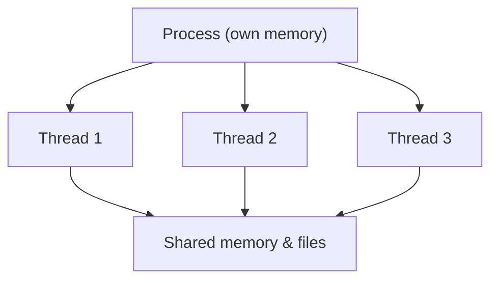
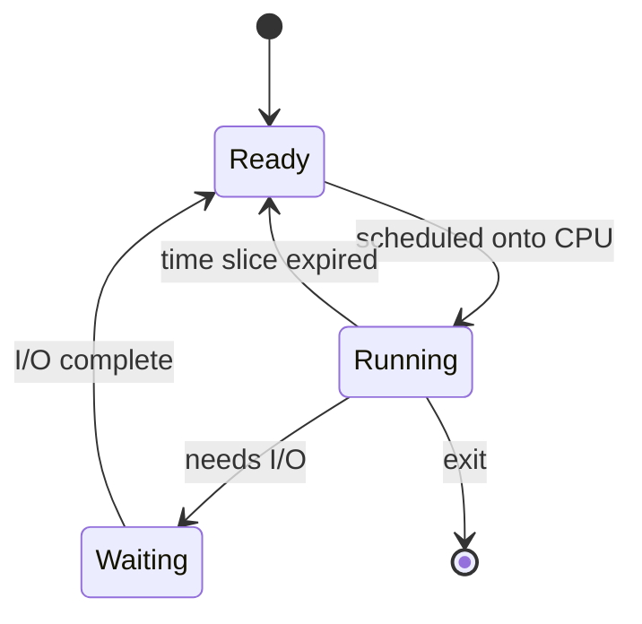

⬅ [Back to Index](../README.md)

# Processes & Threads

When you launch a program, the OS turns it into a **process**. Inside that process, one or more **threads** do the actual work. Understanding the difference is essential for performance, scripting, and debugging.

### 🎓 Professional (IT-Standard) Reference

| Concept | Layman View | Professional (IT-Standard) View + Example |
|---------|-------------|--------------------------------------------|
| Process | A running program with its own space | A process is an executing instance of a program with an isolated virtual address space.<br>It owns resources like memory, file handles, and a Process Identifier (PID).<br>The Operating System (OS) schedules it independently.<br>Inter-Process Communication (IPC) is needed to share data.<br>*Example: each Chrome tab running as a separate process.* |
| Thread | A worker inside a process | A thread is the smallest unit of execution scheduled by the OS.<br>Threads within a process share memory and resources.<br>They are cheaper to create than processes.<br>They enable concurrency within one program.<br>*Example: a web server using a thread per request.* |
| Context switch | The OS swapping who's working | A context switch saves one task's state and restores another's.<br>It lets a single CPU core appear to run many tasks at once.<br>Each switch has measurable overhead.<br>Excessive switching hurts performance (thrashing).<br>*Example: the scheduler rotating between processes every time slice.* |

---

## ⚖️ Process vs Thread

| | Process | Thread |
|---|---------|--------|
| Memory | Isolated (own address space) | Shared within the process |
| Creation cost | Higher | Lower |
| Crash impact | Contained to itself | Can crash the whole process |
| Communication | Needs IPC (pipes, sockets) | Shared variables (needs locks) |



**Explanation:** A process is like a house with its own address; threads are the people living inside it who all share the same rooms. Multiple houses (processes) stay private from each other, but roommates (threads) must coordinate to avoid bumping into one another.

---

## 🔄 Process States



**Explanation:** A process constantly moves between **Ready** (waiting for a turn), **Running** (using the CPU), and **Waiting** (blocked on disk or network). The scheduler orchestrates these transitions thousands of times per second.

---

## 🏭 Simple Analogy

Think of a **factory**:

- A **process** is a separate factory building with its own equipment.
- **Threads** are workers inside one building sharing the same tools and workbench.
- A **context switch** is a worker pausing one task to pick up another.

---

## 🧪 See Them Live

```bash
# Linux / macOS
ps aux            # list all processes
top               # live process view (press q to quit)
htop              # nicer live view (if installed)
```

```powershell
# Windows PowerShell
Get-Process | Sort-Object CPU -Descending | Select-Object -First 5
Get-Process chrome | Select-Object Id, Name, Threads
```

---

## ✅ Key Takeaways

- A **process** is an isolated running program; a **thread** runs inside it.
- Threads share memory (fast, but need synchronization); processes don't (safe, but need IPC).
- The scheduler uses **context switches** to share CPU cores.
- Use process/thread tools (`ps`, `top`, `Get-Process`) to inspect what's running.

---

**Navigation:** [Next → Memory & File Systems](memory-filesystem.md) | ⬅ [Back to Index](../README.md)
