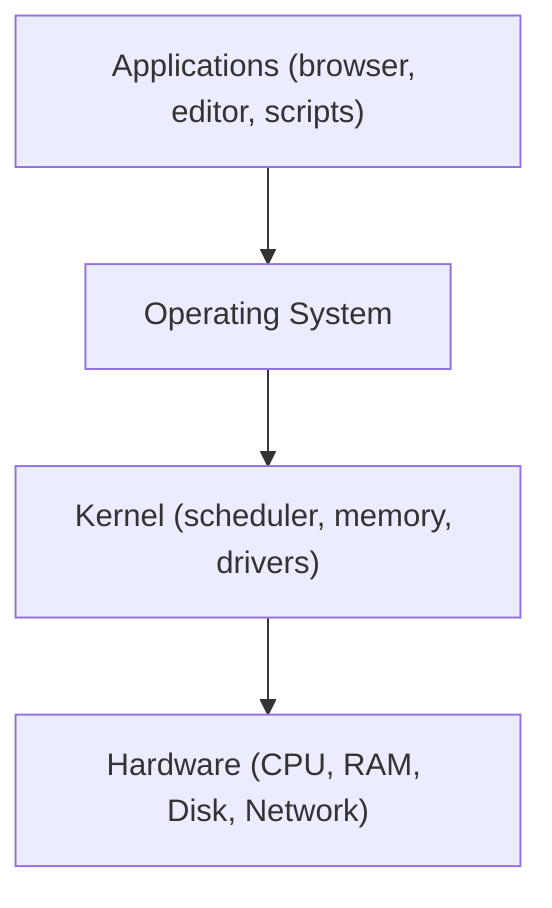

⬅ [Back to Index](../README.md)

# What is an Operating System?

An **operating system (OS)** is the software that sits between your hardware (CPU, memory, disk, network) and your applications. It manages those resources and provides services so that programs can run without talking to hardware directly.

Instead of every app fighting over the CPU or memory, the OS acts as a fair, secure **manager** that shares the machine among everyone.

### 🎓 Professional (IT-Standard) Reference

| Concept | Layman View | Professional (IT-Standard) View + Example |
|---------|-------------|--------------------------------------------|
| Resource management | Shares the computer between programs | The OS allocates Central Processing Unit (CPU) time, memory, and Input/Output (I/O) among competing processes. A scheduler decides which process runs next. This prevents resource starvation and contention. It enables multitasking on a single machine. *Example: the Linux Completely Fair Scheduler (CFS) time-slicing processes.* |
| Abstraction | Hides the messy hardware details | The OS presents a uniform interface over diverse hardware via device drivers. Applications use System Calls instead of hardware registers. This makes software portable across machines. Developers code against a stable Application Programming Interface (API). *Example: writing to a file with `open()`/`write()` regardless of disk brand.* |
| Isolation & security | Keeps programs from breaking each other | The OS enforces process isolation and access control. Each process has a protected virtual address space. User accounts and permissions restrict actions. A crash in one app does not take down the whole system. *Example: Unix file permissions and Windows Access Control Lists (ACLs).* |

---

## 🧩 Core Responsibilities

| Responsibility | What it does |
|----------------|--------------|
| **Process management** | Starts, schedules, pauses, and stops programs |
| **Memory management** | Allocates RAM and provides virtual memory |
| **File system** | Organizes data on disk into files and folders |
| **Device I/O** | Talks to keyboard, disk, and network via drivers |
| **Security** | Manages users, permissions, and isolation |

---

## 🗺️ Where the OS Sits

**Explanation:** Applications never touch the hardware directly. They call the OS, whose **kernel** safely coordinates the CPU, memory, disk, and devices underneath. This layering is what keeps a modern computer stable even with hundreds of programs running.

---

## 🍽️ Simple Analogy

Think of a **busy restaurant**:

| Restaurant | Operating System |
|------------|------------------|
| Kitchen & staff (do the actual cooking) | Hardware (does the actual work) |
| Head chef / manager (assigns tasks) | The OS (schedules and shares resources) |
| A written recipe card | A script (repeatable steps) |
| Health & safety rules | Permissions and security |

---

## 🧩 Real-World Examples

- **Windows** powers most desktop PCs and enterprise servers.
- **Linux** runs the majority of cloud servers, containers, and Android phones.
- **macOS** is Apple's Unix-based desktop OS for developers and creatives.
- **iOS / Android** are the operating systems in your pocket.
- **FreeRTOS / VxWorks** run inside cars, routers, and IoT devices.

---

## 🔑 The Big Picture

Operating systems are organized around a few core ideas you'll explore next:

1. **[Kernel vs User Space](kernel-vs-userspace.md)** — how the OS stays safe.
2. **[Processes & Threads](processes-threads.md)** — how programs actually run.
3. **[Memory & File Systems](memory-filesystem.md)** — how data is stored and accessed.

---

## ✅ Key Takeaways

- An OS manages hardware and provides services to applications.
- It fairly shares the CPU, memory, disk, and devices.
- It isolates programs so one crash doesn't sink the whole system.
- Everything you script or automate ultimately runs on top of an OS.

---

**Navigation:** [Next → Kernel vs User Space](kernel-vs-userspace.md) | ⬅ [Back to Index](../README.md)
