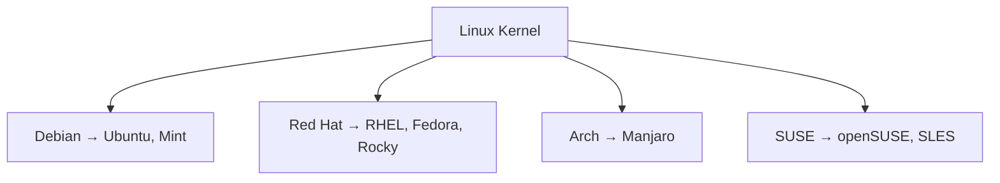

⬅ [Back to Index](../README.md)

# Linux Distributions

Linux is not a single product — it's a **kernel**. A "distribution" (distro) bundles that kernel with tools, a package manager, and sensible defaults to make a complete operating system. Linux dominates servers, cloud, and containers.

### 🎓 Professional (IT-Standard) Reference

| Concept | Layman View | Professional (IT-Standard) View + Example |
|---------|-------------|--------------------------------------------|
| Linux kernel | The engine shared by all distros | The Linux kernel is the open-source core managing hardware, processes, and memory.<br>It is licensed under the GNU General Public License (GPL).<br>Every distribution ships a version of this same kernel.<br>It powers everything from phones to supercomputers.<br>*Example: Android and Red Hat Enterprise Linux both run the Linux kernel.* |
| Distribution | A ready-to-use Linux bundle | A distribution packages the kernel with a package manager, libraries, and defaults.<br>It defines the release cycle and support model.<br>Enterprises pick distros for stability and vendor support.<br>Choice affects tooling and package format.<br>*Example: Ubuntu (Debian-based) versus Red Hat Enterprise Linux (RHEL).* |
| Package manager | The app store for the OS | A package manager installs, updates, and removes software with dependency resolution.<br>It pulls from trusted repositories.<br>It keeps systems consistent and patchable.<br>Format differs per distro family.<br>*Example: `apt` on Debian/Ubuntu, `dnf` on Fedora/RHEL.* |

---

## 🌳 Popular Families

| Family | Distros | Package Manager |
|--------|---------|-----------------|
| Debian | Debian, **Ubuntu**, Mint | `apt` |
| Red Hat | **RHEL**, Fedora, Rocky/AlmaLinux | `dnf` / `yum` |
| Arch | Arch, Manjaro | `pacman` |
| SUSE | openSUSE, SLES | `zypper` |



**Explanation:** All distributions share the same Linux kernel engine. They differ in packaging, defaults, release cadence, and support — so you pick a "family" based on your needs (stability, bleeding-edge, or enterprise support).

---

## 🚀 Why Linux Dominates Servers & Cloud

- 🆓 **Free & open source** — no licensing cost, full transparency.
- 🧩 **Scriptable everything** — ideal for automation and DevOps.
- 🐳 **Native home of containers** — Docker and Kubernetes were built for Linux.
- ⚙️ **Stable & efficient** — runs for years without reboots.

```bash
# Identify your distro
cat /etc/os-release
```

---

## 🧰 Simple Analogy

The Linux **kernel** is like a car **engine**; a **distro** is the full car built around it. Ubuntu, Fedora, and Arch are different car brands using the same engine — same power, different dashboards, trims, and warranties.

---

## 🧩 Real-World Examples

- ☁️ **Cloud servers** — the majority of AWS/Azure/GCP instances run Linux.
- 🐳 **Containers** — Docker images are almost always Linux-based.
- 📱 **Android** — built on the Linux kernel.
- 🌐 **Web servers** — Nginx and Apache on Ubuntu/RHEL power much of the internet.

---

## 🧗 What You Gain: 50+ Years of Experience, Condensed

Work through this lesson and you absorb judgment that normally takes a career to earn. Each stage below is not just a shift in viewpoint but a level of mastery you unlock. By the end you carry the instincts of someone with 50+ years in the field:

| Stage | How you see Linux distros | What you can do |
|-------|---------------------------|-----------------|
| 🌱 **Beginner** | "That black screen hackers use." | Boot a live USB; run a few commands. |
| 🧭 **Learner** | A kernel + packaging (apt/dnf/pacman). | Install packages, edit configs, use a package manager. |
| 🛠️ **Practitioner** | A server platform driven by systemd and files. | Manage services, users, permissions, and logs. |
| 🚀 **Advanced** | A tunable system (kernel params, cgroups, SELinux). | Harden, tune, and containerize workloads. |
| 🏛️ **Veteran** | A base to build reproducible infrastructure on. | Design golden images, immutable infra, distro strategy. |

---

## 🔬 Deep Dive — Advanced & Expert Insights

- **Distro = kernel + userland + package policy:** the real differences are the package manager (apt/dnf/pacman/zypper), release cadence (rolling vs LTS), and default security posture — not the logo.
- **systemd runs modern Linux:** units, targets, timers, journald, and cgroup integration replaced the old init scripts. Knowing `systemctl`/`journalctl` deeply is a practitioner-to-advanced dividing line.
- **Stability vs freshness:** choose LTS (Ubuntu LTS, RHEL, Debian stable) for servers; rolling (Arch, openSUSE Tumbleweed) for latest packages. This choice is an operational trade-off, not taste.
- **Security frameworks:** SELinux (Red Hat) and AppArmor (Debian/SUSE) enforce mandatory access control beyond file permissions — essential for hardened, multi-tenant hosts.
- **Containers are just Linux:** namespaces + cgroups + overlayfs are kernel features. "It runs in Docker" means "the Linux kernel isolates it" — there's no magic VM.
- **Immutable & reproducible:** veterans favor golden images (Packer), immutable distros (Flatcar, Bottlerocket), and declarative configs over hand-tuned snowflake servers.

> 🏛️ **Veteran habit:** pick a distro for its *support lifecycle and security model*, then make every box reproducible from code.

---

## ✅ Key Takeaways

- Linux is a kernel; a **distro** turns it into a full OS.
- Families (Debian, Red Hat, Arch, SUSE) differ mainly in packaging and support.
- It's free, scriptable, and the backbone of cloud and containers.
- Use `cat /etc/os-release` to identify any Linux system.

---

**Navigation:** [Next → macOS](macos.md) | ⬅ [Back to Index](../README.md)
