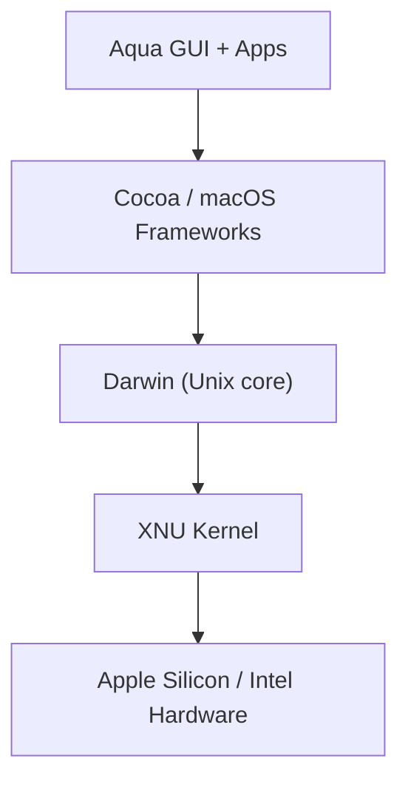

⬅ [Back to Index](../README.md)

# macOS

Apple's **macOS** is a desktop operating system built on a **Unix** foundation (Darwin/BSD). Because it's Unix-like, it feels familiar to Linux users and is popular with developers and creative professionals.

### 🎓 Professional (IT-Standard) Reference

| Concept | Layman View | Professional (IT-Standard) View + Example |
|---------|-------------|--------------------------------------------|
| macOS foundation | A polished Unix under the hood | macOS is built on Darwin, an open-source Unix-based core with an eXtensible Nucleus (XNU) kernel.<br>It is certified Unix and largely Portable Operating System Interface (POSIX) compliant.<br>This makes most Unix/Linux command-line tools work natively.<br>Apple layers its Aqua Graphical User Interface (GUI) on top.<br>*Example: running standard `grep`, `ssh`, and `bash` in Terminal.* |
| APFS | Apple's modern file system | The Apple File System (APFS) is optimized for Solid State Drives (SSDs).<br>It supports snapshots, cloning, and strong encryption.<br>It replaced the older Hierarchical File System Plus (HFS+).<br>It provides crash protection and space sharing.<br>*Example: Time Machine snapshots powered by APFS.* |
| Homebrew & launchd | App store for devs + service manager | Homebrew is the community package manager for macOS command-line software.<br>launchd manages system and user background services (not systemd).<br>Together they cover installation and process management.<br>They are core to a developer's macOS setup.<br>*Example: `brew install wget` and `launchctl list`.* |

---

## 🧱 Key Traits

- **APFS** file system, optimized for SSDs.
- Default shell is **[zsh](../03-Shells-and-Scripting-Types/zsh-fish.md)**; bash is still available.
- **Homebrew** (`brew`) is the de-facto package manager.
- Unix tools work out of the box — great for development.



**Explanation:** macOS pairs a beautiful GUI and Apple frameworks on top of a genuine Unix core (Darwin/XNU). That's why it can look consumer-friendly while still running the same command-line tools developers use on Linux servers.

---

## 🍎 Simple Analogy

macOS is like a **luxury apartment built on a rock-solid Unix foundation**: the décor (GUI) is elegant and curated, but the plumbing and wiring (Unix tools) are the same industrial-grade systems the pros use everywhere.

---

## 🧪 macOS in Action

```bash
# Install a tool via Homebrew
brew install wget

# macOS version and hardware
sw_vers
uname -a
```

> 💡 Because macOS is Unix-like, most Linux shell scripts run with little or no change — a big reason developers love it.

---

## 🧩 Real-World Examples

- 👨‍💻 **Software developers** who deploy to Linux servers but code on a Mac.
- 🎨 **Designers & video editors** using Final Cut, Photoshop, and Xcode.
- 📱 **iOS app development** — Xcode only runs on macOS.

---

## ✅ Key Takeaways

- macOS is a **Unix-based** desktop OS with a polished GUI.
- It uses **APFS** and defaults to the **zsh** shell.
- **Homebrew** installs tools; **launchd** manages services.
- Its Unix roots make it a favorite for developers.

---

**Navigation:** [Next → Unix](unix.md) | ⬅ [Back to Index](../README.md)
