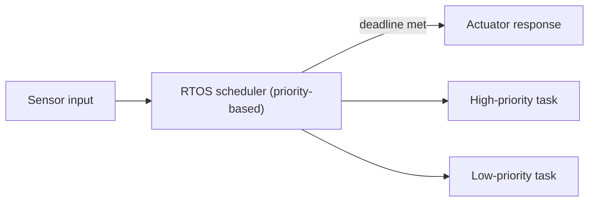

⬅ [Back to Index](../README.md)

# RTOS & Embedded Operating Systems

A **Real-Time Operating System (RTOS)** guarantees that tasks complete within strict time deadlines. Embedded operating systems are small, specialized systems that run inside devices — from cars to smartwatches — where reliability and timing are critical.

### 🎓 Professional (IT-Standard) Reference

| Concept | Layman View | Professional (IT-Standard) View + Example |
|---------|-------------|--------------------------------------------|
| RTOS | An OS that never misses a deadline | A Real-Time Operating System (RTOS) provides deterministic, bounded response times. It uses priority-based preemptive scheduling. Timing guarantees matter more than raw throughput. It is small, predictable, and often certified for safety. *Example: FreeRTOS in a drone flight controller.* |
| Embedded OS | The tiny OS inside a device | An embedded OS runs on resource-constrained hardware dedicated to a single purpose. It has a small memory and storage footprint. It often runs without a Graphical User Interface (GUI). It may or may not be real-time. *Example: the firmware OS inside a router or smart thermostat.* |
| Determinism | Always responds in the same time | Determinism means an operation completes within a guaranteed worst-case time. It is essential for control systems and safety. Jitter (timing variation) must be minimized. It is measured and certified, not assumed. *Example: an airbag controller firing within milliseconds, every time.* |

---

## 📍 Where They Run

- 🚗 Automotive Electronic Control Units (ECUs)
- ✈️ Avionics and flight systems
- 🏭 Industrial machine controllers
- ⌚ IoT devices, wearables, medical devices

**Explanation:** An RTOS constantly prioritizes tasks so the most time-critical one (like reading a crash sensor) always runs first and finishes within a guaranteed window. Missing that window isn't just slow — it can be dangerous.

---

## ⏱️ Hard vs Soft Real-Time

| Type | A Missed Deadline Means... | Example |
|------|----------------------------|---------|
| **Hard real-time** | Total failure | Airbag deployment, pacemaker |
| **Soft real-time** | Degraded quality | Video streaming stutter |

---

## 🎛️ Simple Analogy

An RTOS is like a **Formula 1 pit crew**: every action is choreographed to finish within a guaranteed split-second. A normal desktop OS is more like a **home cook** — it gets things done, but timing can vary and that's fine.

---

## 🧩 Examples of RTOS/Embedded Systems

- **FreeRTOS** — tiny, popular in IoT and hobby projects.
- **VxWorks** — used in spacecraft and industrial systems.
- **Zephyr** — modern, scalable RTOS for connected devices.
- **QNX** — powers many automotive infotainment systems.

---

## ✅ Key Takeaways

- An RTOS guarantees **deterministic, deadline-bound** responses.
- Embedded OSes are small and dedicated to a single device's job.
- **Hard** real-time failures are catastrophic; **soft** ones just degrade quality.
- They power cars, medical devices, aerospace, and IoT.

---

**Navigation:** [Next → Bash](../03-Shells-and-Scripting-Types/bash.md) | ⬅ [Back to Index](../README.md)
