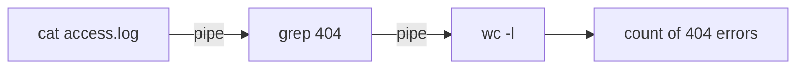

⬅ [Back to Index](../README.md)

# Unix

**Unix** is the ancestor that shaped modern operating system design. Created at Bell Labs in the 1970s, its ideas live on in Linux, macOS, and BSD — and its philosophy still guides how we write scripts today.

### 🎓 Professional (IT-Standard) Reference

| Concept | Layman View | Professional (IT-Standard) View + Example |
|---------|-------------|--------------------------------------------|
| Unix | The original multi-user OS | Unix is a family of multitasking, multi-user operating systems from the 1970s.<br>It introduced hierarchical file systems, pipes, and the shell.<br>Its design influenced nearly every modern OS.<br>Certified Unix must meet the Single UNIX Specification.<br>*Example: IBM AIX, Oracle Solaris, and HP-UX.* |
| POSIX | The rulebook that keeps Unix compatible | The Portable Operating System Interface (POSIX) standardizes Unix Application Programming Interfaces (APIs).<br>It lets software run across different Unix-like systems.<br>Shells and utilities target POSIX for portability.<br>Linux and macOS are largely POSIX-compliant.<br>*Example: a POSIX shell script running on both Linux and macOS.* |
| Unix philosophy | Small tools that combine | The Unix philosophy favors small programs that do one thing well.<br>Programs are composed via pipes and text streams.<br>"Everything is a file" unifies devices and data.<br>This underpins powerful command-line automation.<br>*Example: `cat log | grep error | wc -l` chaining three tools.* |

---

## 🧠 The Unix Philosophy

- ✅ Write programs that do **one thing well**.
- ✅ Make programs work **together** (via pipes).
- ✅ Treat **everything as a file**.



**Explanation:** Instead of one giant program, Unix chains tiny specialized tools with **pipes** — the output of one becomes the input of the next. This composability is why the command line is so powerful for automation.

---

## 🌳 Unix vs Unix-like

| Type | Meaning | Examples |
|------|---------|----------|
| **True Unix** | Certified against the Unix standard | AIX, HP-UX, Solaris |
| **Unix-like** | Behaves like Unix, not certified | Linux, macOS, BSD |

---

## 🏛️ Simple Analogy

Unix is like **Latin** for operating systems: few people run the original today, but its "grammar" (pipes, files, shells) lives on in every modern descendant. Learn the grammar once, and Linux and macOS both become readable.

---

## 🧪 Classic Unix Composition

```bash
# Count how many times "404" appears in a log — three small tools working together
cat access.log | grep "404" | wc -l
```

---

## 🧩 Real-World Examples

- 🏦 **Banks & telcos** running Solaris or AIX for legacy reliability.
- 🖥️ **Every Linux server** inherits Unix design.
- 🍎 **macOS** is certified Unix under the hood.

---

## 🧗 What You Gain: 50+ Years of Experience, Condensed

Work through this lesson and you absorb judgment that normally takes a career to earn. Each stage below is not just a shift in viewpoint but a level of mastery you unlock. By the end you carry the instincts of someone with 50+ years in the field:

| Stage | How you see Unix | What you can do |
|-------|------------------|-----------------|
| 🌱 **Beginner** | "An old operating system." | Recognize Unix-like commands. |
| 🧭 **Learner** | The ancestor of Linux, macOS, and BSD. | Use pipes and small tools together. |
| 🛠️ **Practitioner** | A philosophy: small tools + "everything is a file." | Compose `grep`/`sed`/`awk` pipelines fluently. |
| 🚀 **Advanced** | A POSIX contract that guarantees portability. | Write portable scripts that run across Unix-likes. |
| 🏛️ **Veteran** | A design language that still shapes modern systems. | Apply Unix principles to APIs, tooling, and architecture. |

---

## 🔬 Deep Dive — Advanced & Expert Insights

- **"Everything is a file" runs deep:** devices (`/dev`), kernel state (`/proc`, `/sys`), sockets, and pipes are all file-like. This uniformity is why the same tools work everywhere.
- **The Unix philosophy** — do one thing well, compose via text streams, expect the output to be someone else's input — still guides good CLI and API design today.
- **POSIX is the portability contract:** writing to POSIX (`sh`, not `bash`-isms) is what lets a script run on Linux, macOS, BSD, and Solaris unchanged.
- **Genealogy matters:** BSD (FreeBSD/OpenBSD/macOS) vs System V (traditional commercial Unix) explains differences in `ps` flags, init systems, and tooling you'll hit in the wild.
- **File descriptors, signals, and fork/exec** are the Unix primitives every higher-level system (containers, shells, servers) is built from — learning them once pays off across all Unix-likes.

> 🏛️ **Veteran habit:** when a tool feels awkward, ask "what's the smallest composable piece?" — the Unix answer usually beats a monolithic one.

---

## ✅ Key Takeaways

- Unix is the ancestor of Linux, macOS, and BSD.
- Its philosophy: **small tools, pipes, and "everything is a file."**
- **POSIX** keeps Unix-like systems compatible.
- Learning Unix concepts transfers directly to Linux and macOS.

---

**Navigation:** [Next → RTOS & Embedded](rtos-embedded.md) | ⬅ [Back to Index](../README.md)
