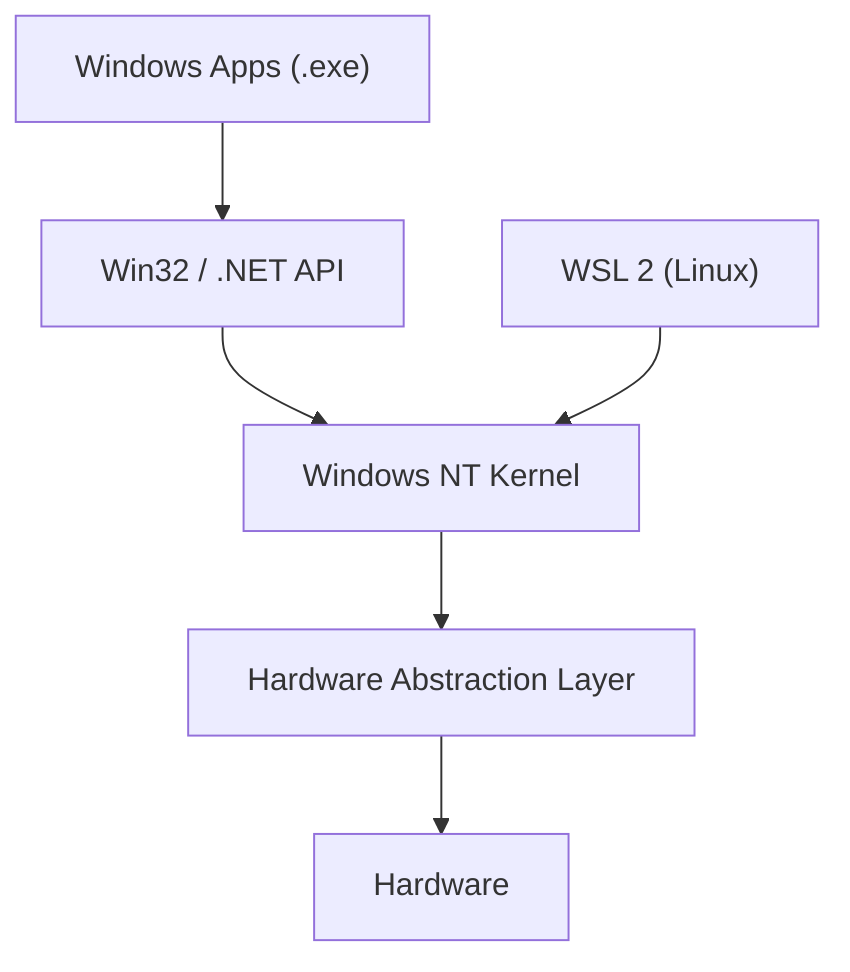

⬅ [Back to Index](../README.md)

# Windows

Microsoft **Windows** is the world's dominant **desktop** operating system and a major force in enterprise servers (Windows Server). It is known for its graphical, user-friendly design and huge software/hardware compatibility.

### 🎓 Professional (IT-Standard) Reference

| Concept | Layman View | Professional (IT-Standard) View + Example |
|---------|-------------|--------------------------------------------|
| Windows OS | The familiar PC operating system | Microsoft Windows is a proprietary Operating System (OS) family for desktops and servers. It uses the New Technology File System (NTFS) and a Graphical User Interface (GUI) first design. Enterprises manage it with Active Directory (AD) and Group Policy. Automation is done via PowerShell and, legacy, Command Prompt (CMD). *Example: Windows 11 on laptops and Windows Server 2022 in data centers.* |
| WSL | Running Linux inside Windows | Windows Subsystem for Linux (WSL) runs a real Linux kernel and userland on Windows. It lets developers use Linux tools without dual booting. WSL 2 uses a lightweight virtual machine for full compatibility. It bridges Windows and Linux workflows. *Example: running Ubuntu and Bash on a Windows dev machine.* |
| Registry & services | Central settings + background programs | The Windows Registry is a hierarchical database of system and app configuration. Windows Services are background processes managed by the Service Control Manager (SCM). Together they control startup and system behavior. Admins manage them via consoles and PowerShell. *Example: `Get-Service` listing running background services.* |

---

## 🧱 Key Traits

- **GUI-first**, with the widest software and hardware compatibility.
- **NTFS** file system, drive letters (`C:\`, `D:\`).
- Scripting via **[PowerShell](../03-Shells-and-Scripting-Types/powershell.md)** (modern) and **[CMD/Batch](../03-Shells-and-Scripting-Types/batch-cmd.md)** (legacy).
- **WSL** runs real Linux tooling inside Windows.

**Explanation:** Windows apps talk to the Win32/.NET APIs, which call into the NT kernel, which reaches hardware through a Hardware Abstraction Layer. WSL 2 runs a real Linux environment alongside, so developers get both worlds on one machine.

---

## 🗂️ Editions

| Edition | Use Case |
|---------|----------|
| Home | Everyday users |
| Pro | Developers, small business (BitLocker, Hyper-V) |
| Enterprise | Large organizations (advanced management/security) |
| Server | Hosting, Active Directory, Internet Information Services (IIS) |

---

## 🏢 Simple Analogy

Windows is like a **fully-furnished chain hotel**: familiar layout everywhere you go, everything works out of the box, and there's staff (drivers, updates) handling the messy details — you rarely need to look under the hood.

---

## 🧩 Real-World Examples

- 🏢 **Corporate desktops** managed by Active Directory and Group Policy.
- 🎮 **Gaming PCs** — the dominant platform for PC games.
- 🖥️ **Windows Server** hosting IIS websites and SQL Server databases.
- 👨‍💻 **Developer machines** using WSL for Linux tooling.

---

## 🧗 What You Gain: 50+ Years of Experience, Condensed

Work through this lesson and you absorb judgment that normally takes a career to earn. Each stage below is not just a shift in viewpoint but a level of mastery you unlock. By the end you carry the instincts of someone with 50+ years in the field:

| Stage | How you see Windows | What you can do |
|-------|---------------------|-----------------|
| 🌱 **Beginner** | "The desktop with the Start menu." | Install apps, use File Explorer. |
| 🧭 **Learner** | An OS with NTFS, drive letters, and the registry. | Use Task Manager, PowerShell basics, environment variables. |
| 🛠️ **Practitioner** | A scriptable, policy-driven platform. | Automate with PowerShell; manage services, scheduled tasks, WSL. |
| 🚀 **Advanced** | Active Directory, Group Policy, and remoting at scale. | Manage fleets with GPO/Intune, PowerShell Remoting, DSC. |
| 🏛️ **Veteran** | An enterprise identity + management ecosystem. | Design domain, security, and automation architecture. |

---

## 🔬 Deep Dive — Advanced & Expert Insights

- **The registry is a database, not just settings:** `HKLM`/`HKCU` hives drive nearly all configuration. Veterans script it, back it up, and audit it — never hand-edit blindly.
- **NT kernel roots:** Windows NT is a hybrid kernel; the Win32 API is one subsystem. This is why WSL2 (a real Linux kernel via a lightweight VM) can coexist so cleanly.
- **PowerShell is object-oriented, not text:** pipelines pass .NET objects, not strings — a fundamental mental shift from Bash that unlocks its real power.
- **Identity is the platform:** Active Directory / Entra ID, Kerberos, and Group Policy are what make Windows dominate enterprises. Managing *identity* is the senior skill, not managing PCs.
- **Fleet management:** Intune, SCCM, DSC, and Windows Update for Business move you from "clicking on one PC" to "declaring desired state for thousands."

> 🏛️ **Veteran habit:** treat every desktop as cattle, not a pet — configuration is code (GPO/DSC/Intune), reproducible and audited.

---

## ✅ Key Takeaways

- Windows dominates desktops and is strong in the enterprise.
- It uses NTFS, drive letters, and a GUI-first design.
- **PowerShell** is the go-to scripting tool; CMD/Batch is legacy.
- **WSL** lets you run Linux directly inside Windows.

---

**Navigation:** [Next → Linux Distros](linux-distros.md) | ⬅ [Back to Index](../README.md)
