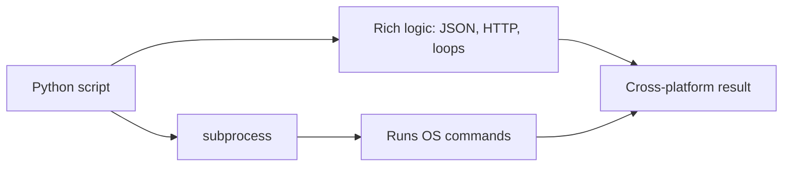

⬅ [Back to Index](../README.md)

# Python Scripting

**Python** is a cross-platform scripting favorite for when shell scripts get too complex. It's readable, runs on every OS, and has a massive library ecosystem — making it the bridge between quick shell one-liners and full applications.

### 🎓 Professional (IT-Standard) Reference

| Concept | Layman View | Professional (IT-Standard) View + Example |
|---------|-------------|--------------------------------------------|
| Python | A readable, cross-platform scripting language | Python is a high-level, interpreted language popular for automation and data tasks.<br>It runs identically on Windows, Linux, and macOS.<br>Its extensive standard library covers files, networking, and JSON.<br>It scales from one-off scripts to full applications.<br>*Example: an automation script using the `os` and `requests` modules.* |
| Interpreter & venv | The runtime + an isolated toolbox | The Python interpreter executes scripts line-by-line.<br>A virtual environment (venv) isolates project dependencies.<br>This prevents version conflicts between projects.<br>Packages are installed via the Package Installer for Python (pip).<br>*Example: `python -m venv .venv` then `pip install requests`.* |
| subprocess | Letting Python run shell commands | The `subprocess` module runs external programs from Python.<br>It captures output and exit codes safely.<br>It replaces fragile shell string-building.<br>It bridges Python logic with system commands.<br>*Example: `subprocess.run(["ls", "-la"])`.* |

---

## ▶️ Your First Script

```python
#!/usr/bin/env python3
import os

name = os.environ.get("USER", "World")
print(f"Hello, {name}!")
```

## 🧩 Shell Out When Needed

```python
import subprocess

result = subprocess.run(["ls", "-la"], capture_output=True, text=True)
print(result.stdout)
```



**Explanation:** Python handles the complex logic (parsing JSON, making HTTP calls, branching) that becomes painful in a shell, while still being able to call OS commands via `subprocess`. That combination makes it ideal when a Bash or PowerShell script starts getting unwieldy.

---

## 🚀 Why Python for Scripting

- 📖 **Readable** and consistent across Windows, Linux, macOS.
- 📦 **Huge library** — `os`, `subprocess`, `requests`, `pandas`, and more.
- 🧮 **Better for logic** — data, JSON, HTTP, and branching-heavy tasks.

---

## 🧰 Simple Analogy

A shell script is a **handwritten sticky note** — perfect for a short list. Python is a **proper word processor** — once your "note" needs tables, formatting, and logic, you switch tools to stay sane.

---

## 🧩 Real-World Examples

- 🌐 **API automation** — calling REST endpoints and processing JSON.
- 📊 **Data processing** — cleaning CSV/Excel files with pandas.
- 🤖 **DevOps glue** — orchestrating deployments and cloud SDKs.
- 🧪 **Testing & tooling** — build scripts and test harnesses.

> 💡 Rule of thumb: if a shell script grows past ~50 lines of logic, consider rewriting it in Python.

---

## ✅ Key Takeaways

- Python is **cross-platform**, readable, and library-rich.
- Use **venv + pip** to isolate project dependencies.
- Call OS commands with **`subprocess`** when needed.
- Reach for Python when shell scripts get too complex.

---

**Navigation:** [Next → Linux Commands](../04-OS-Specific-Commands/linux-commands.md) | ⬅ [Back to Index](../README.md)
