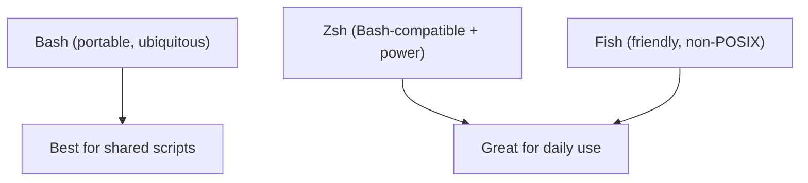

⬅ [Back to Index](../README.md)

# Zsh & Fish

**Zsh** and **Fish** are modern, user-friendly shells that improve the *interactive* experience over Bash — with smarter completion, autosuggestions, and syntax highlighting.

### 🎓 Professional (IT-Standard) Reference

| Concept | Layman View | Professional (IT-Standard) View + Example |
|---------|-------------|--------------------------------------------|
| Zsh | A supercharged, Bash-compatible shell | The Z Shell (Zsh) extends Bash with advanced completion and theming.<br>It is the default login shell on modern macOS.<br>It is largely Bash-compatible, so most scripts run unchanged.<br>Frameworks like Oh My Zsh add plugins and themes.<br>*Example: a developer using Oh My Zsh with Git-aware prompts.* |
| Fish | A friendly shell with built-in niceties | The Friendly Interactive SHell (Fish) offers autosuggestions and syntax highlighting out of the box.<br>It prioritizes usability over tradition.<br>It is not Portable Operating System Interface (POSIX) compliant.<br>Scripts need Fish-specific syntax.<br>*Example: Fish autocompleting a command from your history as you type.* |
| Interactive vs script shell | Daily typing vs automation | Interactive shells optimize the human typing experience.<br>Script shells prioritize portability and predictability.<br>Best practice: enjoy zsh/fish interactively, write portable Bash scripts.<br>This avoids portability surprises on servers.<br>*Example: zsh at your desk, `#!/usr/bin/env bash` for shared scripts.* |

---

## 🧱 Zsh

- Default shell on **macOS**.
- Powerful tab completion, themes via **Oh My Zsh**.
- Mostly **Bash-compatible**, so most scripts just work.

## 🐟 Fish (Friendly Interactive SHell)

- Autosuggestions & syntax highlighting **out of the box**.
- Cleaner, more consistent syntax — but **not POSIX-compatible**.

```fish
# Fish uses 'set' instead of VAR=value
set name "World"
echo "Hello, $name!"
```



**Explanation:** Zsh and Fish shine when you're *typing* commands all day — they guess, complete, and color-code to reduce mistakes. But for scripts you share with servers and teammates, plain **Bash** is the safe, portable choice.

---

## 🧰 Simple Analogy

Bash is a **reliable manual car** that runs anywhere. Zsh is that same car with **cruise control and parking sensors**. Fish is a **fully automatic with a heads-up display** — lovely to drive, but built a bit differently under the hood.

---

## 🧩 Real-World Examples

- 💻 **Developers on macOS** using zsh + Oh My Zsh for a rich prompt.
- 🐟 **Newcomers** enjoying Fish's autosuggestions while learning the CLI.
- 🖥️ **Servers** still standardizing on Bash for scripts and automation.

> 💡 Rule of thumb: use **zsh/fish** for interactive comfort, but write portable **Bash** for scripts you share.

---

## ✅ Key Takeaways

- Zsh and Fish improve the **interactive** shell experience.
- **Zsh** is Bash-compatible and the macOS default.
- **Fish** is the friendliest but **not POSIX-compatible**.
- Write shared automation in **Bash** for portability.

---

**Navigation:** [Next → Batch / CMD](batch-cmd.md) | ⬅ [Back to Index](../README.md)
