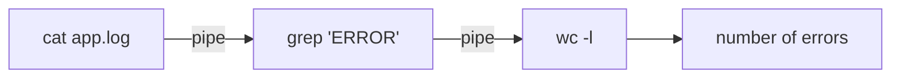

⬅ [Back to Index](../README.md)

# Linux Commands (Essential → Advanced)

The Linux command line is where real power lives. Master these core commands and you can navigate, inspect, and control any Linux server — from a Raspberry Pi to a cloud fleet.

### 🎓 Professional (IT-Standard) Reference

| Concept | Layman View | Professional (IT-Standard) View + Example |
|---------|-------------|--------------------------------------------|
| Filesystem commands | Move around and manage files | Core utilities navigate and manipulate the file system hierarchy.<br>They follow the Filesystem Hierarchy Standard (FHS).<br>They operate on paths, permissions, and metadata.<br>They compose via pipes and redirection.<br>*Example: `ls`, `cd`, `cp`, `mv`, `rm`, `find`.* |
| Process management | Watch and stop programs | Commands inspect and control running processes by Process Identifier (PID).<br>Signals (like SIGTERM/SIGKILL) request or force termination.<br>Tools show Central Processing Unit (CPU) and memory usage live.<br>Services are managed by the init system (systemd).<br>*Example: `ps aux`, `top`, `kill -9`, `systemctl`.* |
| Permissions | Control who can do what | Linux uses user/group/other permission bits for read, write, execute.<br>`chmod` changes modes; `chown` changes ownership.<br>`sudo` grants temporary elevated privileges.<br>This enforces multi-user security.<br>*Example: `chmod 755 script.sh`, `sudo systemctl restart nginx`.* |

---

## 📂 Navigation & Files

```bash
pwd                 # print current directory
ls -la              # list all files, detailed
cd /var/log         # change directory
cp a.txt b.txt      # copy
mv a.txt dir/       # move / rename
rm -r folder        # remove recursively
mkdir -p a/b/c      # create nested directories
```

## 🔍 Viewing & Searching

```bash
cat file.txt              # print a file
less file.txt             # page through (q to quit)
grep "error" app.log      # search inside a file
find / -name "*.conf" 2>/dev/null   # find files by name
tail -f app.log           # follow a log live
```

## ⚙️ System & Processes

```bash
top                 # live processes (or htop)
df -h               # disk usage
free -h             # memory usage
systemctl status nginx    # service status
kill -9 <pid>       # force stop a process
```

## 🔐 Permissions

```bash
chmod 755 script.sh       # rwxr-xr-x
chown user:group file     # change ownership
sudo command              # run as root
```



**Explanation:** Linux commands are designed to **chain**. Here, `cat` streams a log, `grep` keeps only error lines, and `wc -l` counts them — three tiny tools solving a real problem together, the essence of the Unix philosophy.

---

## 🧰 Simple Analogy

Linux commands are like **kitchen tools**: each does one job (knife, peeler, whisk). The magic is combining them — chop, then mix, then bake — to cook up exactly the result you want.

---

## 🧩 Real-World Examples

- 🔎 **Troubleshooting**: `tail -f /var/log/syslog` to watch errors as they happen.
- 🧹 **Cleanup**: `find . -name "*.tmp" -delete` to remove temp files.
- 📊 **Reporting**: `grep 500 access.log | wc -l` to count server errors.

---

## ✅ Key Takeaways

- Learn navigation (`ls`, `cd`), files (`cp`, `mv`, `rm`), and search (`grep`, `find`).
- Inspect the system with `top`, `df -h`, `free -h`, and `systemctl`.
- Control access with `chmod`, `chown`, and `sudo`.
- **Chain commands with pipes** to solve complex tasks simply.

---

**Navigation:** [Next → Windows Commands](windows-commands.md) | ⬅ [Back to Index](../README.md)
