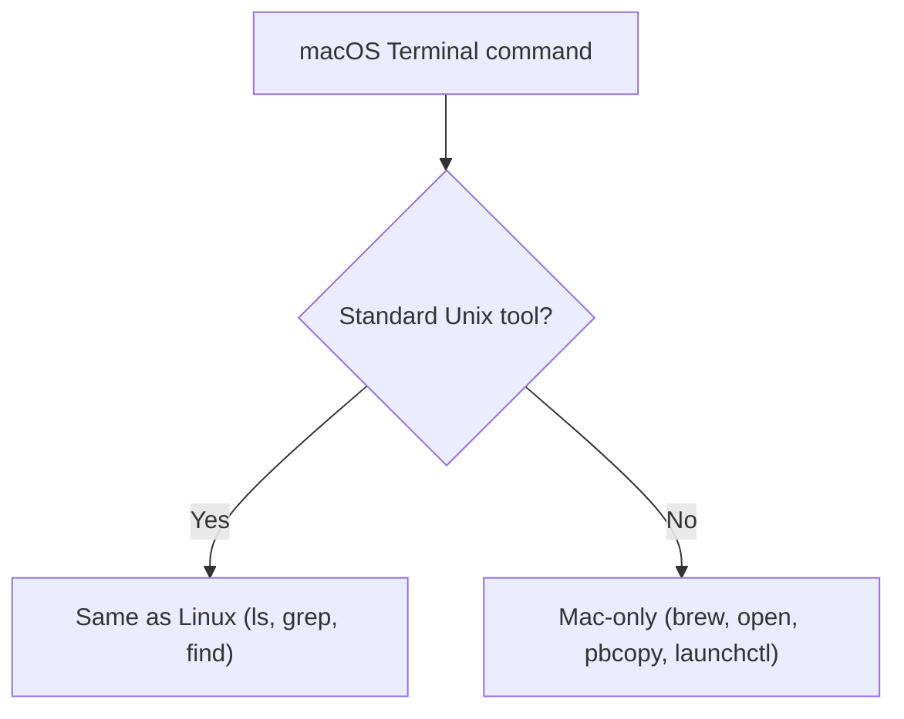

⬅ [Back to Index](../README.md)

# macOS Commands

Because macOS is **Unix-based**, it shares almost all Linux commands — plus a few Mac-only tools. If you know Linux commands, you already know most of macOS.

### 🎓 Professional (IT-Standard) Reference

| Concept | Layman View | Professional (IT-Standard) View + Example |
|---------|-------------|--------------------------------------------|
| Shared Unix commands | Same tools as Linux | macOS ships standard Unix utilities from its Berkeley Software Distribution (BSD) heritage.<br>Navigation, file, and text tools behave like Linux.<br>Some flags differ slightly (BSD vs GNU variants).<br>Portable Operating System Interface (POSIX) scripts run cleanly.<br>*Example: `ls`, `grep`, `find`, `chmod` all work as expected.* |
| Homebrew | The developer app store | Homebrew is the community package manager for macOS.<br>It installs command-line tools missing from the base system.<br>It manages dependencies and updates.<br>It complements the Mac App Store for developers.<br>*Example: `brew install wget`.* |
| launchd | The macOS service manager | launchd is the macOS init and service manager (macOS does not use systemd).<br>It starts daemons and scheduled agents.<br>Configuration lives in property list (plist) files.<br>It is controlled via `launchctl`.<br>*Example: `launchctl list` to view running services.* |

---

## ✅ Same as Linux

```bash
ls -la   cd   cp   mv   rm   grep   find   chmod   ps   top   ssh   curl
```

## 🍎 macOS-Specific

```bash
brew install <pkg>       # Homebrew package manager
open .                   # open current folder in Finder
open -a "Safari" https://example.com   # open an app with an argument
pbcopy < file.txt        # copy file contents to clipboard
pbpaste > out.txt        # paste clipboard into a file
sw_vers                  # macOS version
diskutil list            # disks and partitions
launchctl list           # background services (launchd)
```



**Explanation:** Most commands you type on macOS are the exact same Unix tools found on Linux. Only a small set — package management (`brew`), Finder integration (`open`), clipboard (`pbcopy`), and services (`launchctl`) — are Mac-specific.

---

## 🧰 Simple Analogy

Switching from Linux to macOS commands is like driving the **same car in a different country**: the controls are identical, you just learn a few local road signs (`brew`, `open`, `launchctl`).

---

## 🧩 Real-World Examples

- 📋 **Clipboard piping**: `pbpaste | grep TODO` to filter copied text.
- 📦 **Tool install**: `brew install git node python`.
- 🚀 **Quick open**: `open .` to jump from Terminal into Finder.

> 💡 macOS uses **launchd** (not systemd) to manage background services — the main difference to remember versus Linux.

---

## 🧗 What You Gain: 50+ Years of Experience, Condensed

Work through this lesson and you absorb judgment that normally takes a career to earn. Each stage below is not just a shift in viewpoint but a level of mastery you unlock. By the end you carry the instincts of someone with 50+ years in the field:

| Stage | How you use macOS commands | What you can do |
|-------|----------------------------|-----------------|
| 🌱 **Beginner** | Open Terminal, run basic commands. | `ls`, `cd`, `open .`. |
| 🧭 **Learner** | Notice most Linux commands work. | Install tools with `brew`. |
| 🛠️ **Practitioner** | Use Mac-specific tooling. | `pbcopy`/`pbpaste`, `defaults`, `launchctl`, `mdfind`. |
| 🚀 **Advanced** | Automate setup and services. | launchd agents, `softwareupdate`, dotfiles + Brewfile. |
| 🏛️ **Veteran** | Manage many Macs consistently. | Zero-touch MDM provisioning + scripted baselines. |

---

## 🔬 Deep Dive — Advanced & Expert Insights

- **BSD userland ≠ GNU:** macOS `sed`, `ls`, and `date` are BSD variants with different flags (e.g., `sed -i ''` needs an argument). For GNU behavior, `brew install coreutils gnu-sed`.
- **`defaults` is the config CLI:** `defaults write` scripts system/app preferences — the backbone of reproducible Mac setup scripts.
- **launchd, not cron:** create `~/Library/LaunchAgents/*.plist` and load with `launchctl` for reliable scheduling/supervision; cron is deprecated on macOS.
- **Spotlight from the CLI:** `mdfind` and `mdls` query the same index Spotlight uses — fast file search and metadata without `find` scanning the disk.
- **Reproducible machines:** a `Brewfile` (`brew bundle`) plus versioned dotfiles turns a new Mac into your exact setup in one command — the practitioner-to-veteran habit.

> 🏛️ **Veteran habit:** script the whole machine setup (`brew bundle` + `defaults` + dotfiles) so any Mac is disposable and rebuildable.

---

## ✅ Key Takeaways

- macOS shares nearly all Linux/Unix commands.
- Mac-only tools: `brew`, `open`, `pbcopy`/`pbpaste`, `launchctl`.
- Services are managed by **launchd**, not systemd.
- Linux shell scripts usually run on macOS with little change.

---

**Navigation:** [Next → Variables & I/O](../05-Scripting-Basic-to-Advanced/variables-io.md) | ⬅ [Back to Index](../README.md)
