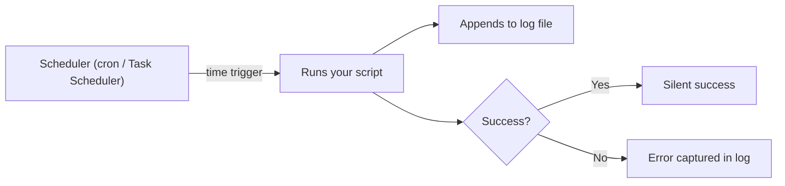

⬅ [Back to Index](../README.md)

# Automation: cron & Task Scheduler

Scripts become truly powerful when they run **automatically** — on a schedule, without you. On Linux/macOS that's **cron**; on Windows it's the **Task Scheduler**.

### 🎓 Professional (IT-Standard) Reference

| Concept | Layman View | Professional (IT-Standard) View + Example |
|---------|-------------|--------------------------------------------|
| cron | The Linux scheduler | cron is a time-based job scheduler on Unix-like systems.<br>Jobs are defined in a crontab with a five-field time syntax.<br>The cron daemon runs jobs unattended.<br>Output should be redirected to logs.<br>*Example: a nightly backup at 2:30 AM.* |
| Task Scheduler | The Windows scheduler | Windows Task Scheduler runs tasks on triggers (time, logon, event).<br>Tasks are managed via GUI or PowerShell cmdlets.<br>They can run whether or not a user is logged in.<br>They integrate with the Service Control Manager.<br>*Example: `Register-ScheduledTask` for a daily script.* |
| Idempotency & logging | Safe-to-repeat + a paper trail | Idempotent jobs produce the same result if run twice.<br>Logging captures success/failure for auditing.<br>Together they make automation reliable.<br>Silent failures are the top scheduling risk.<br>*Example: appending output with `>> log 2>&1`.* |

---

## 🐧 Linux/macOS — cron

```bash
crontab -e          # edit your cron jobs
crontab -l          # list your jobs
```

Cron time format:

```text
┌ minute (0-59)
│ ┌ hour (0-23)
│ │ ┌ day of month (1-31)
│ │ │ ┌ month (1-12)
│ │ │ │ ┌ day of week (0-6, Sun=0)
│ │ │ │ │
* * * * *  /path/to/script.sh
```

```bash
# Run backup every day at 2:30 AM, logging output and errors
30 2 * * * /home/user/backup.sh >> /var/log/backup.log 2>&1
```

## 🪟 Windows — Task Scheduler

```powershell
$action  = New-ScheduledTaskAction -Execute "powershell.exe" -Argument "-File C:\backup.ps1"
$trigger = New-ScheduledTaskTrigger -Daily -At 2:30AM
Register-ScheduledTask -TaskName "DailyBackup" -Action $action -Trigger $trigger
```



**Explanation:** A scheduler watches the clock and fires your script at the right moment — no human needed. Because nobody's watching, **logging** is essential: it's your only proof the job ran and your only clue when it fails.

---

## 🧰 Simple Analogy

A scheduler is an **automatic sprinkler timer**: set it once, and it waters the garden (runs your script) every morning whether you're home or not. The rain gauge (log file) tells you it actually happened.

---

## 🧩 Real-World Examples

- 🗄️ **Nightly database backups** at 2 AM.
- 🧹 **Log rotation & cleanup** every week.
- 📊 **Report generation** emailed every Monday morning.
- 🔄 **Health checks** every 5 minutes.

> 💡 Always log output (`>> log 2>&1`) so you can debug jobs that fail silently — the #1 cause of "why didn't my backup run?"

---

## ✅ Key Takeaways

- **cron** schedules jobs on Linux/macOS; **Task Scheduler** on Windows.
- Cron uses a five-field time syntax; know the field order.
- Make jobs **idempotent** and **always log** their output.
- Automation turns scripts into hands-off, reliable operations.

---

**Navigation:** [Next → Bash Debugging Tips](../06-Debugging-Scripts/bash-debugging.md) | ⬅ [Back to Index](../README.md)
