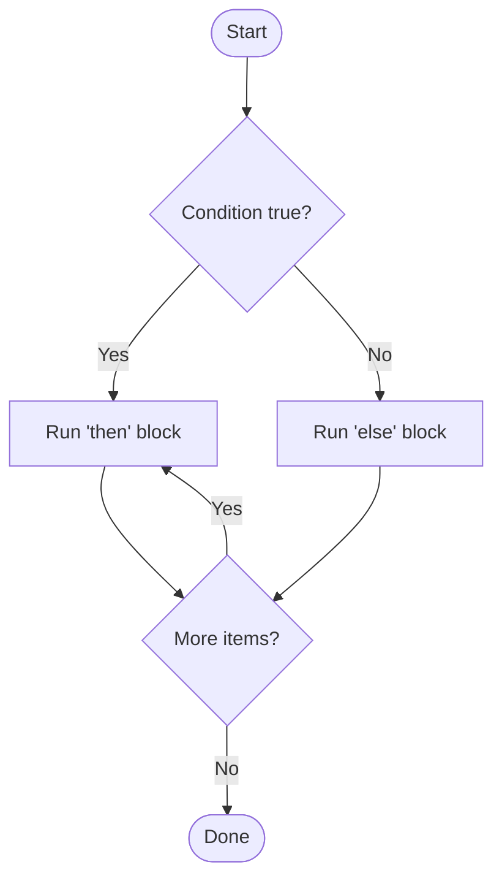

⬅ [Back to Index](../README.md)

# Conditionals & Loops

**Conditionals** let a script make decisions; **loops** let it repeat work. Together they turn a flat list of commands into real logic.

### 🎓 Professional (IT-Standard) Reference

| Concept | Layman View | Professional (IT-Standard) View + Example |
|---------|-------------|--------------------------------------------|
| Conditionals | "If this, then that" decisions | Conditionals branch execution based on a boolean test.<br>Tests check files, strings, and numeric comparisons.<br>They enable error handling and validation.<br>Exit codes drive control flow.<br>*Example: `if [[ -f config ]]; then ... fi`.* |
| Loops | Repeat until done | Loops iterate over collections or repeat while a condition holds.<br>`for` iterates a known set; `while` repeats on a condition.<br>They automate bulk operations.<br>Guard conditions prevent infinite loops.<br>*Example: iterating over files with `for f in *.log`.* |
| Exit codes | Pass/fail signal from a command | An exit code (0 = success, non-zero = failure) reports a command's result.<br>Scripts branch on it to handle errors.<br>It is stored in `$?` (Bash) or `$LASTEXITCODE` (PowerShell).<br>It underpins reliable automation.<br>*Example: `if command; then echo ok; fi`.* |

---

## 🔀 Bash Conditionals

```bash
if [[ -f "config.txt" ]]; then
  echo "File exists"
elif [[ -d "config" ]]; then
  echo "It's a directory"
else
  echo "Not found"
fi
```

## 🔁 Bash Loops

```bash
for i in 1 2 3; do
  echo "Number $i"
done

while read -r line; do
  echo "Line: $line"
done < file.txt
```

## 🔀🔁 PowerShell

```powershell
if (Test-Path "config.txt") {
  "File exists"
} else {
  "Not found"
}

foreach ($i in 1..3) { "Number $i" }

Get-Content file.txt | ForEach-Object { "Line: $_" }
```



**Explanation:** Conditionals pick a path based on a true/false test; loops send execution back to repeat until there's nothing left. Combining them is how scripts validate input and process many items automatically.

---

## 🧰 Simple Analogy

A conditional is a **fork in the road** (go left or right based on a sign). A loop is a **roundabout** — you keep circling until you decide to take the exit.

---

## 🧩 Real-World Examples

- ✅ Validate that a config file exists before continuing.
- 📦 Loop over every `.log` file and compress it.
- 🔁 Retry a network call until it succeeds or hits a max attempt count.

> 💡 Always base decisions on **exit codes**, not screen text — it's how commands truly report success or failure.

---

## 🧗 What You Gain: 50+ Years of Experience, Condensed

Work through this lesson and you absorb judgment that normally takes a career to earn. Each stage below is not just a shift in viewpoint but a level of mastery you unlock. By the end you carry the instincts of someone with 50+ years in the field:

| Stage | How you see control flow | What you can do |
|-------|--------------------------|-----------------|
| 🌱 **Beginner** | "If this, do that." | Write a simple `if` and a `for` loop. |
| 🧭 **Learner** | Tests return true/false via exit codes. | Use `[[ ]]`, `elif`, `while`, `case`. |
| 🛠️ **Practitioner** | Loops + conditionals build real logic. | Iterate files safely, guard edge cases. |
| 🚀 **Advanced** | Loop pitfalls (word-splitting, subshells) bite. | Use `while read`, avoid `for` over `ls`, manage state. |
| 🏛️ **Veteran** | Simplicity beats cleverness. | Prefer clear logic; know when to switch languages. |

---

## 🔬 Deep Dive — Advanced & Expert Insights

- **`[ ]` vs `[[ ]]`:** in Bash prefer `[[ ]]` (no word-splitting, supports `&&`, `=~` regex). Use `(( ))` for arithmetic comparisons.
- **Never loop over `ls`:** filenames with spaces/newlines break it. Use `while IFS= read -r -d '' f; do ...; done < <(find ... -print0)` or shell globs.
- **Pipes create subshells:** `cmd | while read ...` runs the loop in a subshell, so variables set inside are lost. Use process substitution `while read; do...; done < <(cmd)` to keep state.
- **`case` over long `if` chains:** cleaner for pattern dispatch; PowerShell's `switch` even supports regex and file input.
- **Fail-fast loops:** check exit codes inside loops; `set -e` won't catch failures inside `&&`/pipelines, so test explicitly for critical steps.

> 🏛️ **Veteran habit:** if the branching logic no longer fits on a screen, that's the signal to refactor into functions — or move to Python.

---

## ✅ Key Takeaways

- **Conditionals** (`if/elif/else`) branch on tests.
- **Loops** (`for`, `while`, `foreach`) repeat work.
- **Exit codes** (0 = success) drive reliable control flow.
- Combine them to add real logic and error handling.

---

**Navigation:** [Next → Functions & Arguments](functions-args.md) | ⬅ [Back to Index](../README.md)
