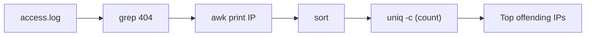

⬅ [Back to Index](../README.md)

# Regex & Text Processing

Most system data is **text** — logs, configs, CSVs. The Unix power trio **grep**, **sed**, and **awk**, combined with **regular expressions (regex)**, let you search, transform, and extract that text at scale.

### 🎓 Professional (IT-Standard) Reference

| Concept | Layman View | Professional (IT-Standard) View + Example |
|---------|-------------|--------------------------------------------|
| Regex | A pattern to match text | A regular expression (regex) is a pattern language for matching text.<br>It uses metacharacters for classes, anchors, and quantifiers.<br>It powers search, validation, and extraction.<br>Flavors vary (Basic vs Extended Regular Expressions).<br>*Example: `error|warn` to match either word.* |
| grep / sed / awk | Search, edit, and columnize text | grep filters lines by pattern; sed edits streams; awk processes columns with logic.<br>They read standard input and write standard output.<br>They compose via pipes.<br>They are core to log analysis and Extract-Transform-Load (ETL).<br>*Example: `grep`, `sed 's/a/b/'`, `awk '{print $1}'`.* |
| Text pipelines | Chaining transforms together | A text pipeline passes data through successive filters.<br>Each stage does one transformation.<br>Order matters and is composable.<br>It enables powerful one-liners.<br>*Example: `cat log | grep 404 | awk '{print $7}' | sort | uniq -c`.* |

---

## 🔍 grep — Search

```bash
grep -E "error|warn" app.log       # extended regex (either word)
grep -c "404" access.log           # count matches
grep -ri "TODO" src/               # recursive, case-insensitive
```

## ✂️ sed — Stream Edit

```bash
sed 's/foo/bar/g' file.txt         # replace all foo with bar
sed -n '10,20p' file.txt           # print only lines 10-20
```

## 📊 awk — Columns & Logic

```bash
awk '{print $1, $3}' data.txt              # print columns 1 and 3
awk -F',' '$2 > 100 {print $1}' data.csv   # filter rows by a column
```

## 🪟 PowerShell Regex

```powershell
Select-String -Path app.log -Pattern "error|warn"
"foobar" -replace "foo", "baz"
```



**Explanation:** This pipeline finds all "404" lines, extracts the IP column, sorts them, and counts duplicates — turning a messy log into a ranked list of problem clients. Each tool does one job; the pipe glues them together.

---

## 🧰 Simple Analogy

Text processing is an **assembly line**: `grep` picks the right parts off the belt, `sed` reshapes them, and `awk` measures and sorts them — each station specialized, the belt (pipe) moving items along.

---

## 🧩 Real-World Examples

- 🚨 Count HTTP 500 errors: `grep " 500 " access.log | wc -l`.
- 📮 Extract all emails from a file with a regex.
- 📈 Summarize top IPs, URLs, or error codes from web logs.

> 💡 Learn regex once and it pays off everywhere — editors, `grep`, code, and validation all speak it.

---

## 🧗 What You Gain: 50+ Years of Experience, Condensed

Work through this lesson and you absorb judgment that normally takes a career to earn. Each stage below is not just a shift in viewpoint but a level of mastery you unlock. By the end you carry the instincts of someone with 50+ years in the field:

| Stage | How you see regex | What you can do |
|-------|-------------------|-----------------|
| 🌱 **Beginner** | "Weird symbols for search." | Match a literal word with `grep`. |
| 🧭 **Learner** | Patterns with `.`, `*`, `+`, `[]`. | Search and filter lines. |
| 🛠️ **Practitioner** | Anchors, groups, and backrefs. | Extract/replace with `sed`/`awk`/`-replace`. |
| 🚀 **Advanced** | Greedy vs lazy, classes, flavors differ. | Write precise, efficient patterns; avoid catastrophic backtracking. |
| 🏛️ **Veteran** | Regex is powerful but not a parser. | Know when to use a real parser (JSON/HTML) instead. |

---

## 🔬 Deep Dive — Advanced & Expert Insights

- **Greedy vs lazy:** `.*` grabs as much as possible; `.*?` as little. The wrong one silently over/under-matches — the most common regex bug.
- **Flavors differ:** BRE (`grep`) vs ERE (`grep -E`/`awk`) vs PCRE (`grep -P`, Perl, Python) vs .NET (PowerShell `-match`). `\d`/lookaround aren't universal — know your engine.
- **Catastrophic backtracking:** patterns like `(a+)+$` can hang on certain inputs (a real DoS vector). Prefer specific classes and possessive/atomic groups where supported.
- **Capture and reuse:** groups `(...)` + backreferences `\1` (and named groups) power find-replace; PowerShell `$matches`, Python `re.groups()`.
- **Right tool boundary:** regex can't reliably parse nested/recursive formats (HTML, JSON, code). Use `jq`, an XML/HTML parser, or a language library instead.
- **Text-processing pairing:** combine regex with `awk` (fields) and `sed` (stream edits) for surgical transformations across large files.

> 🏛️ **Veteran habit:** make patterns as *specific* as possible (`[0-9]{4}` not `.*`), test against edge cases, and reach for a parser the moment structure gets nested.

---

## ✅ Key Takeaways

- **Regex** is a reusable pattern language for matching text.
- **grep** searches, **sed** edits, **awk** handles columns and logic.
- **Pipe** these tools together for powerful one-liners.
- PowerShell offers `Select-String` and `-replace` for the same jobs.

---

**Navigation:** [Next → Automation (cron / Task Scheduler)](automation-cron-tasks.md) | ⬅ [Back to Index](../README.md)
