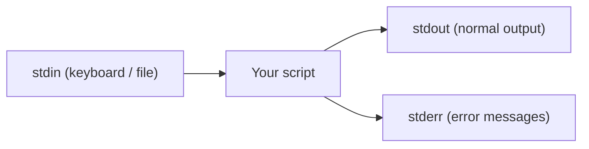

⬅ [Back to Index](../README.md)

# Variables & I/O

Every script needs to **store data** (variables) and **talk to the world** (input/output). This is the foundation everything else builds on.

### 🎓 Professional (IT-Standard) Reference

| Concept | Layman View | Professional (IT-Standard) View + Example |
|---------|-------------|--------------------------------------------|
| Variables | Named boxes that hold values | Variables store values referenced by name during script execution.<br>Shell variables are untyped strings by default.<br>Scope can be global or local to a function.<br>Quoting prevents word-splitting bugs.<br>*Example: `name="Alice"` in Bash, `$name = "Alice"` in PowerShell.* |
| Standard streams | Input, output, and errors | Programs use three standard streams: stdin, stdout, and stderr.<br>stdout carries normal output; stderr carries errors.<br>Streams can be redirected to files or piped.<br>Separating them enables clean logging.<br>*Example: `command > out.txt 2> err.txt`.* |
| Environment variables | System-wide settings for programs | Environment variables pass configuration into processes.<br>They are inherited by child processes.<br>They store secrets, paths, and feature flags.<br>They avoid hardcoding values in scripts.<br>*Example: `export API_KEY=123`, then read `$API_KEY`.* |

---

## 🧮 Bash

```bash
#!/usr/bin/env bash
name="Alice"                 # no spaces around =
echo "Hi $name"

read -p "Your age? " age     # read user input
echo "You are $age"

count=$((2 + 3))             # arithmetic
echo "$count"
```

## 🧮 PowerShell

```powershell
$name = "Alice"
Write-Output "Hi $name"

$age = Read-Host "Your age?"
Write-Output "You are $age"

$count = 2 + 3
Write-Output $count
```

## 🌍 Environment Variables

```bash
echo "$HOME"          # read an env var (Bash)
export API_KEY=123    # set one for child processes
```

```powershell
$env:HOME             # read an env var (PowerShell)
$env:API_KEY = "123"  # set one
```



**Explanation:** A script reads from **stdin**, sends normal results to **stdout**, and sends errors to **stderr**. Keeping errors on a separate stream lets you log or hide them independently — crucial for clean automation.

---

## 🧰 Simple Analogy

Variables are **labeled jars** on a shelf; I/O streams are the **doors**: one door for deliveries in (stdin), one for finished goods out (stdout), and a separate one for complaints (stderr).

---

## 🧩 Real-World Examples

- 🔑 Reading a secret from an env var instead of hardcoding it.
- 📝 Prompting an operator for a confirmation before a risky action.
- 🧾 Redirecting output to a log file while errors go to another.

> 💡 In Bash, **always quote** your variables (`"$name"`) to avoid bugs with spaces and empty values.

---

## 🧗 What You Gain: 50+ Years of Experience, Condensed

Work through this lesson and you absorb judgment that normally takes a career to earn. Each stage below is not just a shift in viewpoint but a level of mastery you unlock. By the end you carry the instincts of someone with 50+ years in the field:

| Stage | How you see variables & I/O | What you can do |
|-------|-----------------------------|-----------------|
| 🌱 **Beginner** | "Boxes that hold a value." | Set a variable and echo it. |
| 🧭 **Learner** | Typed-ish data with quoting rules. | Read input, use command substitution. |
| 🛠️ **Practitioner** | Scope, environment, and streams matter. | Manage `export`, stdin/stdout/stderr, exit codes. |
| 🚀 **Advanced** | I/O redirection and buffering shape behavior. | Redirect fds, use here-docs, handle large streams. |
| 🏛️ **Veteran** | Data flow is a contract between tools. | Design clean stdin/stdout interfaces for composability. |

---

## 🔬 Deep Dive — Advanced & Expert Insights

- **Three streams, not one:** stdout (1) is *data*, stderr (2) is *diagnostics*. Well-behaved tools keep logs on stderr so `cmd | next` pipes clean data. `2>&1` merges them; order matters: `>file 2>&1` is not `2>&1 >file`.
- **Quoting = correctness:** in Bash always `"$var"`; use arrays `"${arr[@]}"` for lists. In PowerShell, prefer typed variables and `[string]`/`[int]` casts.
- **Environment vs shell variables:** only `export`ed vars cross into child processes — the cause of "my script can't see MY_VAR."
- **Robust input:** `read -r` (never bare `read`), IFS handling, and `mapfile`/`readarray` for lines; validate and default with `"${VAR:?required}"` / `"${VAR:-default}"`.
- **Exit codes are data:** `$?`/`$LASTEXITCODE` drive control flow; return meaningful codes so callers and CI can react.

> 🏛️ **Veteran habit:** put data on stdout, logs on stderr, and a meaningful exit code on the way out — that's what makes a script a good citizen in a pipeline.

---

## ✅ Key Takeaways

- Store data in **variables**; mind quoting in Bash.
- Programs use three streams: **stdin, stdout, stderr**.
- Use **environment variables** for config and secrets.
- Redirect streams to separate normal output from errors.

---

**Navigation:** [Next → Conditionals & Loops](conditionals-loops.md) | ⬅ [Back to Index](../README.md)
