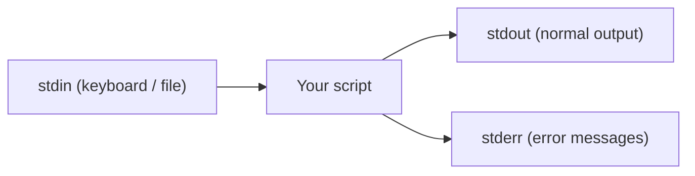

⬅ [Back to Index](../README.md)

# Variables & I/O

Every script needs to **store data** (variables) and **talk to the world** (input/output). This is the foundation everything else builds on.

### 🎓 Professional (IT-Standard) Reference

| Concept | Layman View | Professional (IT-Standard) View + Example |
|---------|-------------|--------------------------------------------|
| Variables | Named boxes that hold values | Variables store values referenced by name during script execution.<br>Shell variables are untyped strings by default.<br>Scope can be global or local to a function.<br>Quoting prevents word-splitting bugs.<br>*Example: `name="Alice"` in Bash, `$name = "Alice"` in PowerShell.* |
| Standard streams | Input, output, and errors | Programs use three standard streams: stdin, stdout, and stderr.<br>stdout carries normal output; stderr carries errors.<br>Streams can be redirected to files or piped.<br>Separating them enables clean logging.<br>*Example: `command > out.txt 2> err.txt`.* |
| Environment variables | System-wide settings for programs | Environment variables pass configuration into processes.<br>They are inherited by child processes.<br>They store secrets, paths, and feature flags.<br>They avoid hardcoding values in scripts.<br>*Example: `export API_KEY=123`, then read `$API_KEY`.* |

---

## 🧮 Bash

```bash
#!/usr/bin/env bash
name="Alice"                 # no spaces around =
echo "Hi $name"

read -p "Your age? " age     # read user input
echo "You are $age"

count=$((2 + 3))             # arithmetic
echo "$count"
```

## 🧮 PowerShell

```powershell
$name = "Alice"
Write-Output "Hi $name"

$age = Read-Host "Your age?"
Write-Output "You are $age"

$count = 2 + 3
Write-Output $count
```

## 🌍 Environment Variables

```bash
echo "$HOME"          # read an env var (Bash)
export API_KEY=123    # set one for child processes
```

```powershell
$env:HOME             # read an env var (PowerShell)
$env:API_KEY = "123"  # set one
```



**Explanation:** A script reads from **stdin**, sends normal results to **stdout**, and sends errors to **stderr**. Keeping errors on a separate stream lets you log or hide them independently — crucial for clean automation.

---

## 🧰 Simple Analogy

Variables are **labeled jars** on a shelf; I/O streams are the **doors**: one door for deliveries in (stdin), one for finished goods out (stdout), and a separate one for complaints (stderr).

---

## 🧩 Real-World Examples

- 🔑 Reading a secret from an env var instead of hardcoding it.
- 📝 Prompting an operator for a confirmation before a risky action.
- 🧾 Redirecting output to a log file while errors go to another.

> 💡 In Bash, **always quote** your variables (`"$name"`) to avoid bugs with spaces and empty values.

---

## ✅ Key Takeaways

- Store data in **variables**; mind quoting in Bash.
- Programs use three streams: **stdin, stdout, stderr**.
- Use **environment variables** for config and secrets.
- Redirect streams to separate normal output from errors.

---

**Navigation:** [Next → Conditionals & Loops](conditionals-loops.md) | ⬅ [Back to Index](../README.md)
