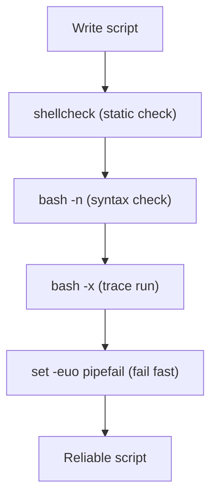

⬅ [Back to Index](../README.md)

# Bash Debugging Tips

Bugs in Bash are often silent — a script keeps running with the wrong values. These techniques make problems **loud and visible** so you can fix them fast.

### 🎓 Professional (IT-Standard) Reference

| Concept | Layman View | Professional (IT-Standard) View + Example |
|---------|-------------|--------------------------------------------|
| Trace mode | Watch each command run | `set -x` prints every command with expanded variables as it executes.<br>It reveals what the script actually does versus what you intended.<br>It can be toggled on and off around suspect sections.<br>It is the fastest way to see logic flow.<br>*Example: `bash -x script.sh`.* |
| Fail-fast flags | Stop at the first error | `set -euo pipefail` halts on errors, unset variables, and pipe failures.<br>It prevents cascading damage from a bad step.<br>It surfaces the real failure point.<br>It is standard for production scripts.<br>*Example: adding it at the top of every script.* |
| Static analysis | Catch bugs before running | ShellCheck lints scripts for quoting, syntax, and portability issues.<br>It flags common pitfalls automatically.<br>It integrates with editors and Continuous Integration (CI).<br>It prevents entire classes of bugs.<br>*Example: `shellcheck script.sh`.* |

---

## 1️⃣ Turn On Trace Mode

```bash
bash -x script.sh          # print each command as it runs
# or inside the script:
set -x                     # start tracing
# ... suspicious section ...
set +x                     # stop tracing
```

## 2️⃣ Fail Fast & Loud

```bash
set -euo pipefail
# -e  exit on any error
# -u  error on use of an unset variable
# -o pipefail  catch failures inside a pipeline
```

## 3️⃣ Check Syntax Without Running

```bash
bash -n script.sh
```

## 4️⃣ Lint with ShellCheck

```bash
shellcheck script.sh       # catches quoting bugs, typos, and pitfalls
```

## 5️⃣ Debug Prints to stderr

```bash
echo "DEBUG: value=$var" >&2   # send to stderr, not stdout
```



**Explanation:** Effective Bash debugging is a funnel: lint first to catch obvious issues, verify syntax, then trace the run to watch real values, and finally add fail-fast flags so future errors surface immediately instead of hiding.

---

## 🧰 Simple Analogy

Debugging Bash is like **checking a recipe out loud** as you cook (`set -x`), stopping the moment something's wrong (`set -e`), and having a friend proofread it first (`shellcheck`).

---

## 🧩 Real-World Examples

- 🔍 A deploy script "succeeds" but does nothing → `set -e` reveals a failing step.
- 🧵 A filename with spaces breaks a loop → ShellCheck flags the unquoted variable.
- 🐛 Wrong branch taken → `bash -x` shows the actual variable value.

> 💡 90% of Bash bugs are **unquoted variables**. Always use `"$var"`.

---

## 🧗 What You Gain: 50+ Years of Experience, Condensed

Work through this lesson and you absorb judgment that normally takes a career to earn. Each stage below is not just a shift in viewpoint but a level of mastery you unlock. By the end you carry the instincts of someone with 50+ years in the field:

| Stage | How you debug Bash | What you can do |
|-------|--------------------|-----------------|
| 🌱 **Beginner** | Add `echo` everywhere. | Print values to see what's happening. |
| 🧭 **Learner** | Turn on tracing. | Use `bash -x` / `set -x` to watch execution. |
| 🛠️ **Practitioner** | Fail fast and lint. | `set -euo pipefail`, `shellcheck`, targeted traps. |
| 🚀 **Advanced** | Inspect the runtime. | `trap DEBUG`, `PS4` timing, `strace` a misbehaving call. |
| 🏛️ **Veteran** | Prevent bugs before they happen. | Static analysis + tests (`bats`) in CI; defensive design. |

---

## 🔬 Deep Dive — Advanced & Expert Insights

- **Make `set -x` readable:** set `PS4='+ ${BASH_SOURCE}:${LINENO}:${FUNCNAME[0]:-main}() '` to get file, line, and function on every traced line — turns noise into a precise trace.
- **Trace with timing:** `PS4='+ $(date "+%s.%N") '` reveals which step is slow. Enable tracing for just a region: `set -x; risky_part; set +x`.
- **`shellcheck` catches what your eyes can't:** unquoted vars, useless `cat`, subshell variable loss. Run it in CI and treat warnings as errors.
- **`trap` for forensics:** `trap 'echo "ERR line $LINENO: $BASH_COMMAND" >&2' ERR` logs the exact failing command — invaluable with `set -e`.
- **Reproduce the environment:** many "only fails in cron/CI" bugs are `PATH`, locale (`LC_ALL`), or cwd differences. Print `env`, `pwd`, and `bash --version` at the top when hunting.

> 🏛️ **Veteran habit:** the best debugging is prevention — `set -euo pipefail`, `shellcheck`, and a handful of `bats` tests stop most bugs from ever shipping.

---

## ✅ Key Takeaways

- Use `bash -x` / `set -x` to **trace** execution.
- Add `set -euo pipefail` to **fail fast**.
- Run `bash -n` for a **syntax check** and `shellcheck` to **lint**.
- Send debug output to **stderr** to keep stdout clean.

---

**Navigation:** [Next → PowerShell Debugging Tips](powershell-debugging.md) | ⬅ [Back to Index](../README.md)
