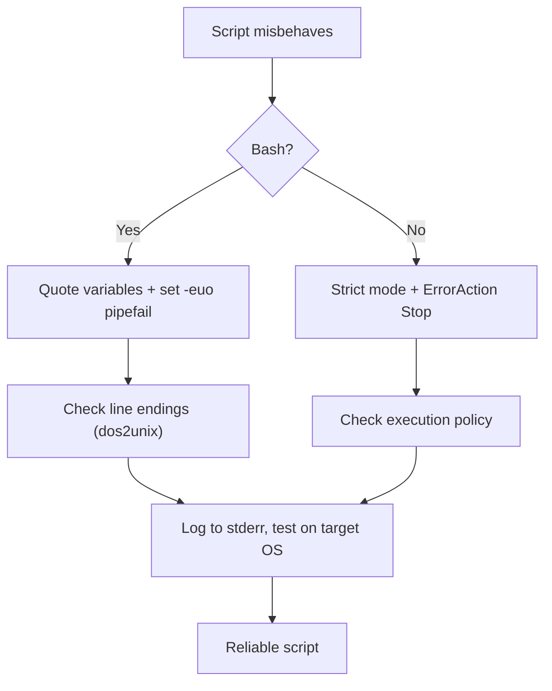

⬅ [Back to Index](../README.md)

# Common Pitfalls & Fixes

Most scripting bugs come from a small set of recurring mistakes. Learn to spot these and you'll avoid the majority of "why isn't this working?" moments.

### 🎓 Professional (IT-Standard) Reference

| Concept | Layman View | Professional (IT-Standard) View + Example |
|---------|-------------|--------------------------------------------|
| Quoting & word-splitting | Spaces break unquoted values | Unquoted variables undergo word-splitting and globbing in Bash. This breaks on spaces, empty values, and special characters. Quoting (`"$var"`) preserves the intended value. It is the most common Bash bug source. *Example: `cp "$src" "$dst"` instead of `cp $src $dst`.* |
| Line endings | Windows vs Unix newline mismatch | Carriage Return + Line Feed (CRLF) endings break scripts on Linux. The interpreter sees a stray `\r` and fails. Convert with `dos2unix` or configure the editor. Version control settings can prevent it. *Example: `bad interpreter: /bin/bash^M`.* |
| Error handling | Ignoring failures silently | Unchecked exit codes let failures pass unnoticed. Fail-fast settings surface them immediately. Logging preserves evidence for debugging. This is critical for scheduled jobs. *Example: `set -e` in Bash, `$ErrorActionPreference = "Stop"` in PowerShell.* |

---

## 🐞 Pitfalls & Fixes

| Pitfall | Symptom | Fix |
|---------|---------|-----|
| Unquoted variables (Bash) | Breaks on spaces/empties | Always `"$var"` |
| Spaces around `=` (Bash) | `command not found` | Use `x=1`, not `x = 1` |
| Wrong line endings (CRLF) | `bad interpreter` on Linux | Convert with `dos2unix` |
| Missing shebang | Runs in the wrong shell | Add `#!/usr/bin/env bash` |
| Not executable | `Permission denied` | `chmod +x script.sh` |
| Ignoring exit codes | Silent failures | Check `$?` / use `set -e` |
| Hardcoded paths | Breaks on other machines | Use variables / relative paths |
| Execution policy (PS) | Script won't run | `Set-ExecutionPolicy RemoteSigned` |

**Explanation:** Nearly every scripting failure traces back to quoting, line endings, permissions, or ignored errors. Building a quick mental checklist around these lets you diagnose most problems in seconds.

---

## 🏆 Golden Rules

1. ✅ **Quote everything** in Bash (`"$var"`).
2. ✅ **Fail fast** (`set -euo pipefail` / `$ErrorActionPreference = "Stop"`).
3. ✅ **Log to stderr**, not stdout.
4. ✅ **Test on the target OS** — line endings and paths differ.

---

## 🧰 Simple Analogy

These pitfalls are the **potholes on a familiar road**. Once you know exactly where they are, you steer around them automatically — and the drive gets smooth.

---

## 🧩 Real-World Examples

- 🧵 A backup skips files with spaces → unquoted `$path` was the culprit.
- 🚫 A script fails only on the Linux server → CRLF line endings from Windows.
- 🤫 A cron job "runs" but does nothing → no `set -e`, so an early failure was ignored.

---

## ✅ Key Takeaways

- Most bugs are **quoting, line endings, permissions, or ignored errors**.
- Apply the **four golden rules** to every script.
- Convert CRLF with **dos2unix** when moving scripts to Linux.
- **Test on the OS** where the script will actually run.

---

**Navigation:** [Next → Bash Cheat Sheet](../07-Cheat-Sheets/bash-cheatsheet.md) | ⬅ [Back to Index](../README.md)
