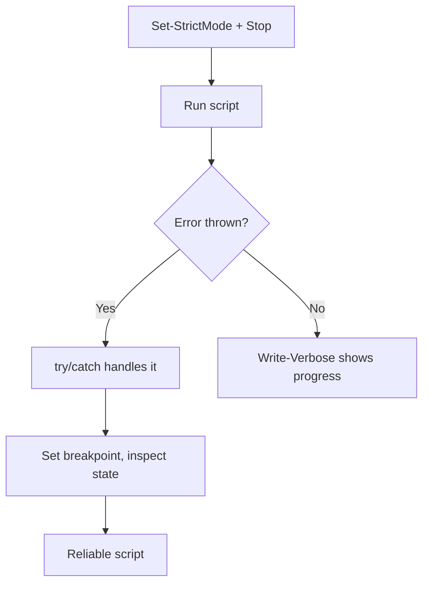

⬅ [Back to Index](../README.md)

# PowerShell Debugging Tips

PowerShell has rich, built-in debugging — streams, strict mode, breakpoints, and structured error handling — that make finding problems far easier than in classic shells.

### 🎓 Professional (IT-Standard) Reference

| Concept | Layman View | Professional (IT-Standard) View + Example |
|---------|-------------|--------------------------------------------|
| Output streams | Separate channels for messages | PowerShell has distinct streams: output, error, warning, verbose, and debug.<br>Verbose and Debug streams add diagnostics without cluttering output.<br>They can be toggled per command.<br>This keeps results clean and logs rich.<br>*Example: `Write-Verbose "..." -Verbose`.* |
| Strict mode | Catch undefined variables early | `Set-StrictMode` raises errors for uninitialized variables and bad property access.<br>It surfaces typos immediately.<br>Combined with `$ErrorActionPreference = "Stop"` it fails fast.<br>It is best practice for robust scripts.<br>*Example: `Set-StrictMode -Version Latest`.* |
| Breakpoints & try/catch | Pause and handle errors | Breakpoints pause execution to inspect state interactively.<br>`try/catch/finally` provides structured exception handling.<br>Together they enable precise diagnosis and recovery.<br>They integrate with Visual Studio and VS Code.<br>*Example: `Set-PSBreakpoint` and a `try { } catch { }` block.* |

---

## 1️⃣ Verbose & Debug Streams

```powershell
Write-Verbose "Loading config..." -Verbose
Write-Debug   "Value is $x"
```

## 2️⃣ Strict Mode Catches Bugs

```powershell
Set-StrictMode -Version Latest   # errors on undefined variables/properties
$ErrorActionPreference = "Stop"  # stop on the first error
```

## 3️⃣ Breakpoints

```powershell
Set-PSBreakpoint -Script .\script.ps1 -Line 20
# In VS Code / Visual Studio: press F9 on a line, then F5 to debug
```

## 4️⃣ Try/Catch for Real Error Handling

```powershell
try {
	Get-Content "missing.txt" -ErrorAction Stop
} catch {
	Write-Error "Failed: $($_.Exception.Message)"
}
```

## 5️⃣ Step Through Interactively

```powershell
Set-PSDebug -Trace 1    # trace each line (Set-PSDebug -Off to stop)
```



**Explanation:** PowerShell lets you fail fast (strict mode + Stop), see progress (verbose stream), catch and report errors gracefully (try/catch), and pause to inspect variables (breakpoints) — a full debugging toolkit built into the shell.

---

## 🧰 Simple Analogy

Debugging PowerShell is like flying a plane with a **glass cockpit**: strict mode is the stall warning, verbose is the running commentary, try/catch is the autopilot recovery, and breakpoints let you freeze time to read every dial.

---

## 🧩 Real-World Examples

- 🧾 A missing file crashes a script → `try/catch` logs a clear message instead.
- 🐛 A typo'd variable returns `$null` → `Set-StrictMode` throws immediately.
- 🔎 Complex loop misbehaves → a breakpoint at line 20 reveals the bad value.

> 💡 Set `$ErrorActionPreference = "Stop"` so cmdlet errors become catchable exceptions.

---

## 🧗 What You Gain: 50+ Years of Experience, Condensed

Work through this lesson and you absorb judgment that normally takes a career to earn. Each stage below is not just a shift in viewpoint but a level of mastery you unlock. By the end you carry the instincts of someone with 50+ years in the field:

| Stage | How you debug PowerShell | What you can do |
|-------|--------------------------|-----------------|
| 🌱 **Beginner** | Add `Write-Host`. | See values on screen. |
| 🧭 **Learner** | Use proper streams. | `Write-Verbose`/`Write-Debug` with `-Verbose`/`-Debug`. |
| 🛠️ **Practitioner** | Handle errors deliberately. | try/catch, `$ErrorActionPreference`, inspect `$Error`. |
| 🚀 **Advanced** | Step through interactively. | Breakpoints (`Set-PSBreakpoint`), `Get-Member`, strict mode. |
| 🏛️ **Veteran** | Test and prevent regressions. | `Pester` tests + CI; structured logging. |

---

## 🔬 Deep Dive — Advanced & Expert Insights

- **Use the streams, not `Write-Host`:** `Write-Verbose`/`Write-Debug`/`Write-Warning` are toggleable and redirectable; `Write-Host` writes to the host and can't be captured or filtered.
- **Terminating vs non-terminating errors:** try/catch only catches *terminating* errors. Set `-ErrorAction Stop` (or `$ErrorActionPreference='Stop'`) to make failures catchable; inspect `$_.Exception` and `$Error[0]`.
- **Conditional breakpoints:** `Set-PSBreakpoint -Script x.ps1 -Line 20 -Action { if ($count -gt 100) { break } }` — and `Set-PSBreakpoint -Variable x -Mode Write` to catch *what changes a variable*.
- **`Set-StrictMode -Version Latest`** surfaces typos and use of uninitialized variables — the PowerShell equivalent of `set -u`.
- **`Get-Member` is a debugger too:** when a pipeline misbehaves, `... | Get-Member` reveals the real object type and properties, ending guesswork.

> 🏛️ **Veteran habit:** wire `Pester` tests into CI and use structured logging — catching regressions automatically beats interactive debugging every time.

---

## ✅ Key Takeaways

- Use **Verbose/Debug streams** for diagnostics without clutter.
- Enable **Strict Mode** + `Stop` to fail fast on real bugs.
- Wrap risky code in **try/catch/finally**.
- Use **breakpoints** (F9) to pause and inspect state.

---

**Navigation:** [Next → Common Pitfalls & Fixes](common-pitfalls.md) | ⬅ [Back to Index](../README.md)
