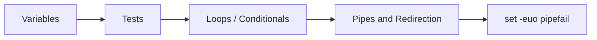

⬅ [Back to Index](../README.md)

# ⚡ Bash Cheat Sheet

Quick-reference for the Bash syntax you'll use every day. Bookmark this page.

---

## 🧮 Variables

```bash
name="Alice"; echo "$name"
count=$((1 + 2))
arr=(a b c); echo "${arr[0]}" "${#arr[@]}"
"${var:-default}"        # use default if var is unset/empty
```

## 🧪 Tests

```bash
[[ -f file ]]     # file exists
[[ -d dir ]]      # directory exists
[[ -z "$s" ]]     # string is empty
[[ -n "$s" ]]     # string is non-empty
[[ "$a" == "$b" ]] # string equality
[[ $n -gt 5 ]]    # numeric greater-than
```

## 🔁 Loops & Conditionals

```bash
for f in *.txt; do echo "$f"; done
while [[ $i -lt 5 ]]; do ((i++)); done
if cmd; then echo ok; else echo fail; fi
case "$x" in a) echo A ;; *) echo other ;; esac
```

## 🔗 Pipes & Redirection

```bash
cmd > out.txt      # stdout to file
cmd 2> err.txt     # stderr to file
cmd &> all.txt     # both stdout + stderr
cmd1 | cmd2        # pipe output to next command
cmd <<< "string"   # here-string as input
```

## 🛡️ Safety Header

```bash
#!/usr/bin/env bash
set -euo pipefail
```



**Explanation:** These five building blocks — variables, tests, control flow, pipes, and the safety header — compose into virtually every Bash script you'll write.

---

## 🚀 Advanced & Expert Quick Reference

```bash
# Strict mode + cleanup trap (top of every production script)
set -euo pipefail
trap 'rm -rf "$tmpdir"' EXIT
tmpdir=$(mktemp -d)

# Parameter expansion tricks
"${VAR:-default}"      # default if unset
"${VAR:?must be set}"  # abort with message if unset
"${VAR%.txt}"          # strip suffix
"${VAR##*/}"           # basename
"${VAR//old/new}"      # replace all

# Safe iteration over files (handles spaces/newlines)
while IFS= read -r -d '' f; do echo "$f"; done < <(find . -type f -print0)

# Process substitution (no temp files)
diff <(sort a.txt) <(sort b.txt)

# Arrays
arr=(one two "three four"); echo "${arr[@]}"; echo "${#arr[@]}"
```

- **Lint before shipping:** `shellcheck script.sh` and syntax-check with `bash -n script.sh`.
- **Debug a region:** `set -x; ...; set +x` with a rich `PS4` prompt.

---

## 🧗 What You Gain: 50+ Years of Experience, Condensed

Memorize this sheet and you carry reflexes that normally take a career to build. Each stage below is a level of Bash mastery you unlock — by the end you reach for the right tool the way someone with 50+ years at the terminal would:

| Stage | How you use this sheet | What you can do |
|-------|------------------------|-----------------|
| 🌱 **Beginner** | Copy commands one at a time. | Run variables, tests, and loops without fear. |
| 🧭 **Learner** | Recognize the patterns behind the snippets. | Combine pipes and redirection deliberately. |
| 🛠️ **Practitioner** | Reach for the right idiom instantly. | Write safe scripts with `set -euo pipefail` by habit. |
| 🚀 **Advanced** | Bend parameter expansion and process substitution to your will. | Refactor fragile scripts into robust, portable tools. |
| 🏛️ **Veteran** | See the whole pipeline as composable primitives. | Design automation others trust in production. |

---

## ✅ Key Takeaways

- Quote variables and use `${var:-default}` for safe defaults.
- Use `[[ ]]` for tests; remember numeric vs string operators.
- Chain tools with **pipes** and redirect streams deliberately.
- Start every script with `set -euo pipefail`.

---

**Navigation:** [Next → PowerShell Cheat Sheet](powershell-cheatsheet.md) | ⬅ [Back to Index](../README.md)
