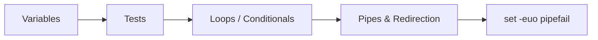

⬅ [Back to Index](../README.md)

# ⚡ Bash Cheat Sheet

Quick-reference for the Bash syntax you'll use every day. Bookmark this page.

---

## 🧮 Variables

```bash
name="Alice"; echo "$name"
count=$((1 + 2))
arr=(a b c); echo "${arr[0]}" "${#arr[@]}"
"${var:-default}"        # use default if var is unset/empty
```

## 🧪 Tests

```bash
[[ -f file ]]     # file exists
[[ -d dir ]]      # directory exists
[[ -z "$s" ]]     # string is empty
[[ -n "$s" ]]     # string is non-empty
[[ "$a" == "$b" ]] # string equality
[[ $n -gt 5 ]]    # numeric greater-than
```

## 🔁 Loops & Conditionals

```bash
for f in *.txt; do echo "$f"; done
while [[ $i -lt 5 ]]; do ((i++)); done
if cmd; then echo ok; else echo fail; fi
case "$x" in a) echo A ;; *) echo other ;; esac
```

## 🔗 Pipes & Redirection

```bash
cmd > out.txt      # stdout to file
cmd 2> err.txt     # stderr to file
cmd &> all.txt     # both stdout + stderr
cmd1 | cmd2        # pipe output to next command
cmd <<< "string"   # here-string as input
```

## 🛡️ Safety Header

```bash
#!/usr/bin/env bash
set -euo pipefail
```



**Explanation:** These five building blocks — variables, tests, control flow, pipes, and the safety header — compose into virtually every Bash script you'll write.

---

## ✅ Key Takeaways

- Quote variables and use `${var:-default}` for safe defaults.
- Use `[[ ]]` for tests; remember numeric vs string operators.
- Chain tools with **pipes** and redirect streams deliberately.
- Start every script with `set -euo pipefail`.

---

**Navigation:** [Next → PowerShell Cheat Sheet](powershell-cheatsheet.md) | ⬅ [Back to Index](../README.md)
