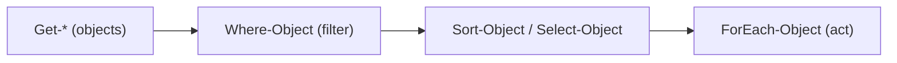

⬅ [Back to Index](../README.md)

# ⚡ PowerShell Cheat Sheet

Quick-reference for everyday PowerShell. Remember: the pipeline passes **objects**, not text.

---

## 🧮 Variables & Types

```powershell
$name = "Alice"
[int]$n = 5
$arr = @(1,2,3); $arr[0]; $arr.Count
$hash = @{ key = "value" }; $hash["key"]
```

## 🧰 Common Cmdlets

```powershell
Get-ChildItem            # ls / dir
Get-Content file.txt     # cat
Set-Location C:\Temp     # cd
Copy-Item / Move-Item / Remove-Item
Get-Process / Stop-Process
Get-Service / Start-Service / Restart-Service
```

## 🔗 Pipeline & Filtering

```powershell
Get-Process | Where-Object CPU -gt 10 | Sort-Object CPU -Descending
Get-ChildItem | Select-Object Name, Length
1..5 | ForEach-Object { $_ * 2 }
```

## 🔀 Conditionals & Loops

```powershell
if ($x -gt 5) { } elseif ($x -eq 5) { } else { }
foreach ($i in 1..3) { "Item $i" }
while ($i -lt 5) { $i++ }
```

## 🛡️ Error Handling

```powershell
$ErrorActionPreference = "Stop"
try { Get-Content missing.txt } catch { Write-Error $_ } finally { "cleanup" }
```



**Explanation:** The PowerShell pattern is get → filter → shape → act, all passing rich objects. Because you reference real properties (`CPU`, `Name`), your commands are precise and readable.

---

## 🔑 Comparison Operators

| Operator | Meaning |
|----------|---------|
| `-eq` / `-ne` | equal / not equal |
| `-gt` / `-lt` | greater / less than |
| `-like` | wildcard match |
| `-match` | regex match |

---

## 🚀 Advanced & Expert Quick Reference

```powershell
# Make errors catchable and inspect the pipeline object
$ErrorActionPreference = 'Stop'
try { Get-Item .\missing } catch { Write-Warning $_.Exception.Message }

# Discover any object's real members
Get-Process | Get-Member
Get-Process | Select-Object -First 1 | Format-List *

# Advanced function skeleton (behaves like a cmdlet)
function Get-Thing {
	[CmdletBinding()]
	param(
		[Parameter(Mandatory, ValueFromPipeline)] [string]$Name,
		[ValidateSet('A','B')] [string]$Kind = 'A'
	)
	process { [pscustomobject]@{ Name = $Name; Kind = $Kind } }
}

# Fast, structured filtering
Get-ChildItem -Recurse -File | Where-Object Length -gt 1MB |
	Sort-Object Length -Descending | Select-Object FullName, Length

# Run across many machines
Invoke-Command -ComputerName (Get-Content hosts.txt) { $env:COMPUTERNAME }
```

- **Strict mode:** `Set-StrictMode -Version Latest` to catch typos and unset variables.
- **Test it:** wrap logic in functions and cover them with `Pester`.

---

## 🧗 What You Gain: 50+ Years of Experience, Condensed

Memorize this sheet and you carry reflexes that normally take a career to build. Each stage below is a level of PowerShell mastery you unlock — by the end you think in objects and pipelines the way someone with 50+ years of automation experience would:

| Stage | How you use this sheet | What you can do |
|-------|------------------------|-----------------|
| 🌱 **Beginner** | Copy cmdlets one at a time. | Run variables, cmdlets, and loops with confidence. |
| 🧭 **Learner** | See the Verb-Noun and object patterns. | Filter and shape data with `Where-Object`/`Select-Object`. |
| 🛠️ **Practitioner** | Reach for the right cmdlet instantly. | Handle errors with `try/catch` and strict mode by habit. |
| 🚀 **Advanced** | Compose the object pipeline fluently. | Build reusable, testable modules and functions. |
| 🏛️ **Veteran** | See automation as idempotent, safe systems. | Design remoting and DSC workflows teams rely on. |

---

## ✅ Key Takeaways

- Variables can be typed (`[int]`); collections use `@()` and `@{}`.
- Cmdlets follow **Verb-Noun**; pipe objects between them.
- Filter with `Where-Object`, shape with `Select-Object`.
- Use comparison operators (`-eq`, `-gt`, `-match`) and try/catch.

---

**Navigation:** [Next → Interview Questions](../08-Final-Test/interview-questions.md) | ⬅ [Back to Index](../README.md)
