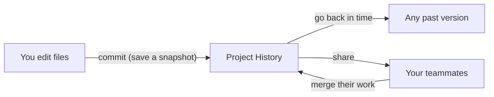

# 👋 Start Here — Source Control in Plain English

> **Read this first.** No jargon, no assumptions. This page explains the *whole* of source control and version management using everyday analogies, then shows how each idea is used in real companies. Once this "clicks," the rest of the track will make sense easily.

⬅ [Back to Index](../README.md)

---

## 🧠 The One Big Idea (if you remember nothing else)

> **Version control is a time machine and a team diary for your files. It remembers every change, who made it, and why — so you can go back, compare, and work together without overwriting each other.**

That's it. Everything else — Git, GitHub, branches, pull requests — is a detail on top of that one sentence.

**Explanation:** Instead of keeping `report-final-FINAL-v2.docx`, version control keeps **one file** with a full, labeled history behind it. You can rewind, branch off to try ideas, and merge everyone's work back together safely.

---

## 🏢 The Master Analogy: Version Control = A Shared Diary with a Time Machine

Keep this one analogy in your head for the whole track:

| Everyday Situation | Version Control Equivalent | What it means |
|--------------------|----------------------------|---------------|
| 📸 **Taking a photo of your desk each night** | A **commit** | A labeled snapshot of your project at a moment in time. |
| 📔 **Writing "why" next to each photo** | A **commit message** | Every change explains its reason, for your future self. |
| 🌱 **A side notebook to sketch ideas** | A **branch** | A safe parallel copy to experiment without breaking the main work. |
| 🤝 **Combining two notebooks into one** | A **merge** | Bringing separate lines of work back together. |
| ☁️ **A shared cloud copy everyone syncs to** | A **remote (GitHub)** | The central place the whole team pushes to and pulls from. |

The diary never forgets, and the time machine lets you undo mistakes — **that's the heart of source control.**

---

## 📜 What is "Git" vs "GitHub"?

People mix these up constantly. Here is the simple split:

| | Git | GitHub |
|--|-----|--------|
| **What it is** | The tool that tracks changes (runs on your computer) | A website that hosts your Git projects online |
| **Analogy** | The camera that takes snapshots | The shared photo album in the cloud |
| **Works offline?** | ✅ Yes, fully | ❌ Needs the internet |
| **Alternatives** | (Git is the standard) | GitLab, Bitbucket, Azure Repos |

> 💡 **Git is the engine. GitHub is one popular garage that stores the car.** You can use Git with no GitHub at all.

---

## 🎓 Professional (IT-Standard) Reference

| Concept | Layman View | Professional (IT-Standard) View + Example |
|---------|-------------|--------------------------------------------|
| Version Control System (VCS) | A time machine for files | A Version Control System (VCS) records changes to files over time so specific versions can be recalled. It tracks author, timestamp, and intent for every change. Distributed VCS (DVCS) like Git give every clone the full history. It is the backbone of modern software collaboration. *Example: Git tracking a web app's source code.* |
| Commit | A saved snapshot | A commit is an immutable snapshot of the repository at a point in time, identified by a hash. It stores a pointer to a tree of files plus parent commits. Each commit carries an author, message, and timestamp. Commits form the history graph of the project. *Example: `git commit -m "Fix login validation"`.* |
| Repository | The project folder with history | A repository is the full project plus its entire change history and metadata. It can be local (on your machine) or remote (on a server). It contains branches, tags, and configuration. Cloning copies the whole repository. *Example: a GitHub repo holding all code and history.* |

---

## 🚀 Why Learn This?

- 💾 **Never lose work** — every version is saved and recoverable.
- 🤝 **Work as a team** — many people edit the same project without chaos.
- 🔬 **Experiment safely** — branch off, try ideas, throw them away or keep them.
- 🏗️ **Foundation for DevOps & Cloud** — CI/CD, deployments, and automation all start from a Git repository.
- 💼 **Career must-have** — every software, DevOps, and cloud role expects fluency in Git and GitHub.

---

## 🧭 How to Use This Track

1. Build the mental model with **[Version Control Concepts](../01-Version-Control-Foundations/version-control-concepts.md)**.
2. Learn **[Git Fundamentals](../02-Git-Fundamentals/git-fundamentals.md)** and how commits, branches, and merges work.
3. Move onto the **[GitHub platform](../03-GitHub-Platform/github.md)** — pull requests, reviews, and issues.
4. Automate with **[GitHub Actions and releases](../04-Automation-and-Releases/github-actions.md)**.
5. Adopt a **[team workflow](../05-Git-Workflows/git-workflows.md)**, then level up with **[advanced Git](../06-Advanced-Git/git-hooks.md)** and **[best practices](../07-Best-Practices/industry-best-practices.md)**.

---

## 🧗 What You Gain: 50+ Years of Experience, Condensed

The same idea — *version control is a time machine and team diary* — stays true forever, but **what you notice** about it changes as you gain experience. Every lesson in this track carries this same lens:

| Stage | How you see "source control" | A typical thought at this stage |
|-------|------------------------------|--------------------------------|
| 🌱 **Beginner** | A way to save my work online | "How do I push my code to GitHub?" |
| 🧭 **Learner** | A history of commits and branches | "Why did my merge create a conflict?" |
| 🛠️ **Practitioner** | A collaboration workflow I use daily | "How do I keep a clean history with pull requests?" |
| 🚀 **Advanced** | A graph of objects I can reshape | "How do I rebase, cherry-pick, and recover lost commits?" |
| 🏛️ **Veteran** | A system of trade-offs to design around | "Which branching strategy scales for hundreds of engineers?" |

> 🎯 **Don't rush the ladder.** You climb it by collaborating on real projects and recovering from real mistakes. Each lesson's **Deep Dive** section is where the higher rungs live — come back to them as you grow.

---

## ✅ Key Takeaways

- Version control is a **time machine + team diary** for your files.
- **Git** is the tool; **GitHub** is a popular place to host Git projects.
- A **commit** is a labeled snapshot; a **branch** is a safe parallel line of work.
- Learning this unlocks teamwork, DevOps, and cloud engineering.
- Keep a terminal open and **run every command** as you read.

---

**Navigation:** [Next → Version Control Concepts](../01-Version-Control-Foundations/version-control-concepts.md) | ⬅ [Back to Index](../README.md)
