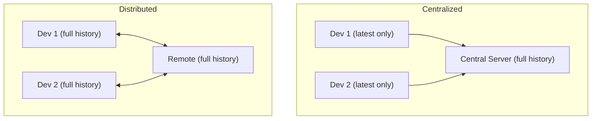

⬅ [Back to Index](../README.md)

# Version Control Concepts

**Version control** is the practice of recording changes to files over time so you can recall any version, understand who changed what and why, and collaborate without stepping on each other. It is the foundation every other topic in this track builds on.

### 🎓 Professional (IT-Standard) Reference

| Concept | Layman View | Professional (IT-Standard) View + Example |
|---------|-------------|--------------------------------------------|
| Centralized VCS | One server holds the history | A Centralized Version Control System (CVCS) keeps history on a single server that clients check out from.<br>Clients typically hold only the latest version, not full history.<br>It requires network access for most operations.<br>A server outage blocks the whole team.<br>*Example: Subversion (SVN) and Perforce.* |
| Distributed VCS | Everyone has the full history | A Distributed Version Control System (DVCS) gives every clone a complete copy of the repository and its history.<br>Most operations are local and fast.<br>It supports offline work and multiple remotes.<br>It has no single point of failure.<br>*Example: Git and Mercurial.* |
| Working directory | The files you actually edit | The working directory is the checked-out set of files you see and modify.<br>Changes there are untracked until staged.<br>It reflects one commit plus your edits.<br>Git compares it against the index and repository.<br>*Example: the folder you open in your editor.* |

---

## 🧠 Centralized vs Distributed

The biggest split in version control is **where the history lives**.



**Explanation:** In a **centralized** system, only the server has the full history, so you must be online for most tasks. In a **distributed** system like Git, every developer has the entire history locally — commits, branches, and diffs are instant and work offline.

---

## 🕰️ Why Version Control Exists

| Problem Without It | How Version Control Solves It |
|--------------------|-------------------------------|
| `report-FINAL-v3-really-final.docx` chaos | One file, full labeled history |
| "Who broke this and when?" | Every line traces to an author and commit |
| Overwriting a teammate's work | Merging combines changes safely |
| "Can we get last week's version back?" | Any past snapshot is one command away |

---

## 🏛️ Simple Analogy

Version control is like the **edit history in a shared document** — but far more powerful. You can see every past state, who wrote each sentence, branch off to draft a different version, and merge the good parts back. Nothing is ever truly lost.

---

## 🧪 The Three States (Git's Model)

```bash
# 1. Modify files in your working directory
echo "new line" >> app.txt

# 2. Stage the changes you want to save
git add app.txt

# 3. Commit them into permanent history
git commit -m "Add new line to app"
```

Every change moves through **working directory → staging area → repository**. Understanding these three states is the single most useful mental model in Git.

---

## 🧩 Real-World Examples

- 🏢 **Every software company** stores its source code in a VCS.
- 📝 **Writers and researchers** version documents, papers, and configs.
- ☁️ **Infrastructure as Code** keeps servers and cloud setups in Git.

---

## 🧗 What You Gain: 50+ Years of Experience, Condensed

Work through this lesson and you absorb judgment that normally takes a career to earn. Each stage below is a level of mastery you unlock — by the end you carry the instincts of someone with 50+ years in the field:

| Stage | How you see version control | What you can do |
|-------|-----------------------------|-----------------|
| 🌱 **Beginner** | "A way to back up files." | Save snapshots and recover old versions. |
| 🧭 **Learner** | Centralized vs distributed history. | Explain why Git works offline. |
| 🛠️ **Practitioner** | The working / staging / repository model. | Craft clean, meaningful commits. |
| 🚀 **Advanced** | A content-addressable history graph. | Reason about integrity and traceability. |
| 🏛️ **Veteran** | A collaboration and audit backbone. | Choose the right VCS strategy for a whole org. |

---

## 🔬 Deep Dive — Advanced & Expert Insights

- **Distributed by design:** Git's biggest leap over SVN is that every clone is a full backup — history survives even if the central server is lost.
- **Snapshots, not diffs:** Git stores each commit as a snapshot of the whole tree (deduplicated), not as a chain of deltas. This is why branching and switching are so fast.
- **Integrity is built in:** every object is hashed, so any corruption or tampering is detectable — the history is cryptographically verifiable.
- **The staging area is a feature, not friction:** it lets you compose a commit precisely, separating *what you changed* from *what you choose to record*.
- **Version everything:** modern teams version not just code but infrastructure, documentation, configuration, and pipelines — "if it matters, it's in Git."

> 🏛️ **Veteran habit:** treat history as communication. A clean, well-messaged history is documentation your future teammates will thank you for.

---

## ✅ Key Takeaways

- Version control records **every change** with author, time, and intent.
- **Centralized** systems keep history on a server; **distributed** systems (Git) give everyone a full copy.
- Git's model has three states: **working directory → staging → repository**.
- Versioning applies to code, infra, docs, and config alike.

---

**Navigation:** [Next → Git Fundamentals](../02-Git-Fundamentals/git-fundamentals.md) | ⬅ [Back to Index](../README.md)
