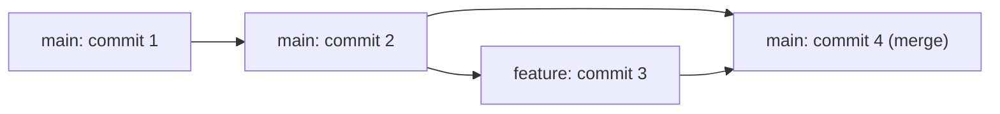

⬅ [Back to Index](../README.md)

# Branching & Merging

**Branching** lets you split off a parallel line of work; **merging** brings it back together. This is the heart of collaboration — many people building different things at once without breaking the main project.

### 🎓 Professional (IT-Standard) Reference

| Concept | Layman View | Professional (IT-Standard) View + Example |
|---------|-------------|--------------------------------------------|
| Branch | A parallel copy to work on | A branch is a movable pointer to a commit, representing an independent line of development.<br>Creating one is instant and cheap.<br>The default is usually `main`.<br>Work is isolated until merged.<br>*Example: `git switch -c feature/login`.* |
| Merge | Combining two branches | A merge integrates the changes of one branch into another, creating a merge commit with two parents when histories diverge.<br>Fast-forward merges just move the pointer.<br>Conflicts arise when the same lines differ.<br>It preserves both histories.<br>*Example: `git merge feature/login`.* |
| Merge conflict | Two edits clash | A merge conflict occurs when Git cannot auto-combine changes to the same region of a file.<br>Git marks the conflicting sections.<br>A human must choose the correct result.<br>The merge completes after resolution.<br>*Example: two branches editing the same line.* |

---

## 🧠 How Branching Works



**Explanation:** From `main`, you branch off to `feature`, make commits in isolation, then **merge** back. Because a branch is just a pointer, this is fast and safe — `main` stays stable while you experiment.

---

## 🌿 Fast-Forward vs Merge Commit

| Type | When it happens | Result |
|------|-----------------|--------|
| **Fast-forward** | `main` hasn't moved since you branched | Pointer just moves forward, no extra commit |
| **Three-way merge** | Both branches have new commits | A merge commit with two parents is created |

---

## 🏛️ Simple Analogy

Branching is like **photocopying a document to sketch edits** without touching the original. Merging is **combining the best edits back into the master copy**. If two people scribbled on the same line, someone has to decide which wins — that's a conflict.

---

## 🧪 Branch & Merge in Practice

```bash
git switch -c feature/login    # create and switch to a branch
# ...make changes and commit...
git switch main                # go back to main
git merge feature/login        # merge the feature in

# If a conflict appears:
git status                     # see conflicted files
# edit the files to resolve, then:
git add <file>
git commit                     # complete the merge
```

---

## 🧩 Real-World Examples

- 🧑‍🤝‍🧑 **Teams** give every feature and bugfix its own branch.
- 🚦 **Release branches** stabilize a version while `main` keeps moving.
- 🔥 **Hotfix branches** patch production quickly, then merge everywhere.

---

## 🧗 What You Gain: 50+ Years of Experience, Condensed

Work through this lesson and you absorb judgment that normally takes a career to earn. Each stage below is a level of mastery you unlock — by the end you carry the instincts of someone with 50+ years in the field:

| Stage | How you see branching | What you can do |
|-------|-----------------------|-----------------|
| 🌱 **Beginner** | "A scary copy of my code." | Create and switch branches. |
| 🧭 **Learner** | Isolated lines of work. | Merge a feature and resolve simple conflicts. |
| 🛠️ **Practitioner** | A daily collaboration tool. | Keep branches short-lived and up to date. |
| 🚀 **Advanced** | Pointers in a commit graph. | Choose merge vs rebase deliberately. |
| 🏛️ **Veteran** | A workflow design decision. | Define a branching strategy for the whole team. |

---

## 🔬 Deep Dive — Advanced & Expert Insights

- **Short-lived branches win:** the longer a branch lives, the harder the merge. Integrate frequently to avoid painful conflicts.
- **`git merge --no-ff`** forces a merge commit even on fast-forwards, preserving the fact that a feature existed as a unit.
- **Conflict resolution is a skill:** understand the `<<<<<<<`, `=======`, `>>>>>>>` markers, and use `git mergetool` or a three-way diff view for complex cases.
- **Rerere:** `git config rerere.enabled true` makes Git remember how you resolved a conflict and reapply it automatically next time.
- **Merge vs rebase is about intent:** merge preserves true history; rebase creates a linear, tidy story. Teams should agree on one convention.

> 🏛️ **Veteran habit:** merge `main` into your feature branch often — small, frequent integrations beat one giant conflict at the end.

---

## ✅ Key Takeaways

- A **branch** is a cheap, movable pointer to a commit.
- **Merging** combines branches; conflicts need a human decision.
- Prefer **short-lived branches** and frequent integration.
- Understand **fast-forward vs three-way** merges.

---

**Navigation:** [Next → Rebasing](rebasing.md) | ⬅ [Back to Index](../README.md)
