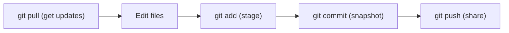

⬅ [Back to Index](../README.md)

# Git Fundamentals

**Git** is the world's most widely used version control system — a fast, distributed tool that tracks every change to your project. This lesson covers the everyday commands and the mental model behind them.

### 🎓 Professional (IT-Standard) Reference

| Concept | Layman View | Professional (IT-Standard) View + Example |
|---------|-------------|--------------------------------------------|
| Clone | Copy a project to your machine | Cloning creates a full local copy of a remote repository, including all history and branches.<br>It sets up a default remote named `origin`.<br>You can work fully offline after cloning.<br>It is the usual way to start on an existing project.<br>*Example: `git clone https://github.com/user/repo.git`.* |
| Staging area (index) | The "about to save" pile | The staging area (index) holds the exact snapshot that the next commit will record.<br>It lets you build commits selectively.<br>`git add` moves changes into it.<br>It sits between the working directory and the repository.<br>*Example: `git add file.txt` before committing.* |
| Remote | The shared online copy | A remote is a named reference to another copy of the repository, usually hosted on a server.<br>You push to and pull from remotes.<br>A repo can have several remotes.<br>`origin` is the conventional default.<br>*Example: `git push origin main`.* |

---

## 🧠 The Core Workflow

Nearly all daily Git work is a loop of five commands.



**Explanation:** You edit files, **stage** the ones you want, **commit** them into history with a message, and **push** to share. When teammates make changes, you **pull** them down. That loop is 90% of everyday Git.

---

## 🧰 Essential Commands

| Command | What it does |
|---------|--------------|
| `git init` | Start tracking a new project |
| `git clone <url>` | Copy an existing repo locally |
| `git status` | See what's changed and staged |
| `git add <file>` | Stage changes for the next commit |
| `git commit -m "msg"` | Record a snapshot with a message |
| `git log` | View the commit history |
| `git push` / `git pull` | Share and receive changes |

---

## 🏛️ Simple Analogy

Git is like a **photographer for your project**. `git add` is arranging who's in the photo; `git commit` is pressing the shutter and labeling the picture; `git push` is uploading the album so the whole family can see it.

---

## 🧪 A First Session

```bash
git init                          # start a repo
echo "# My Project" > README.md   # create a file
git add README.md                 # stage it
git commit -m "Initial commit"    # snapshot it
git remote add origin <url>       # connect to GitHub
git push -u origin main           # share it
```

---

## 🧩 Real-World Examples

- 👩‍💻 **Developers** commit small changes many times a day.
- 🤖 **CI/CD pipelines** trigger on every push.
- 📦 **Open-source projects** accept contributions as commits and pull requests.

---

## 🧗 What You Gain: 50+ Years of Experience, Condensed

Work through this lesson and you absorb judgment that normally takes a career to earn. Each stage below is a level of mastery you unlock — by the end you carry the instincts of someone with 50+ years in the field:

| Stage | How you see Git | What you can do |
|-------|-----------------|-----------------|
| 🌱 **Beginner** | "The tool that pushes to GitHub." | Clone, add, commit, and push. |
| 🧭 **Learner** | A staging area plus a commit history. | Craft focused commits with clear messages. |
| 🛠️ **Practitioner** | A daily collaboration loop. | Resolve conflicts and keep a tidy branch. |
| 🚀 **Advanced** | A graph you can navigate and rewrite. | Recover, reset, and reshape history safely. |
| 🏛️ **Veteran** | A distributed system with guarantees. | Standardize Git usage across teams. |

---

## 🔬 Deep Dive — Advanced & Expert Insights

- **The index is your friend:** `git add -p` lets you stage *parts* of a file, so each commit is a clean, single-purpose change.
- **HEAD is just a pointer:** it references the commit (usually the tip of a branch) you're currently on — moving HEAD is how checkout and reset work.
- **Everything local is fast:** because history is local, `log`, `diff`, `blame`, and branching never touch the network.
- **Undo is layered:** `git restore`, `git reset`, and `git revert` undo at different levels — working dir, staging, and committed history respectively.
- **Config matters:** setting `user.name`, `user.email`, `pull.rebase`, and a good `.gitignore` early prevents a lot of pain.

> 🏛️ **Veteran habit:** commit early and often locally, then curate before sharing. Local history is a scratchpad; shared history is a contract.

---

## ✅ Key Takeaways

- The daily loop is **edit → add → commit → push/pull**.
- The **staging area** lets you build precise commits.
- Git is **distributed** — most operations are local and fast.
- Good messages and a `.gitignore` make history readable and clean.

---

**Navigation:** [Next → Git Internals](git-internals.md) | ⬅ [Back to Index](../README.md)
