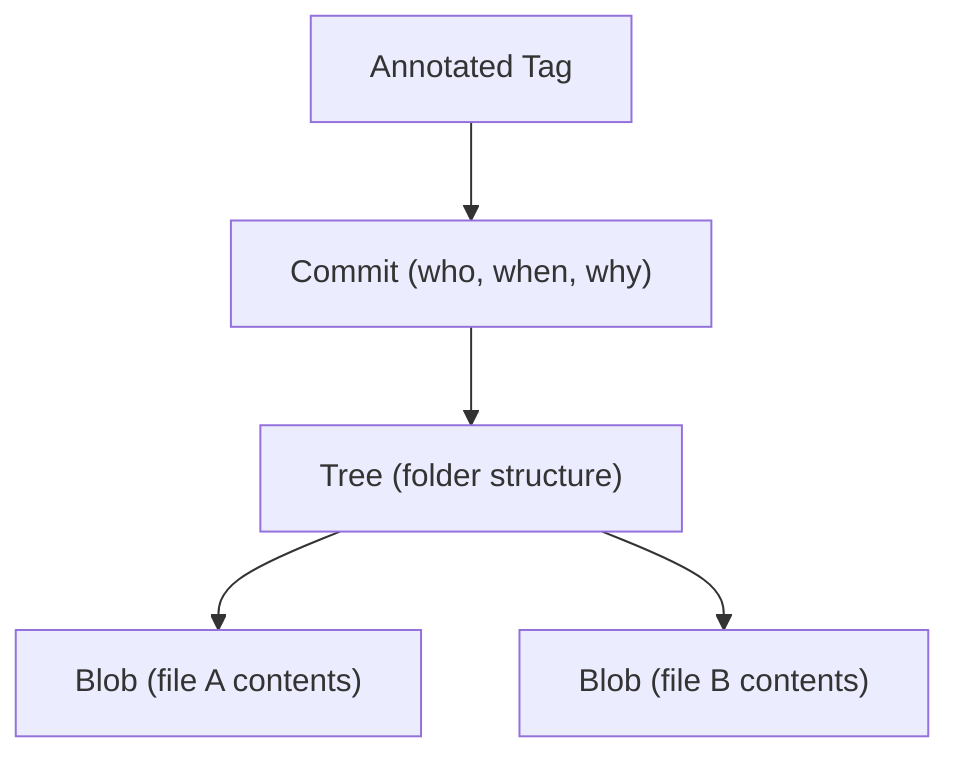

⬅ [Back to Index](../README.md)

# Git Internals

Under the hood, **Git is a content-addressable key-value store** — a tiny database of objects. Once you understand the four object types, Git stops feeling like magic and starts feeling logical.

### 🎓 Professional (IT-Standard) Reference

| Concept | Layman View | Professional (IT-Standard) View + Example |
|---------|-------------|--------------------------------------------|
| Blob | The contents of one file | A blob (binary large object) stores the raw contents of a file, addressed by the SHA-1/SHA-256 hash of that content.<br>Identical content shares one blob.<br>It stores data only, not filename.<br>It is immutable.<br>*Example: two files with the same text share one blob.* |
| Tree | A folder listing | A tree object represents a directory: it maps names to blobs and other trees, with modes.<br>It captures the structure of a snapshot.<br>Trees reference other trees for subfolders.<br>It is also content-addressed.<br>*Example: a tree listing `README.md` and a `src/` subtree.* |
| Commit | A labeled snapshot | A commit object points to one tree (the snapshot), zero or more parent commits, and carries author, committer, and message.<br>Its hash depends on all of that.<br>Parents form the history graph.<br>It is immutable once created.<br>*Example: a merge commit with two parents.* |

---

## 🧠 The Four Object Types



**Explanation:** A **commit** points to a **tree**, which lists **blobs** (file contents) and subtrees. **Tags** point at commits. Every object is named by the hash of its content, so nothing can change without changing its name — that's what makes Git tamper-evident.

---

## 🔑 Content-Addressable Storage

| Idea | Consequence |
|------|-------------|
| Object name = hash of its content | Identical content is stored once |
| Any change alters the hash | Corruption and tampering are detectable |
| Commits reference parents by hash | History is an immutable linked graph |

---

## 🏛️ Simple Analogy

Git's object store is like a **library where every book is filed by a fingerprint of its exact text**. Two copies of the same book get one shelf spot. Change a single word and it becomes a "different book" with a new fingerprint — so you always know precisely what you have.

---

## 🧪 Peeking Inside

```bash
# See the object type and contents behind a hash
git cat-file -t <hash>     # e.g. commit, tree, blob
git cat-file -p <hash>     # pretty-print the object

# What does HEAD point to?
git rev-parse HEAD

# Explore the low-level object of a file
git hash-object README.md
```

---

## 🧩 Real-World Examples

- 🔎 **`git blame` and `git log`** walk the commit graph to trace changes.
- 🩹 **Recovery tools** like `git fsck` and `git reflog` rely on the object model.
- 🚀 **Fast branching** works because a branch is just a pointer to a commit.

---

## 🧗 What You Gain: 50+ Years of Experience, Condensed

Work through this lesson and you absorb judgment that normally takes a career to earn. Each stage below is a level of mastery you unlock — by the end you carry the instincts of someone with 50+ years in the field:

| Stage | How you see Git internals | What you can do |
|-------|---------------------------|-----------------|
| 🌱 **Beginner** | "Some hidden `.git` folder." | Know commits are saved somewhere. |
| 🧭 **Learner** | Commits, trees, and blobs. | Explain what a commit actually stores. |
| 🛠️ **Practitioner** | A content-addressable graph. | Use `reflog` and `cat-file` to investigate. |
| 🚀 **Advanced** | An immutable object database. | Recover "lost" commits and repair repos. |
| 🏛️ **Veteran** | A verifiable, distributed data structure. | Reason about integrity, packfiles, and scale. |

---

## 🔬 Deep Dive — Advanced & Expert Insights

- **Branches and tags are refs:** they're just files under `.git/refs` containing a commit hash — creating a branch costs almost nothing.
- **The reflog is your safety net:** even after a bad reset or rebase, `git reflog` remembers where HEAD has been, so "lost" commits are usually recoverable.
- **Packfiles compress history:** Git periodically packs loose objects into deltified packfiles to save space, while keeping content-addressing intact.
- **SHA-1 to SHA-256:** Git is migrating hash algorithms; the object model stays the same, only the address length changes.
- **Immutability is the superpower:** because objects never change, history is auditable and merges are just graph operations.

> 🏛️ **Veteran habit:** when Git behaves surprisingly, drop to `reflog` and `cat-file`. The object model always explains what happened.

---

## ✅ Key Takeaways

- Git stores four object types: **blob, tree, commit, tag**.
- Objects are **content-addressed** by hash — identical content is stored once.
- **Branches and tags are just pointers** to commits.
- The **reflog** makes most "lost" work recoverable.

---

**Navigation:** [Next → Branching & Merging](branching-merging.md) | ⬅ [Back to Index](../README.md)
