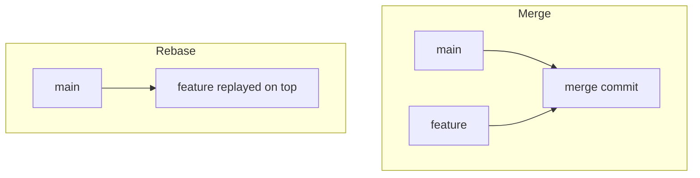

⬅ [Back to Index](../README.md)

# Rebasing

**Rebasing** rewrites your branch so its commits appear to start from a newer base, producing a clean, linear history. It is powerful and controversial — used well it keeps history tidy; used carelessly it rewrites shared history.

### 🎓 Professional (IT-Standard) Reference

| Concept | Layman View | Professional (IT-Standard) View + Example |
|---------|-------------|--------------------------------------------|
| Rebase | Replay commits on a new base | Rebasing reapplies a series of commits on top of another base commit, creating new commits with new hashes.<br>It produces a linear history.<br>It should not be used on shared/public branches.<br>It differs from merge, which preserves divergence.<br>*Example: `git rebase main`.* |
| Interactive rebase | Edit history as you replay | Interactive rebase (`-i`) lets you reorder, squash, edit, or drop commits during the replay.<br>It is used to clean up a branch before sharing.<br>Each action rewrites the affected commits.<br>It only touches local, unshared history ideally.<br>*Example: `git rebase -i HEAD~5`.* |
| Golden rule | Don't rewrite shared history | The golden rule of rebasing: never rebase commits that others have already based work on.<br>Rewriting shared history forces painful re-syncs.<br>Rebase private work; merge public work.<br>It keeps collaboration sane.<br>*Example: rebase a local feature, never `main`.* |

---

## 🧠 Merge vs Rebase



**Explanation:** **Merge** keeps both lines and adds a merge commit — true but sometimes cluttered history. **Rebase** moves your feature commits to sit *on top* of the latest `main`, giving a straight line as if you'd started from there.

---

## 🧹 What Interactive Rebase Can Do

| Action | Effect |
|--------|--------|
| `pick` | Keep the commit as-is |
| `reword` | Change the commit message |
| `squash` / `fixup` | Combine commits into one |
| `edit` | Pause to amend the commit |
| `drop` | Remove the commit entirely |

---

## 🏛️ Simple Analogy

Rebasing is like **rewriting your rough draft into a clean copy** before handing it in — reordering paragraphs, merging notes, fixing wording. Great for *your* draft; rude if you rewrite a document a colleague already built on.

---

## 🧪 Rebasing in Practice

```bash
# Update your feature branch onto the latest main
git switch feature/login
git rebase main

# Clean up the last 5 commits before sharing
git rebase -i HEAD~5

# If a conflict appears mid-rebase:
# fix files, then:
git add <file>
git rebase --continue          # or --abort to bail out
```

---

## 🧩 Real-World Examples

- ✨ **Squashing** a messy feature branch into one clean commit before a pull request.
- 🔄 **Rebasing onto main** to keep a linear project history.
- 🩹 **Reordering commits** so a fix comes before the code that uses it.

---

## 🧗 What You Gain: 50+ Years of Experience, Condensed

Work through this lesson and you absorb judgment that normally takes a career to earn. Each stage below is a level of mastery you unlock — by the end you carry the instincts of someone with 50+ years in the field:

| Stage | How you see rebasing | What you can do |
|-------|----------------------|-----------------|
| 🌱 **Beginner** | "Something dangerous I avoid." | Understand it rewrites commits. |
| 🧭 **Learner** | A way to get a linear history. | Rebase a local branch onto main. |
| 🛠️ **Practitioner** | A history-cleaning tool. | Squash and reword before a PR. |
| 🚀 **Advanced** | Controlled history rewriting. | Recover from conflicts and bad rebases. |
| 🏛️ **Veteran** | A team policy decision. | Set rebase-vs-merge conventions safely. |

---

## 🔬 Deep Dive — Advanced & Expert Insights

- **Rebase makes new commits:** the originals still exist in the reflog until garbage-collected, so a botched rebase is recoverable via `git reflog`.
- **`--onto` is surgical:** `git rebase --onto newbase oldbase branch` transplants a specific range of commits — invaluable for splitting work.
- **Autosquash workflow:** commit with `--fixup <hash>`, then `git rebase -i --autosquash` to auto-arrange fixups. Fast, clean history curation.
- **Force-push carefully:** after rebasing a *published* branch you must `git push --force-with-lease`, which refuses to clobber others' new work — safer than `--force`.
- **Never rebase `main`:** rewriting a branch everyone shares is the classic way to break a whole team's clones.

> 🏛️ **Veteran habit:** rebase to *communicate* — a reviewer should be able to read your commits like a story, one logical step at a time.

---

## ✅ Key Takeaways

- **Rebase** replays commits onto a new base for a linear history.
- **Interactive rebase** squashes, reorders, and rewords commits.
- Follow the **golden rule**: never rebase shared/public history.
- Use **`--force-with-lease`**, and lean on the **reflog** to recover.

---

**Navigation:** [Next → Tags & Releases](tags-releases.md) | ⬅ [Back to Index](../README.md)
