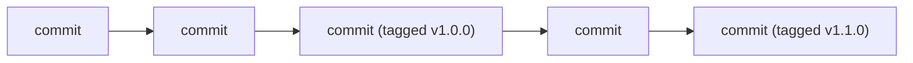

⬅ [Back to Index](../README.md)

# Tags & Releases

**Tags** mark specific points in history as important — usually version releases like `v1.4.0`. A **release** packages a tagged commit with notes and build artifacts for users to download.

### 🎓 Professional (IT-Standard) Reference

| Concept | Layman View | Professional (IT-Standard) View + Example |
|---------|-------------|--------------------------------------------|
| Lightweight tag | A sticky note on a commit | A lightweight tag is just a named pointer to a commit, with no extra metadata.<br>It is quick to create.<br>It stores no message or author.<br>It behaves like a branch that never moves.<br>*Example: `git tag v1.0.0`.* |
| Annotated tag | A signed, dated bookmark | An annotated tag is a full Git object storing tagger, date, message, and optionally a GPG signature.<br>It is recommended for releases.<br>It can be verified for authenticity.<br>It is stored in the object database.<br>*Example: `git tag -a v1.0.0 -m "First release"`.* |
| Release | A published, downloadable version | A release associates a tag with release notes and build artifacts on a hosting platform.<br>It gives users a stable download point.<br>It often triggers CI/CD publishing.<br>It communicates what changed.<br>*Example: a GitHub Release for `v1.0.0`.* |

---

## 🧠 Tags Mark Milestones



**Explanation:** As commits pile up, **tags** pin the exact commits that became releases. Anyone can later check out `v1.0.0` and get precisely the code that shipped — reproducible and auditable.

---

## 🏷️ Lightweight vs Annotated

| | Lightweight | Annotated |
|--|-------------|-----------|
| Stores metadata | ❌ No | ✅ Tagger, date, message |
| Can be signed | ❌ No | ✅ GPG signature |
| Best for | Temporary/local marks | **Official releases** |

---

## 🏛️ Simple Analogy

Tags are like **bookmarks with sticky labels in a long book**. A lightweight tag is a plain bookmark; an annotated tag is a labeled bookmark noting *who* placed it, *when*, and *why*. A release is publishing that chapter as a standalone booklet for readers.

---

## 🧪 Tagging & Releasing

```bash
# Create an annotated tag for a release
git tag -a v1.2.0 -m "Add search feature"

# Push tags to the remote (they aren't pushed by default)
git push origin v1.2.0
git push origin --tags

# List and inspect tags
git tag
git show v1.2.0

# Check out the exact released code
git checkout v1.2.0
```

---

## 🧩 Real-World Examples

- 📦 **Libraries** tag every published version so users can pin dependencies.
- 🚀 **CI/CD** builds and deploys automatically when a version tag is pushed.
- 📝 **GitHub Releases** attach changelogs and binaries to each tag.

---

## 🧗 What You Gain: 50+ Years of Experience, Condensed

Work through this lesson and you absorb judgment that normally takes a career to earn. Each stage below is a level of mastery you unlock — by the end you carry the instincts of someone with 50+ years in the field:

| Stage | How you see tags & releases | What you can do |
|-------|-----------------------------|-----------------|
| 🌱 **Beginner** | "A label on a commit." | Create and push a tag. |
| 🧭 **Learner** | Milestones in history. | Use annotated tags for versions. |
| 🛠️ **Practitioner** | Release checkpoints. | Publish releases with notes. |
| 🚀 **Advanced** | Automation triggers. | Wire tags to CI/CD publishing. |
| 🏛️ **Veteran** | A traceable release contract. | Design signed, reproducible release processes. |

---

## 🔬 Deep Dive — Advanced & Expert Insights

- **Prefer annotated tags for releases:** they carry authorship and can be GPG-signed, giving you verifiable provenance for what shipped.
- **Tags aren't pushed automatically:** many teams get burned by this — automate `git push --follow-tags` or push tags explicitly in CI.
- **Immutable by convention:** re-pointing an existing release tag breaks everyone who pinned it; cut a new version instead.
- **Tags drive pipelines:** a common pattern is "push a `vX.Y.Z` tag → CI builds, tests, and publishes the artifact" — the tag *is* the release trigger.
- **Reproducibility:** checking out a tag must yield the exact shipped code, which is why lockfiles and pinned dependencies matter alongside tags.

> 🏛️ **Veteran habit:** treat a release tag as a promise. Once published, never move it — cut `v1.2.1` instead.

---

## ✅ Key Takeaways

- **Tags** mark important commits, usually version releases.
- Prefer **annotated (and signed) tags** for official releases.
- Tags must be **pushed explicitly** to reach the remote.
- A **release** adds notes and artifacts to a tag and can trigger CI/CD.

---

**Navigation:** [Next → GitHub](../03-GitHub-Platform/github.md) | ⬅ [Back to Index](../README.md)
