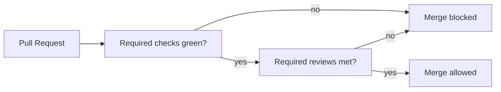

⬅ [Back to Index](../README.md)

# Branch Protection

**Branch protection** rules guard important branches like `main` — requiring reviews, passing checks, and blocking force-pushes. They turn "please don't break main" from a hope into an enforced policy.

### 🎓 Professional (IT-Standard) Reference

| Concept | Layman View | Professional (IT-Standard) View + Example |
|---------|-------------|--------------------------------------------|
| Branch protection rule | A lock on a key branch | A branch protection rule enforces conditions before changes reach a protected branch.<br>It can require reviews and passing status checks.<br>It can block force-pushes and deletions.<br>It applies to matching branch names.<br>*Example: protecting `main` with 2 required reviews.* |
| Required status check | Tests must pass to merge | A required status check blocks merging until specified CI checks succeed.<br>It ties merges to green builds.<br>It can require up-to-date branches.<br>It prevents broken code on `main`.<br>*Example: requiring the `build` and `test` checks.* |
| Required review | Human approval to merge | A required review mandates a minimum number of approving reviews before merge.<br>It can dismiss stale approvals on new commits.<br>It can require CODEOWNERS approval.<br>It enforces the review process.<br>*Example: "1 approval, CODEOWNERS required".* |

---

## 🧠 What Protection Enforces



**Explanation:** Before anything reaches a protected branch, it must clear the gates: **CI checks pass** and **required reviews are approved**. Only then is merge allowed. Direct pushes and force-pushes to the branch are refused.

---

## 🛡️ Common Protection Settings

| Setting | What it prevents |
|---------|------------------|
| Require pull request | Direct commits to `main` |
| Require approvals | Unreviewed merges |
| Require status checks | Merging broken builds |
| Require up-to-date branch | Merging stale code |
| Block force-push | Rewriting shared history |
| Require signed commits | Unverified authorship |

---

## 🏛️ Simple Analogy

Branch protection is like the **security gate to a bank vault**. You can't just walk in — you need the right badge (approvals), the alarm must be off (checks green), and nobody can bulldoze the wall (no force-push). The rules apply to everyone, including managers.

---

## 🧪 Enforcing Protection

```bash
# Example: set a required status check via the GitHub CLI/API
gh api -X PUT repos/OWNER/REPO/branches/main/protection \
  -F required_status_checks.strict=true \
  -F required_pull_request_reviews.required_approving_review_count=1 \
  -F enforce_admins=true
```

> Most teams configure this in **Settings → Branches** in the GitHub UI.

---

## 🧩 Real-World Examples

- 🚫 **No direct pushes** — every change to `main` goes through a reviewed PR.
- ✅ **Green-only merges** — CI must pass before the merge button unlocks.
- ✍️ **Signed commits** required for regulated or high-security repos.

---

## 🧗 What You Gain: 50+ Years of Experience, Condensed

Work through this lesson and you absorb judgment that normally takes a career to earn. Each stage below is a level of mastery you unlock — by the end you carry the instincts of someone with 50+ years in the field:

| Stage | How you see branch protection | What you can do |
|-------|-------------------------------|-----------------|
| 🌱 **Beginner** | "Rules that annoy me." | Understand why `main` is locked. |
| 🧭 **Learner** | A safety net for the team. | Require reviews and checks. |
| 🛠️ **Practitioner** | A quality gate. | Configure protection for key branches. |
| 🚀 **Advanced** | A compliance mechanism. | Enforce signed commits and CODEOWNERS. |
| 🏛️ **Veteran** | A governance policy. | Standardize protection org-wide. |

---

## 🔬 Deep Dive — Advanced & Expert Insights

- **Protect against yourself too:** enabling "include administrators" stops even admins from bypassing rules — critical for real safety and audits.
- **Strict (up-to-date) checks:** requiring the branch to be current before merge prevents the "passed CI but broke on main" class of failures.
- **Rulesets scale protection:** newer GitHub rulesets apply policies across many branches/repos with layering and bypass lists.
- **Signed commits + verification:** for supply-chain security, require GPG/SSH-signed commits so authorship is cryptographically verified.
- **Balance friction vs safety:** too many required reviewers stalls delivery; tune rules to risk — stricter on `main`, looser on scratch branches.

> 🏛️ **Veteran habit:** encode your quality bar as protection rules. Policy that relies on memory eventually fails; policy that's enforced doesn't.

---

## ✅ Key Takeaways

- Branch protection turns "don't break `main`" into **enforced policy**.
- Common gates: **required PRs, reviews, status checks, no force-push**.
- Use **strict checks** and **include administrators** for real safety.
- **Rulesets and signed commits** scale governance and security.

---

**Navigation:** [Next → GitHub Actions](../04-Automation-and-Releases/github-actions.md) | ⬅ [Back to Index](../README.md)
