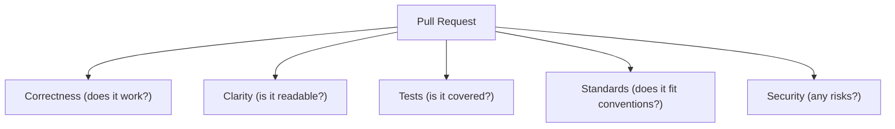

⬅ [Back to Index](../README.md)

# Code Reviews

A **code review** is a human examination of proposed changes before they merge. Done well, reviews catch bugs, spread knowledge, and keep a codebase consistent — they are as much about people as about code.

### 🎓 Professional (IT-Standard) Reference

| Concept | Layman View | Professional (IT-Standard) View + Example |
|---------|-------------|--------------------------------------------|
| Code review | A teammate checks your change | A code review is a structured inspection of a change for correctness, clarity, and standards before merge.<br>It is usually done in a pull request.<br>It combines human judgment with automated checks.<br>It spreads knowledge across the team.<br>*Example: approving a PR after reading the diff.* |
| Approval | A reviewer signs off | An approval is a reviewer's formal statement that the change is fit to merge.<br>Branch rules can require one or more approvals.<br>It can be dismissed on new commits.<br>It gates the merge.<br>*Example: "2 approvals required" before merge.* |
| CODEOWNERS | Auto-assign the right reviewers | A CODEOWNERS file maps file paths to responsible reviewers who are auto-requested on relevant PRs.<br>It routes reviews to domain experts.<br>It can be required by branch protection.<br>It lives in the repo.<br>*Example: `/src/auth/ @security-team`.* |

---

## 🧠 What Reviewers Actually Check



**Explanation:** A good review looks past "does it compile." It weighs **correctness, readability, test coverage, consistency, and security**. The goal is not to prove the author wrong but to make the change — and the whole team — better.

---

## 🧭 Giving Great Feedback

| Do | Avoid |
|----|-------|
| Ask questions ("What happens if this is null?") | Commands without reasons |
| Praise good solutions | Nitpicking style a linter should catch |
| Explain the "why" behind suggestions | Vague "this is wrong" |
| Separate blocking issues from nits | Rewriting the author's whole approach |

---

## 🏛️ Simple Analogy

A code review is like a **second pilot in the cockpit**. Not because the first pilot is bad, but because a second set of eyes catches the one switch that got missed. The goal is a safe flight, not proving who's the better pilot.

---

## 🧪 Review Workflow (CLI)

```bash
# Check out a PR locally to test it
gh pr checkout 123
# ...run it, test it...

# Leave a review
gh pr review 123 --approve
gh pr review 123 --request-changes --body "Please add tests"
```

---

## 🧩 Real-World Examples

- 🧑‍🏫 **Onboarding** — new hires learn the codebase fastest by reviewing and being reviewed.
- 🛡️ **Security teams** are auto-added via CODEOWNERS on sensitive paths.
- 📏 **Consistency** — reviews keep style and patterns uniform across many authors.

---

## 🧗 What You Gain: 50+ Years of Experience, Condensed

Work through this lesson and you absorb judgment that normally takes a career to earn. Each stage below is a level of mastery you unlock — by the end you carry the instincts of someone with 50+ years in the field:

| Stage | How you see code review | What you can do |
|-------|-------------------------|-----------------|
| 🌱 **Beginner** | "Someone judging my code." | Read a diff and respond to comments. |
| 🧭 **Learner** | A quality checkpoint. | Give and receive constructive feedback. |
| 🛠️ **Practitioner** | A knowledge-sharing habit. | Review for correctness, tests, and clarity. |
| 🚀 **Advanced** | A defect-prevention system. | Spot security and design issues early. |
| 🏛️ **Veteran** | A culture-shaping practice. | Set review standards and mentor reviewers. |

---

## 🔬 Deep Dive — Advanced & Expert Insights

- **Automate the boring stuff:** linters, formatters, and CI should catch style and syntax so humans focus on logic, design, and edge cases.
- **Review size drives quality:** studies show defect detection drops sharply past ~400 lines — keep PRs small to keep reviews effective.
- **Blocking vs non-blocking:** label nits ("nit:") so authors know what must change versus what's optional — it speeds resolution.
- **CODEOWNERS scales expertise:** it ensures the auth team always sees auth changes, without manual reviewer hunting.
- **Reviews are teaching:** the best reviewers explain *why*, turning every PR into a small lesson that levels up the whole team.

> 🏛️ **Veteran habit:** review the change, not the person. Kind, specific, reasoned feedback builds a team that *wants* to be reviewed.

---

## ✅ Key Takeaways

- Reviews check **correctness, clarity, tests, standards, and security**.
- Give **specific, kind, reasoned** feedback; separate nits from blockers.
- Let **linters/CI** handle style so humans focus on logic.
- **CODEOWNERS** routes reviews to the right experts automatically.

---

**Navigation:** [Next → GitHub Issues](github-issues.md) | ⬅ [Back to Index](../README.md)
