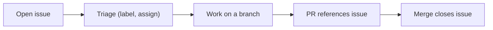

⬅ [Back to Index](../README.md)

# GitHub Issues

**Issues** are GitHub's built-in tracker for bugs, tasks, and feature requests. They turn scattered "we should fix this" conversations into a searchable, assignable, linkable backlog.

### 🎓 Professional (IT-Standard) Reference

| Concept | Layman View | Professional (IT-Standard) View + Example |
|---------|-------------|--------------------------------------------|
| Issue | A tracked to-do or bug | An issue is a trackable unit of work — bug, task, or request — with title, description, and discussion.<br>It supports labels, assignees, and milestones.<br>It links to PRs and commits.<br>It is the atom of project planning.<br>*Example: "Login fails on Safari #212".* |
| Label | A colored tag for sorting | A label categorizes issues and PRs (e.g. `bug`, `enhancement`, `priority:high`).<br>It enables filtering and triage.<br>Labels are repo-defined.<br>They drive dashboards and automation.<br>*Example: filtering all `bug` issues.* |
| Milestone | A group with a due date | A milestone bundles issues and PRs toward a goal or release, with progress and an optional due date.<br>It tracks scope completion.<br>It aids release planning.<br>It shows percent done.<br>*Example: a "v2.0" milestone.* |

---

## 🧠 An Issue's Life



**Explanation:** An issue is **opened**, then **triaged** with labels and an assignee. Someone works on a branch, opens a PR that references the issue (`Closes #212`), and when the PR merges, the issue **auto-closes** — a clean, traceable loop.

---

## 🧰 Organizing Work

| Tool | Purpose |
|------|---------|
| **Labels** | Categorize (bug, feature, priority) |
| **Assignees** | Who owns the work |
| **Milestones** | Group toward a release or goal |
| **Projects** | Kanban-style board across issues/PRs |
| **Templates** | Standardize bug reports and requests |

---

## 🏛️ Simple Analogy

Issues are like a **shared kitchen ticket rail in a busy restaurant**. Every order (task/bug) gets a ticket, is labeled and assigned to a cook, and comes off the rail only when the dish is done (PR merged). Nothing gets forgotten in the rush.

---

## 🧪 Working With Issues (CLI)

```bash
# Create an issue
gh issue create --title "Login fails on Safari" \
  --body "Steps to reproduce..." --label bug

# List and view
gh issue list --label bug
gh issue view 212

# Reference it in a commit so merging closes it
git commit -m "Fix Safari login (Closes #212)"
```

---

## 🧩 Real-World Examples

- 🐛 **Bug tracking** — users and teammates file reproducible reports.
- 🗺️ **Roadmaps** — milestones group issues toward each release.
- 📋 **Project boards** — issues flow across "To Do → In Progress → Done".

---

## 🧗 What You Gain: 50+ Years of Experience, Condensed

Work through this lesson and you absorb judgment that normally takes a career to earn. Each stage below is a level of mastery you unlock — by the end you carry the instincts of someone with 50+ years in the field:

| Stage | How you see issues | What you can do |
|-------|--------------------|-----------------|
| 🌱 **Beginner** | "A comments list." | Open and comment on issues. |
| 🧭 **Learner** | A task tracker. | Label, assign, and link issues to PRs. |
| 🛠️ **Practitioner** | A planning backbone. | Run triage and milestones. |
| 🚀 **Advanced** | An automation surface. | Wire labels and projects into workflows. |
| 🏛️ **Veteran** | A delivery system of record. | Design issue processes across many teams. |

---

## 🔬 Deep Dive — Advanced & Expert Insights

- **Templates raise signal:** issue templates (bug vs feature) force reporters to include repro steps, versions, and expected behavior — saving hours of back-and-forth.
- **Auto-close linking:** keywords like `Closes`, `Fixes`, `Resolves #N` in a PR body close the issue on merge, keeping the backlog honest.
- **Labels power automation:** GitHub Actions can triage, assign, or notify based on labels — turning issues into a workflow engine.
- **Milestones vs Projects:** milestones track *scope toward a release*; Projects give a *flexible board* across repos — use both.
- **Good hygiene beats tooling:** consistent labels, closed stale issues, and clear ownership matter more than any fancy board.

> 🏛️ **Veteran habit:** if it isn't an issue, it doesn't exist. Capture work as issues so nothing lives only in someone's head.

---

## ✅ Key Takeaways

- **Issues** track bugs, tasks, and requests in one searchable place.
- Organize with **labels, assignees, milestones, and projects**.
- Link PRs with **`Closes #N`** to auto-close on merge.
- **Templates** improve the quality of incoming reports.

---

**Navigation:** [Next → Repository Management](repository-management.md) | ⬅ [Back to Index](../README.md)
