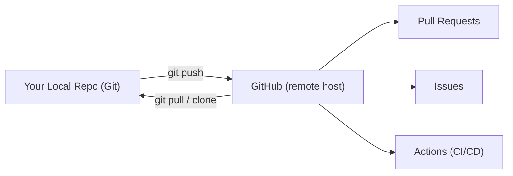

⬅ [Back to Index](../README.md)

# GitHub

**GitHub** is the world's most popular platform for hosting Git repositories and collaborating on code. It adds a web interface, access control, issue tracking, code review, and automation on top of Git.

### 🎓 Professional (IT-Standard) Reference

| Concept | Layman View | Professional (IT-Standard) View + Example |
|---------|-------------|--------------------------------------------|
| Remote host | The cloud home for your repo | GitHub is a cloud platform that hosts Git repositories and adds collaboration features.<br>It provides access control, review, and CI/CD.<br>It serves as the central remote for teams.<br>Alternatives include GitLab and Bitbucket.<br>*Example: `git push` sending commits to GitHub.* |
| Fork | Your own copy of someone's repo | A fork is a server-side copy of another repository under your account.<br>It lets you propose changes without write access.<br>You open pull requests back to the original.<br>It powers open-source contribution.<br>*Example: forking a project to fix a bug.* |
| Clone vs fork | Local copy vs account copy | Cloning copies a repo to your machine; forking copies it to your GitHub account.<br>You usually fork then clone your fork.<br>Forks track the upstream repo.<br>Both preserve full history.<br>*Example: fork on GitHub, then `git clone` your fork.* |

---

## 🧠 How GitHub Fits With Git



**Explanation:** Git runs locally; GitHub is the shared hub in the cloud. You **push** commits up and **pull** teammates' work down. On top of raw Git, GitHub layers pull requests, issues, and automation that make team collaboration smooth.

---

## 🧰 What GitHub Adds on Top of Git

| Feature | Purpose |
|---------|---------|
| **Pull Requests** | Propose and review changes before merging |
| **Issues** | Track bugs, tasks, and feature requests |
| **Actions** | Automate builds, tests, and deployments |
| **Branch protection** | Enforce reviews and passing checks |
| **Releases** | Publish versioned downloads and notes |

---

## 🏛️ Simple Analogy

If Git is a **camera** that takes snapshots of your project, GitHub is the **shared online photo album** — with comments, albums (issues), approval stamps (reviews), and a robot (Actions) that organizes new photos automatically as they arrive.

---

## 🧪 Connecting Local Git to GitHub

```bash
# Link a local repo to a GitHub remote
git remote add origin https://github.com/user/repo.git
git branch -M main
git push -u origin main

# Later, clone it elsewhere
git clone https://github.com/user/repo.git
```

---

## 🧩 Real-World Examples

- 🌍 **Open source** — millions of projects collaborate publicly on GitHub.
- 🏢 **Companies** host private repos with team access controls.
- 🤖 **DevOps** — GitHub Actions builds and deploys on every push.

---

## 🧗 What You Gain: 50+ Years of Experience, Condensed

Work through this lesson and you absorb judgment that normally takes a career to earn. Each stage below is a level of mastery you unlock — by the end you carry the instincts of someone with 50+ years in the field:

| Stage | How you see GitHub | What you can do |
|-------|--------------------|-----------------|
| 🌱 **Beginner** | "A place to store my code." | Push and clone repositories. |
| 🧭 **Learner** | A collaboration platform. | Fork, open PRs, and file issues. |
| 🛠️ **Practitioner** | A team's daily workspace. | Run reviews and manage repo settings. |
| 🚀 **Advanced** | An automation and policy hub. | Wire Actions, protections, and releases. |
| 🏛️ **Veteran** | An engineering system of record. | Govern org-wide access, security, and process. |

---

## 🔬 Deep Dive — Advanced & Expert Insights

- **GitHub ≠ Git:** GitHub is optional hosting; the same repo works on GitLab, Bitbucket, or a bare server. Don't couple your process to one vendor unnecessarily.
- **Fork-and-PR vs shared-repo:** open source uses forks (no write access); internal teams usually share one repo with protected branches.
- **SSH vs HTTPS:** SSH keys or a credential manager avoid retyping tokens; personal access tokens (PATs) replaced passwords for HTTPS.
- **Org structure matters:** teams, roles, and CODEOWNERS files scale access control and review routing across many repos.
- **The API and CLI:** `gh` (GitHub CLI) and the REST/GraphQL APIs let you script PRs, issues, and releases into your automation.

> 🏛️ **Veteran habit:** keep your *process* in Git-native constructs (branches, PRs, tags) so it survives even if you change hosting providers.

---

## ✅ Key Takeaways

- **Git** is local; **GitHub** is the shared cloud host.
- GitHub adds **PRs, issues, Actions, protections, and releases**.
- **Fork** copies to your account; **clone** copies to your machine.
- Use **SSH keys or tokens** for authentication.

---

**Navigation:** [Next → Pull Requests](pull-requests.md) | ⬅ [Back to Index](../README.md)
