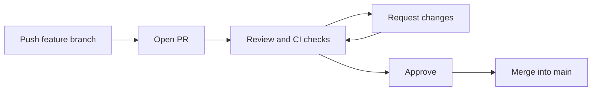

⬅ [Back to Index](../README.md)

# Pull Requests

A **pull request (PR)** proposes merging changes from one branch into another, opening them for discussion, review, and automated checks before they land. PRs are where most team collaboration and quality control happen.

### 🎓 Professional (IT-Standard) Reference

| Concept | Layman View | Professional (IT-Standard) View + Example |
|---------|-------------|--------------------------------------------|
| Pull request | "Please review and merge my work" | A pull request is a request to merge a source branch into a target branch, with diff, discussion, and checks.<br>It is the unit of review and integration.<br>It ties commits to reviewers and CI results.<br>Called a merge request in GitLab.<br>*Example: PR from `feature/login` into `main`.* |
| Draft PR | Work in progress, not ready | A draft pull request signals the work is incomplete and not yet for review or merge.<br>It enables early CI feedback and visibility.<br>It blocks accidental merging.<br>It is converted to "ready" when done.<br>*Example: opening a draft to run tests early.* |
| Merge strategy | How the PR lands | The merge strategy determines the resulting history: merge commit, squash, or rebase.<br>Squash collapses a PR into one commit.<br>Rebase keeps commits but linearizes them.<br>Teams standardize one strategy.<br>*Example: "Squash and merge" on GitHub.* |

---

## 🧠 The Pull Request Lifecycle



**Explanation:** You push a branch, open a **PR**, and reviewers plus automated checks weigh in. You address feedback, get **approval**, and merge. The PR becomes a permanent record of *what* changed and *why* it was accepted.

---

## 🔀 Merge Strategies Compared

| Strategy | History result | Best when |
|----------|----------------|-----------|
| **Merge commit** | Preserves all commits + a merge node | You want full, true history |
| **Squash & merge** | One clean commit per PR | You want a tidy, linear `main` |
| **Rebase & merge** | Commits replayed linearly | You want no merge commits but keep steps |

---

## 🏛️ Simple Analogy

A pull request is like **submitting an article to an editor**. You hand in your draft (branch), the editor and fact-checkers (reviewers and CI) comment, you revise, and once approved it's **published into the main edition** (`main`).

---

## 🧪 Opening a PR (CLI)

```bash
# Push your branch
git push -u origin feature/login

# Open a PR with the GitHub CLI
gh pr create --base main --head feature/login \
  --title "Add login" --body "Implements user login"

# Check status and merge when approved
gh pr status
gh pr merge --squash
```

---

## 🧩 Real-World Examples

- 👀 **Every change** on a healthy team goes through a reviewed PR.
- 🤖 **CI runs tests** automatically on each PR before merge is allowed.
- 📝 **PR descriptions** double as living documentation of decisions.

---

## 🧗 What You Gain: 50+ Years of Experience, Condensed

Work through this lesson and you absorb judgment that normally takes a career to earn. Each stage below is a level of mastery you unlock — by the end you carry the instincts of someone with 50+ years in the field:

| Stage | How you see pull requests | What you can do |
|-------|---------------------------|-----------------|
| 🌱 **Beginner** | "A button to merge my code." | Open a basic PR. |
| 🧭 **Learner** | A review and discussion space. | Write clear descriptions and respond to feedback. |
| 🛠️ **Practitioner** | A quality gate. | Keep PRs small and choose a merge strategy. |
| 🚀 **Advanced** | An automation checkpoint. | Gate merges on CI, coverage, and reviews. |
| 🏛️ **Veteran** | A team's integration contract. | Design PR policy that scales delivery. |

---

## 🔬 Deep Dive — Advanced & Expert Insights

- **Small PRs get better reviews:** a 200-line PR gets real scrutiny; a 2,000-line PR gets a rubber stamp. Split work aggressively.
- **Draft early:** open a draft PR to run CI and gather feedback before the work is "done" — it shortens the loop.
- **Squash vs merge is a history philosophy:** squash keeps `main` clean but loses intermediate steps; pick one and enforce it repo-wide.
- **Link everything:** reference issues (`Closes #123`) so merging a PR auto-closes the tracking item and builds traceability.
- **Templates raise quality:** a `PULL_REQUEST_TEMPLATE.md` prompts authors for context, testing notes, and risk — reviewers review faster.

> 🏛️ **Veteran habit:** optimize for *reviewability*. A PR that's easy to review is easy to trust, and trust is what makes teams fast.

---

## ✅ Key Takeaways

- A **PR** proposes a merge and opens it to review and CI.
- Keep PRs **small and focused** for better reviews.
- Choose a **merge strategy** (merge / squash / rebase) and standardize it.
- **Link issues** and use templates for traceability and quality.

---

**Navigation:** [Next → Code Reviews](code-reviews.md) | ⬅ [Back to Index](../README.md)
