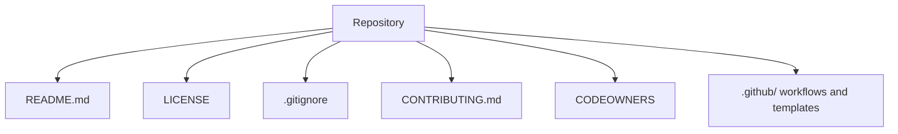

⬅ [Back to Index](../README.md)

# Repository Management

**Repository management** is everything that keeps a repo healthy and welcoming: structure, documentation, access control, and configuration. A well-managed repo is easy to contribute to and hard to break.

### 🎓 Professional (IT-Standard) Reference

| Concept | Layman View | Professional (IT-Standard) View + Example |
|---------|-------------|--------------------------------------------|
| README | The project's front page | A README documents what a project is, how to set it up, and how to use it.<br>It is the first thing visitors read.<br>It lowers the barrier to contribution.<br>It renders on the repo home page.<br>*Example: setup steps and usage in `README.md`.* |
| .gitignore | The "don't track this" list | A `.gitignore` file lists paths Git should never track, such as build output and secrets.<br>It keeps the repo clean and safe.<br>Patterns are matched per line.<br>It is committed to the repo.<br>*Example: ignoring `node_modules/` and `.env`.* |
| License | The rules for using the code | A license defines how others may use, modify, and distribute the code.<br>Without one, default copyright restricts reuse.<br>It is legally significant.<br>It lives in a `LICENSE` file.<br>*Example: MIT, Apache-2.0, or GPL.* |

---

## 🧠 Anatomy of a Healthy Repo



**Explanation:** Beyond source code, a healthy repo carries **meta files** that document, protect, and govern it. These files answer "what is this, how do I help, who owns what, and what gets tracked" — before anyone even reads the code.

---

## 📁 Key Repo Files

| File | Purpose |
|------|---------|
| `README.md` | What the project is and how to use it |
| `LICENSE` | Legal terms for reuse |
| `.gitignore` | Files Git should not track |
| `CONTRIBUTING.md` | How to contribute |
| `CODEOWNERS` | Who reviews which paths |
| `.github/` | Templates and Actions workflows |

---

## 🏛️ Simple Analogy

Managing a repo is like **running a well-kept shop**. The README is the storefront sign, the LICENSE is the terms posted at the door, `.gitignore` is the "staff only" areas, and CONTRIBUTING is the "how to apply" flyer. A tidy shop invites people in; a messy one scares them off.

---

## 🧪 Setting Up a Repo Well

```bash
# Start clean
git init
printf "node_modules/\n.env\ndist/\n" > .gitignore

# Add the essentials
echo "# My Project" > README.md
# add a LICENSE, CONTRIBUTING.md, and CODEOWNERS

git add .
git commit -m "Initialize repository with docs and ignore rules"
```

---

## 🧩 Real-World Examples

- 📖 **Open source** projects live or die by their README and CONTRIBUTING quality.
- 🔒 **Secrets** are kept out via `.gitignore` and secret scanning.
- 🏢 **Monorepos** use CODEOWNERS to route thousands of files to the right teams.

---

## 🧗 What You Gain: 50+ Years of Experience, Condensed

Work through this lesson and you absorb judgment that normally takes a career to earn. Each stage below is a level of mastery you unlock — by the end you carry the instincts of someone with 50+ years in the field:

| Stage | How you see repo management | What you can do |
|-------|-----------------------------|-----------------|
| 🌱 **Beginner** | "Just a folder of code." | Add a README and `.gitignore`. |
| 🧭 **Learner** | A documented project. | Add license, contributing, and templates. |
| 🛠️ **Practitioner** | A maintainable workspace. | Configure CODEOWNERS and settings. |
| 🚀 **Advanced** | A governed system. | Automate hygiene and access control. |
| 🏛️ **Veteran** | An org-wide standard. | Define repo templates and policies at scale. |

---

## 🔬 Deep Dive — Advanced & Expert Insights

- **Repo templates scale consistency:** GitHub template repositories and org-level defaults give every new project the same baseline files and settings.
- **Keep secrets out from day one:** once a secret is committed it lives in history forever — use `.gitignore`, secret scanning, and rotate anything leaked.
- **CONTRIBUTING lowers friction:** clear setup, branch naming, and PR expectations turn drive-by visitors into contributors.
- **Archive, don't delete:** archiving preserves history and links for repos that are no longer active but still referenced.
- **Settings as code:** tools let you manage branch rules, labels, and access via config files, so repo governance is reviewable and repeatable.

> 🏛️ **Veteran habit:** invest in the "boring" meta files early — they pay back every single time a new person touches the repo.

---

## ✅ Key Takeaways

- A healthy repo has a **README, LICENSE, .gitignore**, and contribution docs.
- **CODEOWNERS** and `.github/` templates govern reviews and workflows.
- **Never commit secrets** — keep them out from the start.
- **Templates and settings-as-code** keep repos consistent at scale.

---

**Navigation:** [Next → Branch Protection](branch-protection.md) | ⬅ [Back to Index](../README.md)
