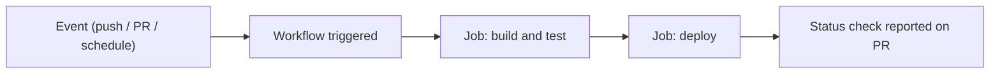

⬅ [Back to Index](../README.md)

# GitHub Actions

**GitHub Actions** is GitHub's built-in automation and CI/CD platform. It runs workflows — defined in YAML — automatically on events like a push, a pull request, or a schedule, so building, testing, and deploying happen without manual steps.

### 🎓 Professional (IT-Standard) Reference

| Concept | Layman View | Professional (IT-Standard) View + Example |
|---------|-------------|--------------------------------------------|
| Workflow | An automated recipe | A workflow is a YAML file in `.github/workflows/` that defines automated jobs triggered by events.<br>It runs on GitHub-hosted or self-hosted runners.<br>It can build, test, and deploy.<br>Multiple workflows can coexist.<br>*Example: `ci.yml` running tests on every push.* |
| Job and step | Stages and commands | A job is a set of steps that run on one runner; steps are individual commands or actions.<br>Jobs can run in parallel or depend on each other.<br>Steps share the job's workspace.<br>Failures stop the job by default.<br>*Example: a `build` job with checkout and test steps.* |
| Action | A reusable building block | An action is a packaged, reusable unit of automation referenced in a step.<br>It can be official, community, or custom.<br>It is versioned like code.<br>It reduces boilerplate.<br>*Example: `actions/checkout@v4`.* |

---

## 🧠 How a Workflow Runs



**Explanation:** An **event** triggers a **workflow**, which runs one or more **jobs** on fresh virtual machines called runners. Each job runs **steps** (commands or reusable actions). Results appear as status checks — the same ones branch protection can require.

---

## 🧰 A Minimal CI Workflow

```yaml
# .github/workflows/ci.yml
name: CI
on: [push, pull_request]
jobs:
  test:
	runs-on: ubuntu-latest
	steps:
	  - uses: actions/checkout@v4
	  - name: Run tests
		run: |
		  echo "Building and testing..."
		  # e.g. npm ci and npm test
```

| Trigger | Common use |
|---------|-----------|
| `push` | Build and test every change |
| `pull_request` | Gate merges with checks |
| `schedule` | Nightly jobs, cleanup, reports |
| `workflow_dispatch` | Manual, on-demand runs |

---

## 🏛️ Simple Analogy

GitHub Actions is like a **robot assistant on your team**. Every time someone drops off work (a push), the robot automatically builds it, tests it, and — if it all passes — ships it. It never forgets a step and never gets tired.

---

## 🧩 Real-World Examples

- ✅ **CI** — run the test suite on every PR before merge is allowed.
- 🚀 **CD** — deploy to production automatically when a `v*` tag is pushed.
- 🧹 **Maintenance** — scheduled jobs prune stale branches or update deps.

---

## 🧗 What You Gain: 50+ Years of Experience, Condensed

Work through this lesson and you absorb judgment that normally takes a career to earn. Each stage below is a level of mastery you unlock — by the end you carry the instincts of someone with 50+ years in the field:

| Stage | How you see GitHub Actions | What you can do |
|-------|----------------------------|-----------------|
| 🌱 **Beginner** | "A green checkmark on PRs." | Read a workflow file. |
| 🧭 **Learner** | Automated build and test. | Write a basic CI workflow. |
| 🛠️ **Practitioner** | A CI/CD pipeline. | Add deploy jobs, caching, and secrets. |
| 🚀 **Advanced** | A reusable automation platform. | Build matrix builds and composite actions. |
| 🏛️ **Veteran** | A delivery and security backbone. | Design secure, scalable pipelines org-wide. |

---

## 🔬 Deep Dive — Advanced & Expert Insights

- **Pin actions by SHA for security:** referencing `@v4` is convenient, but pinning to a commit SHA prevents a compromised tag from injecting malicious code.
- **Least-privilege tokens:** set `permissions:` explicitly per workflow — the default `GITHUB_TOKEN` should grant only what the job needs.
- **Matrix builds:** test across many OS/version combinations in parallel with a `strategy.matrix` — huge coverage for little config.
- **Cache and artifacts:** `actions/cache` speeds builds; artifacts pass data between jobs and preserve build outputs.
- **Secrets and environments:** store credentials as encrypted secrets and gate production deploys behind protected environments with required approvals.

> 🏛️ **Veteran habit:** treat pipelines as production code — review them, pin their dependencies, and give them only the permissions they truly need.

---

## ✅ Key Takeaways

- **Actions** runs YAML **workflows** on events like push, PR, and schedule.
- Workflows contain **jobs → steps**, using reusable **actions**.
- Results become **status checks** that branch protection can require.
- **Pin actions, scope permissions, and use secrets/environments** for safety.

---

**Navigation:** [Next → Release Management](release-management.md) | ⬅ [Back to Index](../README.md)
