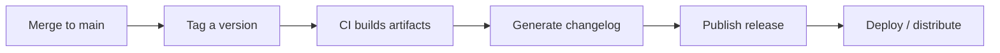

⬅ [Back to Index](../README.md)

# Release Management

**Release management** is the disciplined process of turning merged code into versioned, documented, deployable releases. It answers "what's in this version, when did it ship, and how do we roll back?"

### 🎓 Professional (IT-Standard) Reference

| Concept | Layman View | Professional (IT-Standard) View + Example |
|---------|-------------|--------------------------------------------|
| Release | A published version | A release is a versioned, documented snapshot of the software made available to users.<br>It bundles a tag, changelog, and artifacts.<br>It may be automated via CI/CD.<br>It marks a deployable point.<br>*Example: a GitHub Release for `v2.1.0`.* |
| Changelog | The "what changed" list | A changelog is a human-readable record of notable changes per version.<br>It groups added, changed, fixed, and removed items.<br>It can be generated from commits or PRs.<br>It informs users and auditors.<br>*Example: `CHANGELOG.md` following Keep a Changelog.* |
| Release candidate | A "maybe final" preview | A release candidate (RC) is a pre-release believed ready, pending final validation.<br>It is versioned like `v2.1.0-rc.1`.<br>It gathers real-world testing.<br>It becomes final if no blockers appear.<br>*Example: shipping `-rc.1` before `v2.1.0`.* |

---

## 🧠 The Release Pipeline



**Explanation:** A mature release flow is automated: merging and **tagging** triggers CI to **build**, produce a **changelog**, **publish** a release, and **deploy**. The version tag is the single source of truth for exactly what shipped.

---

## 📦 Release Channels

| Channel | Audience | Example version |
|---------|----------|-----------------|
| **Alpha** | Internal / early testers | `v2.0.0-alpha.1` |
| **Beta** | Broader preview users | `v2.0.0-beta.3` |
| **Release candidate** | Final validation | `v2.0.0-rc.1` |
| **Stable** | Everyone | `v2.0.0` |

---

## 🏛️ Simple Analogy

Release management is like **publishing an edition of a newspaper**. You lock the content (tag), print copies (build artifacts), write the "in this issue" summary (changelog), and distribute (deploy). If a printing error slips through, you can reprint the previous edition (roll back).

---

## 🧪 Cutting a Release (CLI)

```bash
# Tag and push the version
git tag -a v2.1.0 -m "Release 2.1.0"
git push origin v2.1.0

# Create a GitHub Release with auto-generated notes
gh release create v2.1.0 --generate-notes

# Attach a build artifact
gh release upload v2.1.0 ./dist/app.zip
```

---

## 🧩 Real-World Examples

- 📱 **Apps** promote builds alpha → beta → RC → stable.
- 🔁 **Rollbacks** redeploy the previous tagged release when something breaks.
- 🤖 **Automated notes** are generated from merged PR titles and labels.

---

## 🧗 What You Gain: 50+ Years of Experience, Condensed

Work through this lesson and you absorb judgment that normally takes a career to earn. Each stage below is a level of mastery you unlock — by the end you carry the instincts of someone with 50+ years in the field:

| Stage | How you see releases | What you can do |
|-------|----------------------|-----------------|
| 🌱 **Beginner** | "Clicking the release button." | Publish a basic release. |
| 🧭 **Learner** | A versioned checkpoint. | Write changelogs and tag versions. |
| 🛠️ **Practitioner** | A repeatable process. | Automate release notes and artifacts. |
| 🚀 **Advanced** | A safe delivery pipeline. | Design channels, RCs, and rollbacks. |
| 🏛️ **Veteran** | A risk-managed release strategy. | Govern releases across teams and products. |

---

## 🔬 Deep Dive — Advanced & Expert Insights

- **Automate everything reproducible:** tag → build → notes → publish should be a pipeline, not a checklist a human runs by hand at 5pm on Friday.
- **Plan the rollback first:** a release isn't done until you know exactly how to revert it. Keep previous artifacts and immutable tags.
- **Progressive delivery:** canary and blue-green deploys expose a release to a slice of users first, catching issues before full rollout.
- **Conventional Commits enable automation:** structured commit messages let tools compute the next version and generate changelogs automatically.
- **Decouple deploy from release:** feature flags let you ship code dark and "release" a feature by flipping a flag — separating risk from timing.

> 🏛️ **Veteran habit:** make releases boring. Boring means automated, reversible, and well-documented — excitement in releases is usually bad news.

---

## ✅ Key Takeaways

- Release management makes shipping **versioned, documented, reversible**.
- Use **channels** (alpha/beta/RC/stable) to de-risk rollouts.
- **Automate** tag → build → changelog → publish → deploy.
- Always know your **rollback** path before releasing.

---

**Navigation:** [Next → Semantic Versioning](semantic-versioning.md) | ⬅ [Back to Index](../README.md)
