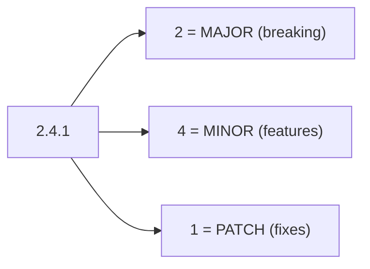

⬅ [Back to Index](../README.md)

# Semantic Versioning

**Semantic Versioning (SemVer)** is a simple, widely adopted rule for numbering releases: `MAJOR.MINOR.PATCH`. Each part has a precise meaning, so a version number *communicates* what changed and whether upgrading is safe.

### 🎓 Professional (IT-Standard) Reference

| Concept | Layman View | Professional (IT-Standard) View + Example |
|---------|-------------|--------------------------------------------|
| MAJOR | Breaking changes | The MAJOR version increments when you make incompatible API changes.<br>Consumers may need code changes to upgrade.<br>It signals "read the migration guide."<br>It resets MINOR and PATCH to zero.<br>*Example: `1.9.0` to `2.0.0`.* |
| MINOR | New features, compatible | The MINOR version increments when you add functionality in a backward-compatible way.<br>Existing usage keeps working.<br>It resets PATCH to zero.<br>It signals safe new capabilities.<br>*Example: `2.0.0` to `2.1.0`.* |
| PATCH | Bug fixes, compatible | The PATCH version increments for backward-compatible bug fixes.<br>No new features or breaking changes.<br>It signals a safe drop-in update.<br>It is the lowest-risk upgrade.<br>*Example: `2.1.0` to `2.1.1`.* |

---

## 🧠 Reading a Version Number



**Explanation:** `2.4.1` tells a whole story: it's the **2nd** major generation, with **4** rounds of compatible features, and **1** bug-fix on top. Bumping the left-most changed digit tells consumers exactly how risky an upgrade is.

---

## 🔢 When to Bump What

| Change | Bump | Example |
|--------|------|---------|
| Remove or change an API | **MAJOR** | `1.4.2 → 2.0.0` |
| Add a new feature (compatible) | **MINOR** | `1.4.2 → 1.5.0` |
| Fix a bug (compatible) | **PATCH** | `1.4.2 → 1.4.3` |
| Pre-release | suffix | `2.0.0-beta.1` |
| Build metadata | `+` suffix | `2.0.0+build.42` |

---

## 🏛️ Simple Analogy

SemVer is like **edition numbers on a textbook**. A new **edition** (MAJOR) may reorganize chapters so your page references break. A **reprint with added chapters** (MINOR) keeps your references valid. A **typo-fix reprint** (PATCH) changes nothing structural. The number tells you how much re-learning to expect.

---

## 🧪 SemVer in Dependencies

```json
// package.json version ranges
{
  "dependencies": {
	"left-pad": "^1.4.0",   // >=1.4.0 <2.0.0  (allow minor + patch)
	"lodash":   "~4.17.0",  // >=4.17.0 <4.18.0 (allow patch only)
	"react":    "18.2.0"    // exact pin
  }
}
```

`^` allows compatible feature updates, `~` allows only patches, and an exact number pins precisely — SemVer is what makes these ranges meaningful.

---

## 🧩 Real-World Examples

- 📦 **npm, PyPI, NuGet** all rely on SemVer for dependency resolution.
- 🤖 **Automated tools** compute the next version from commit messages.
- ⚠️ **`0.x.y` versions** signal "anything may change" during early development.

---

## 🧗 What You Gain: 50+ Years of Experience, Condensed

Work through this lesson and you absorb judgment that normally takes a career to earn. Each stage below is a level of mastery you unlock — by the end you carry the instincts of someone with 50+ years in the field:

| Stage | How you see SemVer | What you can do |
|-------|--------------------|-----------------|
| 🌱 **Beginner** | "Three numbers." | Read `MAJOR.MINOR.PATCH`. |
| 🧭 **Learner** | A compatibility signal. | Choose the right bump for a change. |
| 🛠️ **Practitioner** | A dependency contract. | Set sane version ranges. |
| 🚀 **Advanced** | An automation input. | Derive versions from commits automatically. |
| 🏛️ **Veteran** | A public API promise. | Govern versioning policy across products. |

---

## 🔬 Deep Dive — Advanced & Expert Insights

- **SemVer is a promise, not decoration:** a MAJOR bump means "we may break you." Honoring it builds trust; violating it (breaking on a MINOR) burns it.
- **`0.x` is the wild west:** in `0.y.z`, minor bumps may break — many ecosystems treat pre-1.0 as unstable by design.
- **Automate with Conventional Commits:** `feat:` → MINOR, `fix:` → PATCH, `BREAKING CHANGE:` → MAJOR lets tools like semantic-release version automatically.
- **Range operators carry risk:** `^` trusts publishers to honor SemVer; lockfiles pin exact resolved versions for reproducible builds.
- **Deprecate before you remove:** signal upcoming breaking changes in a MINOR (with warnings), then remove in the next MAJOR — a smoother migration.

> 🏛️ **Veteran habit:** version for your *consumers*, not yourself. The number is a communication tool — use it to set accurate expectations.

---

## ✅ Key Takeaways

- SemVer is **`MAJOR.MINOR.PATCH`** — breaking / feature / fix.
- The changed digit tells consumers **how risky** an upgrade is.
- Range operators (**`^`, `~`, exact**) rely on SemVer being honored.
- **Conventional Commits** let tools automate versioning.

---

**Navigation:** [Next → Git Workflows](../05-Git-Workflows/git-workflows.md) | ⬅ [Back to Index](../README.md)
