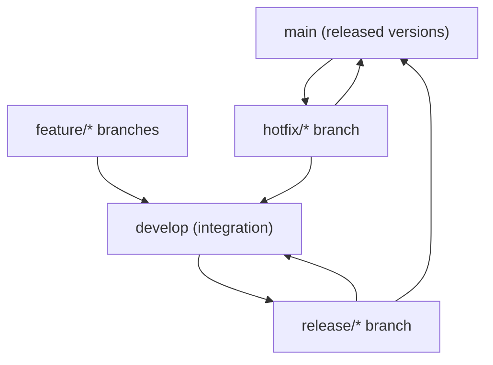

⬅ [Back to Index](../README.md)

# Git Flow

**Git Flow** is a structured branching model with dedicated long-lived branches for development and releases, plus supporting branches for features, releases, and hotfixes. It shines for products with scheduled, versioned releases.

### 🎓 Professional (IT-Standard) Reference

| Concept | Layman View | Professional (IT-Standard) View + Example |
|---------|-------------|--------------------------------------------|
| develop branch | The integration branch | In Git Flow, `develop` is the long-lived branch where completed features integrate before release.<br>It reflects the next release's state.<br>Feature branches merge into it.<br>It feeds release branches.<br>*Example: merging `feature/x` into `develop`.* |
| release branch | The stabilization branch | A release branch forks from `develop` to stabilize a version — only fixes, no new features.<br>It merges into `main` and back to `develop`.<br>It gets a version tag.<br>It isolates release prep.<br>*Example: `release/2.0.0`.* |
| hotfix branch | Emergency production fix | A hotfix branch forks from `main` to patch production urgently.<br>It merges into both `main` and `develop`.<br>It is tagged as a patch release.<br>It bypasses the normal cycle.<br>*Example: `hotfix/2.0.1`.* |

---

## 🧠 The Git Flow Branch Model



**Explanation:** Two permanent branches anchor the model: **`main`** holds released versions, **`develop`** holds ongoing integration. **Feature** branches feed `develop`; **release** branches stabilize and tag; **hotfix** branches patch `main` directly and flow back to `develop`.

---

## 🌳 The Five Branch Types

| Branch | From | Merges to | Purpose |
|--------|------|-----------|---------|
| `main` | — | — | Production-ready, tagged releases |
| `develop` | `main` | — | Integration of finished features |
| `feature/*` | `develop` | `develop` | Build one feature |
| `release/*` | `develop` | `main` + `develop` | Stabilize a version |
| `hotfix/*` | `main` | `main` + `develop` | Urgent production fix |

---

## 🏛️ Simple Analogy

Git Flow is like a **publishing house with departments**. Writers draft in workshops (feature branches), the editing floor assembles the next book (develop), a proofing room polishes it (release), and if a printed book has a typo, a rapid-reprint team fixes it (hotfix) — then feeds the correction back to editing.

---

## 🧪 Git Flow Commands

```bash
# With the git-flow extension
git flow init
git flow feature start login      # branch off develop
git flow feature finish login     # merge back to develop
git flow release start 2.0.0      # stabilize
git flow release finish 2.0.0     # merge to main + develop, tag
git flow hotfix start 2.0.1       # urgent fix off main
```

---

## 🧩 Real-World Examples

- 📦 **Desktop/mobile apps** with distinct shipped versions.
- 🏢 **Enterprise software** with scheduled release cycles.
- 🔧 **Products** needing to maintain and patch multiple versions.

---

## 🧗 What You Gain: 50+ Years of Experience, Condensed

Work through this lesson and you absorb judgment that normally takes a career to earn. Each stage below is a level of mastery you unlock — by the end you carry the instincts of someone with 50+ years in the field:

| Stage | How you see Git Flow | What you can do |
|-------|----------------------|-----------------|
| 🌱 **Beginner** | "Lots of branches." | Follow feature/release/hotfix rules. |
| 🧭 **Learner** | A structured model. | Explain each branch's role. |
| 🛠️ **Practitioner** | A release discipline. | Run releases and hotfixes cleanly. |
| 🚀 **Advanced** | A cadence trade-off. | Judge when its overhead is worth it. |
| 🏛️ **Veteran** | One option among many. | Choose it only when releases demand it. |

---

## 🔬 Deep Dive — Advanced & Expert Insights

- **Powerful but heavy:** Git Flow's structure is a great fit for versioned products, but its long-lived branches cause merge pain for fast, continuous-deploy teams.
- **`develop` can drift from `main`:** without discipline, the two diverge and release merges get messy — automate the back-merges.
- **Hotfixes must flow both ways:** a fix applied only to `main` reappears as a bug when the next release ships from `develop` — always merge back.
- **Great for multi-version support:** if you must patch v1 while building v2, Git Flow's branch separation is a real advantage.
- **Modern shift:** many teams moved from Git Flow to trunk-based + feature flags as CI/CD matured — know both and choose per context.

> 🏛️ **Veteran habit:** adopt Git Flow because your *release model* needs it, not by default. Structure you don't need is just friction.

---

## ✅ Key Takeaways

- **Git Flow** uses long-lived `main` + `develop` and supporting branches.
- Five branch types: **main, develop, feature, release, hotfix**.
- Ideal for **versioned, scheduled releases** and multi-version support.
- **Hotfixes must merge back** to `develop` to avoid regressions.

---

**Navigation:** [Next → Trunk-Based Development](trunk-based-development.md) | ⬅ [Back to Index](../README.md)
