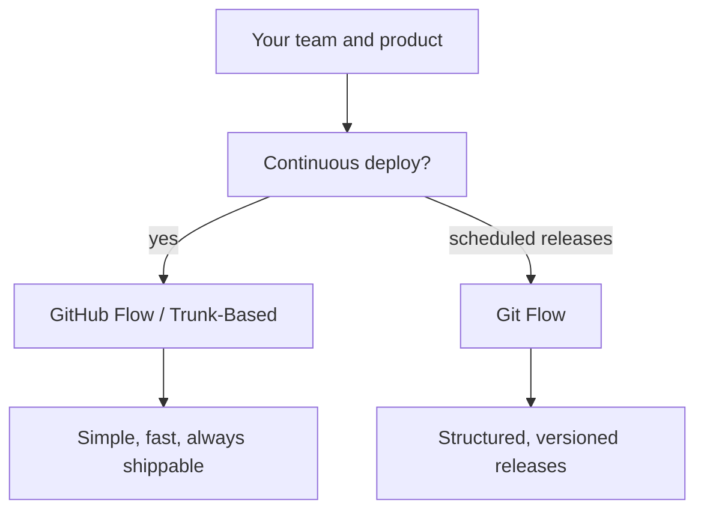

⬅ [Back to Index](../README.md)

# Git Workflows

A **Git workflow** is the agreed-upon set of rules a team follows for branching, reviewing, and releasing. Git itself is unopinionated — a workflow is how a team turns that flexibility into a predictable, shared process.

### 🎓 Professional (IT-Standard) Reference

| Concept | Layman View | Professional (IT-Standard) View + Example |
|---------|-------------|--------------------------------------------|
| Branching strategy | The team's branch rules | A branching strategy defines how branches are created, named, integrated, and released. It standardizes collaboration. It balances speed and stability. Popular models include GitHub Flow and Git Flow. *Example: "feature branches merged to `main` via PR".* |
| Integration frequency | How often work merges | Integration frequency is how often branches merge back to the mainline. Frequent integration reduces conflicts. It underpins continuous integration. Long-lived branches increase merge risk. *Example: merging small PRs daily.* |
| Mainline | The single source of truth | The mainline (e.g. `main`) is the branch representing the current, releasable state. It should always be buildable. Protections keep it healthy. Everything integrates back to it. *Example: a protected `main` branch.* |

---

## 🧠 Choosing a Workflow

**Explanation:** There is no single "best" workflow — the right one depends on release cadence, team size, and risk. Web apps that deploy constantly favor **simple flows**; products with versioned, scheduled releases lean toward **structured flows**.

---

## 🗺️ The Main Contenders

| Workflow | Best for | Key idea |
|----------|----------|----------|
| **GitHub Flow** | Web apps, continuous deploy | One `main` + short feature branches |
| **Git Flow** | Versioned/scheduled releases | Long-lived `develop` + release branches |
| **Trunk-Based** | High-velocity teams, CI/CD | Tiny, frequent merges to trunk |

---

## 🏛️ Simple Analogy

A workflow is like the **traffic rules for a shared road**. Git gives you the road and cars; the workflow decides which side to drive on, where the lanes are, and how to merge. Without agreed rules, even skilled drivers crash.

---

## 🧩 Real-World Examples

- 🌐 **SaaS teams** use GitHub Flow or trunk-based for constant deploys.
- 📦 **Libraries/desktop apps** use Git Flow for versioned releases.
- 🏢 **Large orgs** pick trunk-based with feature flags to scale.

---

## 🧗 What You Gain: 50+ Years of Experience, Condensed

Work through this lesson and you absorb judgment that normally takes a career to earn. Each stage below is a level of mastery you unlock — by the end you carry the instincts of someone with 50+ years in the field:

| Stage | How you see workflows | What you can do |
|-------|-----------------------|-----------------|
| 🌱 **Beginner** | "Just make branches." | Follow the team's branch rules. |
| 🧭 **Learner** | Named strategies exist. | Explain GitHub Flow vs Git Flow. |
| 🛠️ **Practitioner** | A team agreement. | Operate confidently within a workflow. |
| 🚀 **Advanced** | A delivery trade-off. | Match a workflow to release cadence. |
| 🏛️ **Veteran** | An org-scaling decision. | Choose and evolve workflows for many teams. |

---

## 🔬 Deep Dive — Advanced & Expert Insights

- **Workflow follows delivery, not fashion:** deploy-many-times-a-day teams need simplicity; regulated, versioned products need structure. Pick for *your* cadence.
- **Conflict pain is a signal:** frequent, painful merges usually mean branches live too long — shorten them before blaming the tool.
- **Feature flags decouple merge from release:** they let you merge early and often (great for CI) while controlling *when* users see a feature.
- **Consistency beats optimality:** a mediocre workflow everyone follows beats a perfect one half the team ignores.
- **Evolve deliberately:** changing workflows mid-project is costly — document the rules, automate them with protections, and migrate intentionally.

> 🏛️ **Veteran habit:** optimize for a mainline that's *always shippable*. Every workflow decision should serve that goal.

---

## ✅ Key Takeaways

- A **workflow** is the team's shared branching and release process.
- Choose based on **release cadence, team size, and risk**.
- Main models: **GitHub Flow, Git Flow, Trunk-Based**.
- Favor **short-lived branches** and an **always-shippable mainline**.

---

**Navigation:** [Next → GitHub Flow](github-flow.md) | ⬅ [Back to Index](../README.md)
