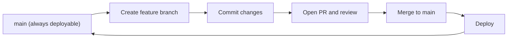

⬅ [Back to Index](../README.md)

# GitHub Flow

**GitHub Flow** is a lightweight, branch-based workflow built around one rule: `main` is always deployable. You branch, commit, open a PR, review, and merge — then deploy. Its simplicity makes it ideal for continuous delivery.

### 🎓 Professional (IT-Standard) Reference

| Concept | Layman View | Professional (IT-Standard) View + Example |
|---------|-------------|--------------------------------------------|
| Deployable main | `main` always works | In GitHub Flow, `main` is kept in an always-deployable state.<br>Anything merged is release-ready.<br>Protections and CI enforce this.<br>It enables deploy-on-merge.<br>*Example: deploying `main` after every merge.* |
| Feature branch | A short-lived work branch | A feature branch is a short-lived branch off `main` for one change, merged via PR.<br>It is deleted after merge.<br>It keeps changes isolated and small.<br>It is the only branch type in this flow.<br>*Example: `add-search` branched off `main`.* |
| Deploy on merge | Ship as soon as it lands | Deploy-on-merge automatically releases `main` after each merge.<br>It shortens lead time.<br>It relies on strong CI and protections.<br>It suits web services.<br>*Example: CD pipeline triggered by merge.* |

---

## 🧠 The GitHub Flow Loop



**Explanation:** Everything starts and ends at `main`. You branch off, do focused work, open a **PR** for review and CI, then merge and deploy. There are no long-lived `develop` or release branches — just `main` plus short feature branches.

---

## 🌿 The Six Steps

| Step | Action |
|------|--------|
| 1 | Create a descriptive branch off `main` |
| 2 | Commit small, meaningful changes |
| 3 | Open a pull request early |
| 4 | Discuss and review |
| 5 | Merge after approval + green CI |
| 6 | Deploy `main` |

---

## 🏛️ Simple Analogy

GitHub Flow is like a **short-order kitchen**. Each order (feature) is cooked on its own pan (branch), checked by the head chef (review), and served the moment it's ready (deploy). Nothing sits around — the line stays fast and fresh.

---

## 🧪 GitHub Flow in Practice

```bash
git switch -c add-search main   # 1. branch off main
# ...commit small changes...    # 2. commit
git push -u origin add-search   # 3. push
gh pr create --base main        # 4. open PR (review + CI)
gh pr merge --squash            # 5. merge when green
# CD pipeline deploys main       # 6. deploy
```

---

## 🧩 Real-World Examples

- 🌐 **SaaS products** that deploy many times a day.
- 👥 **Small-to-mid teams** wanting minimal process overhead.
- 🤖 **CI/CD-first** shops with strong automated testing.

---

## 🧗 What You Gain: 50+ Years of Experience, Condensed

Work through this lesson and you absorb judgment that normally takes a career to earn. Each stage below is a level of mastery you unlock — by the end you carry the instincts of someone with 50+ years in the field:

| Stage | How you see GitHub Flow | What you can do |
|-------|-------------------------|-----------------|
| 🌱 **Beginner** | "Branch, PR, merge." | Follow the six steps. |
| 🧭 **Learner** | A simple deploy loop. | Keep branches short and focused. |
| 🛠️ **Practitioner** | A continuous-delivery flow. | Deploy on merge with confidence. |
| 🚀 **Advanced** | A flow dependent on CI strength. | Harden testing and protections. |
| 🏛️ **Veteran** | A velocity-vs-risk balance. | Decide when it fits and when it doesn't. |

---

## 🔬 Deep Dive — Advanced & Expert Insights

- **Simplicity is the feature:** with only `main` + short branches, there's little ceremony — but it *demands* excellent automated tests to stay safe.
- **Deploy-on-merge needs guardrails:** without strong CI, feature flags, and quick rollback, "always deployable" becomes "always risky."
- **Not ideal for versioned products:** if you must support multiple released versions simultaneously, GitHub Flow's single `main` struggles — Git Flow fits better.
- **Feature flags complete it:** they let you merge unfinished work safely and turn features on independently of deploys.
- **Small PRs are mandatory:** the flow only stays fast if branches are tiny and merged within a day or two.

> 🏛️ **Veteran habit:** if `main` isn't reliably deployable, fix your tests and flags first — GitHub Flow amplifies whatever quality culture you already have.

---

## ✅ Key Takeaways

- **GitHub Flow**: one deployable `main` + short-lived feature branches.
- Loop: **branch → commit → PR → review → merge → deploy**.
- Best for **continuous delivery** with strong CI.
- Pair with **feature flags** and **fast rollback** for safety.

---

**Navigation:** [Next → Git Flow](git-flow.md) | ⬅ [Back to Index](../README.md)
